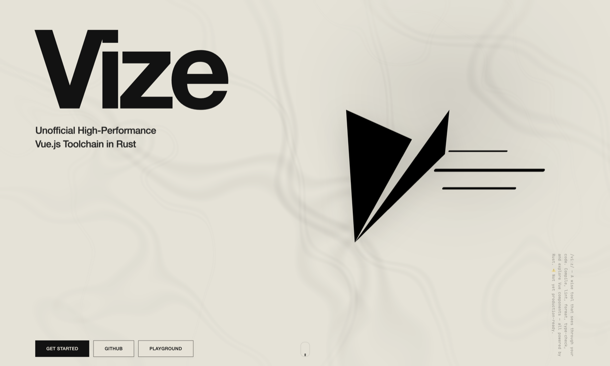

<p align="center">
  
</p>

<p align="center">
  <strong>High-Performance Vue.js Toolchain in Rust</strong>
</p>

<p align="center">
  <em>/viːz/: Named after Vizier + Visor + Advisor, a wise tool that sees through your code.</em>
</p>

<p align="center">
  <a href="https://vizejs.dev"><strong>Documentation</strong></a> ・
  <a href="https://vizejs.dev/play/"><strong>Playground</strong></a> ・
  <a href="https://github.com/sponsors/ubugeeei"><strong>Sponsor</strong></a>
</p>

<p align="center">
  <strong>Real World Testing — Wanted</strong>
</p>

<p align="center">
  <video src="https://raw.githubusercontent.com/ubugeeei-prod/vize/main/docs/public/blog/vize-real-world-testing.mp4" controls muted width="600"></video>
</p>

<p align="center">
  <a href="https://raw.githubusercontent.com/ubugeeei-prod/vize/main/docs/public/blog/vize-real-world-testing.mp4"><strong>▶ Watch the Real World Testing PV</strong></a>
</p>

> [!WARNING]
> Vize is experimental and in its **Real World Testing** phase — not a completely
> production-ready toolchain yet. Breaking changes and behavior that diverges from Vue are
> expected. Review the [stability guide](https://vizejs.dev/stability),
> [production-readiness checklist](https://github.com/ubugeeei-prod/vize/blob/main/docs/release/production-readiness.md),
> and [support policy](https://github.com/ubugeeei-prod/vize/blob/main/docs/release/support-policy.md)
> before adopting it.

## What Is Vize?

Vize is a Rust-native toolchain for Vue. One shared parser powers compilation, linting,
type-checking, formatting, and editor tooling, so the Vue workflow runs on the same core instead of
a patchwork of disconnected tools.

It plugs into the tools you already use: `@vizejs/vite-plugin` for Vite, `@vizejs/nuxt` for Nuxt,
the `vize` package for project scripts, `oxlint-plugin-vize` for Oxlint, and
`@vizejs/vite-plugin-musea` for the component gallery.

## Usage

Vize is a toolchain you add to a Vue app. It does not scaffold the app itself. Pick the shortest
path that matches your project; the [docs](https://vizejs.dev/getting-started) have the rest.

### Drop-in

On a Vue 3 + Vite app, replace `@vitejs/plugin-vue` with `@vizejs/vite-plugin`. Your SFCs stay as
they are.

```bash
npm i -D @vizejs/vite-plugin
```

```ts
// vite.config.ts
import { defineConfig } from "vite";
import vize from "@vizejs/vite-plugin";

export default defineConfig({
  plugins: [vize()],
});
```

Then use the same `dev` / `build` scripts as before. This swaps SFC compilation only. Lint, format,
and type-check stay on your current tools until you add them. The claim is Vue 3 SFCs in Vite — see
[Drop-in Scope](https://vizejs.dev/guide/vite-plugin#drop-in-scope).

Nuxt apps should use `@vizejs/nuxt` instead of wiring the Vite plugin by hand.

### New setup

Create a Vue + Vite or Nuxt app first, then let `vize init` wire the toolchain.

Vue + Vite:

```bash
npm create vue@latest my-app
cd my-app
npx vize init
```

Nuxt:

```bash
npm create nuxt@latest my-app
cd my-app
npx vize init
```

`init` can add the Vite plugin or Nuxt module, Oxlint, `vize fmt`, `vize check`, and a VS Code
recommendation. If you already have [Vite+](https://viteplus.dev/guide/install), run
`vpx vize init` instead.

### Migration

For an existing Vite, Vite+, or Nuxt project, preview the plan, then apply it:

```bash
npx vize init --dry-run
npx vize init
```

`init` is idempotent and lets you choose surfaces. Existing `vize.config.*` is left as-is. A second
run adds no duplicate plugin, script, or dependency. The first run may still add `vize:*` scripts
and update a plain `vite.config.*` or `nuxt.config.*`.

Non-interactive:

```bash
npx vize init --yes --lint --bundler --fmt --typecheck --editor
```

If you only want the compiler, use the drop-in swap above. Custom `vue({ ... })` options and unusual
Vite configs are not rewritten automatically. See [Project Setup](https://vizejs.dev/guide/init).

Vize is in its Real World Testing phase: fix requests and PRs are very welcome, and we are looking for
reasonably large Vue projects to use as test beds.

<!-- benchmark:readme:start -->

## Benchmarks

One committed artifact supplies the README and every locale. File counts are stated per row.

| Runner                                   | Measured                 | Runs | Warmups |
| ---------------------------------------- | ------------------------ | ---- | ------- |
| `blacksmith-32vcpu-ubuntu-2404` (32 CPU) | 2026-09-16T08:19:25.262Z | 3    | 1       |

[Actions](https://github.com/ubugeeei-prod/vize/actions/runs/35072615669) · [f9cc50ee2e2f](https://github.com/ubugeeei-prod/vize/commit/f9cc50ee2e2ff14cd120241cd87a0162446df65b) · [JSON](https://github.com/ubugeeei-prod/vize/blob/main/tools/benchmarks/results/tool-benchmark-latest.json)

Versions: vize: `vize 0.424.11` · tsgo: `Version 7.0.2` · vueTsc: `Version 6.0.3` · verterTsc: `verter-tsc 0.0.1-beta.3` · vue: `3.6.0-beta.10` · node: `v24.14.0`.

| Surface     | Files | Existing tool      | Existing | Vize    | Speedup    |
| ----------- | ----- | ------------------ | -------- | ------- | ---------- |
| SFC compile | 3,000 | @vue/compiler-sfc  | 3.57s    | 65.0ms  | **54.8×**  |
| Lint        | 3,000 | eslint-plugin-vue  | 20.75s   | 114.0ms | **182.0×** |
| Format      | 3,000 | Prettier           | 29.72s   | 351.4ms | **84.6×**  |
| Type check  | 500   | vue-tsc            | 6.75s    | 1.37s   | **4.9×**   |
| Vite build  | 1,000 | @vitejs/plugin-vue | 1.66s    | 889.2ms | **1.9×**   |
| Nuxt build  | 250   | Nuxt compiler      | 3.07s    | 3.21s   | **0.95×**  |

Type-check ratios compare Vize with vue-tsc, the type checker Vue projects run today. vue-tsc drives the JavaScript TypeScript compiler while Vize drives native tsgo, so the ratio covers the whole toolchain rather than the Vue layer alone; the per-engine-class tables in the full snapshot rank same-engine tools against each other to isolate that layer. Each timed invocation passes diagnostic-work validation. Diagnostic coverage differs between tools; these ratios do not prove accuracy parity or a performance improvement over an earlier Vize version. Rejected comparators have no published timing or rank.

Nuxt measures the entire build pipeline, not isolated SFC compilation. Most build work is shared by both variants. Its ratio is 0.95x; a ratio below 1 means Vize was slower in this run.

See the [Blacksmith benchmark snapshot](https://vizejs.dev/architecture/performance-blacksmith) for per-variant timings, diagnostic counts, rejected measurements and methodology.

<!-- benchmark:readme:end -->

## Credits

This project draws inspiration from [Volar.js](https://github.com/volarjs/volar.js),
[vuejs/language-tools](https://github.com/vuejs/language-tools),
[eslint-plugin-vue](https://github.com/vuejs/eslint-plugin-vue),
[eslint-plugin-vuejs-accessibility](https://github.com/vue-a11y/eslint-plugin-vuejs-accessibility),
[Lightning CSS](https://github.com/parcel-bundler/lightningcss),
[Storybook](https://github.com/storybookjs/storybook), and
[OXC](https://github.com/oxc-project/oxc).

Special thanks to:

- [Blacksmith](https://www.blacksmith.sh/) for sponsoring high-performance CI/CD runners and
  Testbox infrastructure for frequent benchmarks and real-project compatibility checks.
- [Mates Inc.](https://eng.mates.education/) for allowing ubugeeei, its employee, to dedicate
  discretionary work time to OSS and for adopting Vize in the build for the company's engineering
  website.
- [OpenAI Codex for Open Source](https://openai.com/form/codex-for-oss/) for supporting
  open-source maintainers through a program that helps keep critical OSS development moving.
- [かっこかり](https://github.com/kakkokari-gtyih) for continuously testing Vize's compiler and
  Vite Plugin on [Misskey](https://github.com/misskey-dev/misskey) (~103k lines of Vue across 586
  SFCs), with timely reports as the implementation changed
  ([report](https://github.com/ubugeeei-prod/vize/discussions/71)).
- [ushironoko](https://github.com/ushironoko) for compiler, linter, and CLI fix reports,
  reference implementations, and reproduction repositories.
- [dannote](https://github.com/dannote) for bringing Vize into the Elixir community through
  [Volt](https://hexdocs.pm/volt/readme.html), an Elixir-native frontend toolchain built on Vize,
  and for reporting missing pieces and sending PRs as Volt adopted Vize as a foundation.
- [n13u](https://x.com/%5Fn13u%5F) and `#frontend_phpcon_do` for persistently reporting fix cases while
  building a Nuxt-based conference website with Vize, then carrying that validation all the way to
  production adoption
  ([report](https://x.com/%5Fn13u%5F/status/2061408599788892230?s=20),
  [write-up](https://www.n13u.dev/ja/blog/detail/nYZKQ3UmslmWfXaP)).
- yamanoku for accessibility-focused feedback around Vize and for using the project in the Vue Fes
  Japan speaker-site migration documented in the v-tokyo Meetup #25 LT notes
  ([write-up](https://scrapbox.io/yamanoku/%E3%81%A8%E3%81%82%E3%82%8B%E3%82%B5%E3%82%A4%E3%83%88%E3%81%8Ckingnize%E3%81%95%E3%82%8C%E3%82%8B%E3%81%BE%E3%81%A7%EF%BD%9ENuxt%E3%81%8B%E3%82%89vuerend_%26_Vize%E3%81%B8)).
- [sevenc-nanashi](https://github.com/sevenc-nanashi) for using the
  [VOICEVOX](https://github.com/VOICEVOX/voicevox) editor (~26k lines of Vue across 128 SFCs) as a
  real-world target for improving compiler precision
  ([report](https://github.com/ubugeeei-prod/vize/discussions/955)).
- Everyone who has mentioned, shared, tested, or amplified Vize across the community.

Vize is a personal project by ubugeeei, licensed under the MIT License and maintained as a
non-commercial OSS effort. It is not owned by any specific company, is intended to remain open, and
is not being built with a buyout in mind.

## License

[MIT](./LICENSE)
