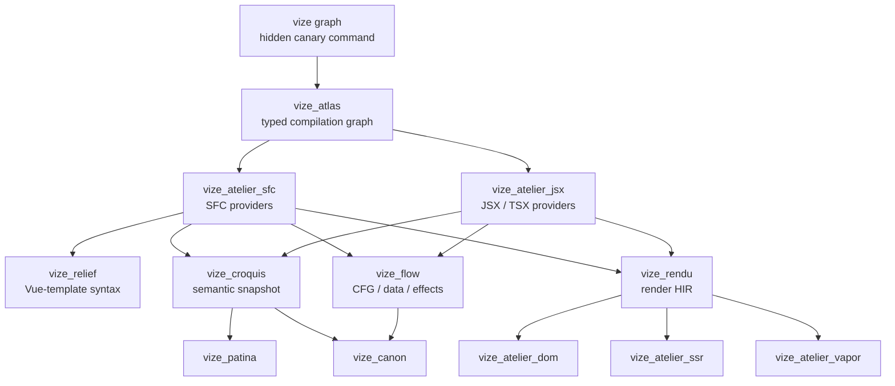
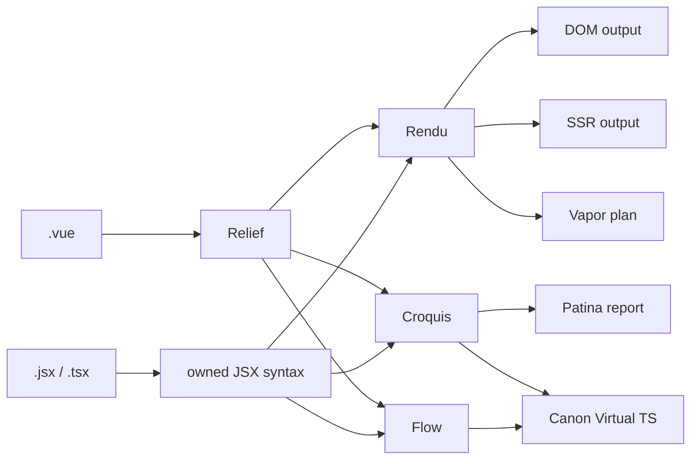

# Architecture Overview

> **⚠️ Work in Progress:** Vize is under active development and is not yet ready for production use. Internal architecture may change as the project evolves.

Vize is a modular Rust workspace where each crate owns one representation,
frontend, backend, or tool concern. A typed artifact graph composes those
pieces on demand instead of forcing every source through one fixed pipeline.

For the new multi-source / multi-target architecture, see the
[Atlas artifact graph](./source-atlas.md). That page is the design contract for
treating SFC blocks, templates, JSX/TSX, semantics, Flow, Rendu, Virtual TS,
DOM/VDOM, SSR, Vapor, linting, and typechecking as peer typed products.

## Canary Graph Relationship Map

The graph-native canary enters through the hidden `vize graph` command. Existing
`build`, `lint`, `check`, Vite, Nuxt, editor, NAPI, and WASM entry points remain
on their production paths until their incremental cutover.

This map shows the implemented canary provider graph, not every workspace call
edge. Atlas plans only the products reachable from these recipe roots and
caches common upstream work once.

## Lanes

### Stage Details

1. **Compilation / Atlas** — Owns source identity, typed inputs, provider
   selection, planning, cache/invalidation, outcomes, counters, and traces.
2. **Frontend products** — SFC decomposition, Vue-template syntax, and owned
   JSX/TSX syntax retain their source-specific facts.
3. **Relief** — Records authored Vue-template syntax and source locations. It
   does not assign symbol identity or own render decisions.
4. **Croquis** — Records derived semantic identity, scopes, bindings, usage,
   and reactivity. Relief and JSX providers can produce the same owned contract.
5. **Flow** — Owns single-file control/data/effect edges and graph analyses;
   it is not Croquis or cross-file aggregation.
6. **Rendu** — Owns indexed, frontend-neutral render HIR. It has no Relief,
   Croquis, SFC, JSX, or backend dependency.
7. **Graph-native Atelier providers** — Consume Rendu without parsing source:
   - **VDOM** (`vize_atelier_dom`) — `createVNode`/`h` calls with patch flag optimization and static hoisting
   - **Vapor** (`vize_atelier_vapor`) — Fine-grained reactive code with direct DOM manipulation (no VDOM)
   - **SSR** (`vize_atelier_ssr`) — String concatenation with hydration markers
8. **Tool products** — Patina diagnostics and Canon Virtual TS request the
   shared semantic product; they do not build Rendu unless another root needs it.

The backend crates also retain legacy frontend-coupled compilation entry points;
those paths are not represented by this graph and will be removed or migrated
incrementally. Within the canary, the executable contract is negative as well
as positive: TSX render/lint/type closures never construct Relief,
lint/typecheck closures never construct Rendu, and multi-root requests execute
shared upstream products once.

The broader design and measurements are documented in
[Atlas artifact graph](./source-atlas.md).

## Tool Lanes

Beyond compilation, Vize provides additional tools that reuse parsing and
analysis infrastructure. In the current canary, the graph-native Patina
semantic report and Canon Virtual TS recipe share Croquis, Flow, and Atlas
source identity without sharing one frontend parser AST. Maestro, Glyph,
editor integrations, and other production tool entry points have not yet been
migrated to Atlas recipes.

For type checking, `vize_canon` adds one more step: it generates virtual TypeScript from Vue SFCs and asks Corsa project sessions from [`corsa-bind`](https://github.com/ubugeeei/corsa-bind) for native diagnostics, then maps those results back onto the original files.

The implementation workflow is documented in
[Language Engineering Practices](./language-engineering-practices.md), which maps parser,
compiler, analyzer, type-checker, formatter, LSP, and release changes to the fixture, snapshot,
parity, benchmark, and readiness evidence expected for review.

## Crate Responsibilities

| Layer         | Crate                | Role                                                     |
| ------------- | -------------------- | -------------------------------------------------------- |
| Foundation    | `vize_carton`        | Shared utilities, arena allocator, string interning      |
| Coordination  | `vize_atlas`         | Typed product graph, provider planning, cache, snapshots |
| AST           | `vize_relief`        | AST node definitions, error types, compiler options      |
| Parsing       | `vize_armature`      | Tokenizer + recursive descent parser                     |
| Analysis      | `vize_croquis`       | Semantic analysis, scope tracking, binding detection     |
| Analysis      | `vize_croquis_cf`    | Opt-in cross-file semantic and dependency aggregation    |
| Render        | `vize_rendu`         | Owned, indexed, frontend-neutral render HIR              |
| Compilation   | `vize_atelier_core`  | Shared transform lane, codegen utilities, source maps    |
| Compilation   | `vize_atelier_dom`   | VDOM code generation                                     |
| Compilation   | `vize_atelier_vapor` | Vapor mode code generation                               |
| Compilation   | `vize_atelier_sfc`   | SFC orchestration (script + template + style + HMR)      |
| Compilation   | `vize_atelier_ssr`   | Server-side rendering compilation                        |
| Bindings      | `vize_vitrine`       | Node.js (NAPI) + WASM bindings                           |
| CLI           | `vize`               | Command-line interface (clap + rayon)                    |
| Type Checking | `vize_canon`         | Native TypeScript and Vue diagnostics via `corsa-bind`   |
| Linting       | `vize_patina`        | Vue.js linter with i18n (en/ja/zh)                       |
| Formatting    | `vize_glyph`         | Vue.js formatter (template + script + style)             |
| LSP           | `vize_maestro`       | Language Server Protocol (tower-lsp)                     |
| Musea         | `vize_musea`         | Art parsing, docs, palette, autogen, and VRT core        |
| TUI           | `vize_fresco`        | Terminal UI framework (crossterm + taffy)                |

The gallery UI and dev-server integration for Musea live in the JavaScript package
`@vizejs/vite-plugin-musea`; the Rust crate focuses on the parsing and generation core.

## Naming Convention

Vize crates are named after **art and sculpture terminology**, reflecting how each component shapes and transforms Vue code. This naming system is more than aesthetic — it encodes the role and relationships between crates. See [Philosophy](../philosophy.md) for the full rationale.

| Name                | Origin       | Art Analogy                                                     | Technical Role                                                                 |
| ------------------- | ------------ | --------------------------------------------------------------- | ------------------------------------------------------------------------------ |
| **Carton**          | /kɑːˈtɒn/    | Artist's portfolio case — stores and organizes tools            | Shared utilities — the foundational toolbox that every crate depends on        |
| **Relief**          | /rɪˈliːf/    | Sculptural technique that projects from a flat surface          | The AST — a structured surface that gives shape to raw source code             |
| **Armature**        | /ˈɑːrmətʃər/ | Internal skeleton supporting a sculpture                        | The parser — the structural framework that supports the AST                    |
| **Croquis**         | /kʁɔ.ki/     | Quick gestural sketch capturing the essence of a subject        | Semantic analysis — a quick sketch that captures the meaning of code           |
| **Rendu**           | /ʁɑ̃.dy/      | Rendered appearance or final treatment of a work                | Internal render semantics before a target compiler finishes the output         |
| **Atelier**         | /ˌætəlˈjeɪ/  | Artist's workshop where creation happens                        | Compiler workspaces — where code is transformed into its final form            |
| **AtelierOutput**   | —            | The arranged work before it leaves the workshop                 | Structured compiler output before flattening to JavaScript                     |
| **AtelierProfile**  | —            | Studio notes made while the work is in progress                 | Cheap compiler observations surfaced through profile reports                   |
| **AtelierFallback** | —            | A change of workshop when the preferred treatment cannot finish | Recorded reason for using a fallback compiler path                             |
| **Vitrine**         | /vɪˈtriːn/   | Glass display case in a museum                                  | Bindings — a transparent layer that exposes the compiler to external consumers |
| **Canon**           | /ˈkænən/     | Standard of ideal proportions in classical sculpture            | Type checker — ensures code conforms to the standard of correctness            |
| **Patina**          | /ˈpætɪnə/    | Aged surface finish that indicates quality and care             | Linter — polishes code by identifying problems that affect quality             |
| **Glyph**           | /ɡlɪf/       | Carved symbol or letterform with precise proportions            | Formatter — shapes code into consistent, readable letterforms                  |
| **Maestro**         | /ˈmaɪstroʊ/  | Master conductor who orchestrates an ensemble                   | LSP — orchestrates all language features into a unified editor experience      |
| **Musea**           | /mjuːˈziːə/  | Plural of museum — a space for exhibiting art                   | Component gallery — a space for exhibiting and exploring components            |
| **Fresco**          | /ˈfrɛskoʊ/   | Painting technique applied to wet plaster walls                 | TUI framework — painting interfaces onto the terminal surface                  |

### Why Art Terminology?

The analogy between software compilation and artistic creation is surprisingly deep:

- A **parser** (Armature) provides the internal skeleton — the structure that everything else builds upon, just as a sculptor's armature supports the clay
- **Semantic analysis** (Croquis) is like a quick sketch — it captures the essential meaning without committing to a final form
- The **compiler** (Atelier) is a workshop where raw material is transformed into a finished work
- The **AST** (Relief) is a projection — it gives three-dimensional structure to what was originally flat text
- **Bindings** (Vitrine) are a glass display case — they let you see and interact with the work inside without directly touching it
- The **linter** (Patina) examines the surface finish — finding imperfections that affect the overall quality
- The **formatter** (Glyph) ensures consistent proportions — like a typographer carving letterforms with precise spacing

This naming convention makes the crate hierarchy intuitive: when you see `vize_atelier_dom`, you immediately understand it is a _workshop_ that produces _VDOM output_.

## External Dependencies

Vize integrates with the broader Rust ecosystem for specialized tasks:

| Dependency                                               | Purpose                                            | Used By                                     |
| -------------------------------------------------------- | -------------------------------------------------- | ------------------------------------------- |
| [OXC](https://oxc.rs/)                                   | JavaScript/TypeScript AST parsing                  | `vize_croquis`, `vize_atelier_core`         |
| [Rayon](https://docs.rs/rayon)                           | Data-parallel multi-threading                      | `vize`, `vize_vitrine`                      |
| [bumpalo](https://docs.rs/bumpalo)                       | Arena allocation for AST nodes                     | `vize_carton`                               |
| [LightningCSS](https://lightningcss.dev/)                | CSS parsing and transformation                     | `vize_atelier_sfc`                          |
| [`corsa-bind`](https://github.com/ubugeeei/corsa-bind)   | Native TypeScript project sessions and diagnostics | `vize_canon`, `vize_maestro`, `vize_patina` |
| [tower-lsp](https://docs.rs/tower-lsp)                   | LSP server framework                               | `vize_maestro`                              |
| [clap](https://docs.rs/clap)                             | CLI argument parsing                               | `vize`                                      |
| [wasm-bindgen](https://rustwasm.github.io/wasm-bindgen/) | WASM-JavaScript interop                            | `vize_vitrine`                              |
| [napi-rs](https://napi.rs/)                              | Node.js native addon bindings                      | `vize_vitrine`                              |
