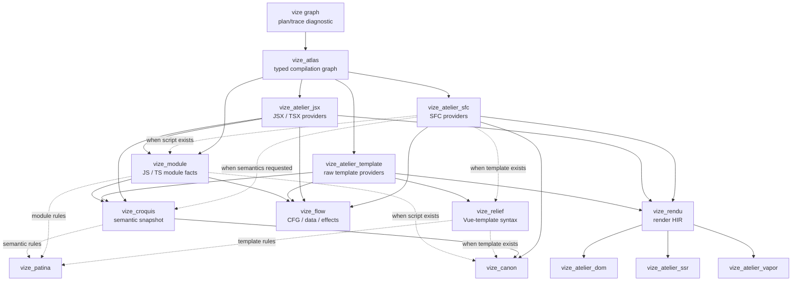
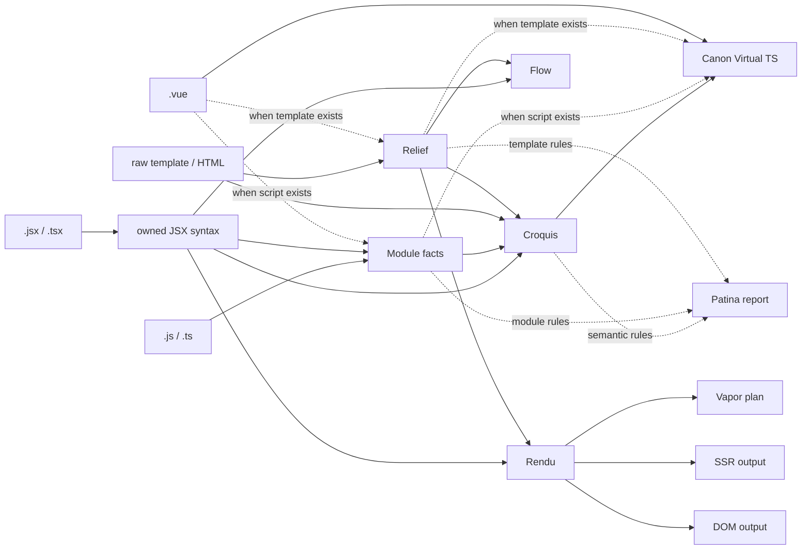

# Architecture Overview

> **⚠️ Work in Progress:** Vize is under active development and is not yet ready for production use. Internal architecture may change as the project evolves.

Vize is a modular Rust workspace where each crate owns one representation,
frontend, backend, or tool concern. A typed artifact graph composes those
pieces on demand instead of forcing every source through one fixed pipeline.

For the multi-source / multi-target architecture, see the
[Atlas artifact graph](./source-atlas.md). That page is the design contract for
composing SFC blocks, raw templates, JS/TS, JSX/TSX, semantics, Flow, Rendu,
Virtual TS, DOM/VDOM, SSR, Vapor, linting, and typechecking as independently
owned typed products. Atlas executes those products; it is not their universal
IR.

## Artifact Graph Relationship Map

The hidden `vize graph` command exposes the plan and trace, while `build`,
`lint`, `check`, Vite, Nuxt, editor, NAPI, and WASM entry points request the
same typed products through their production recipes.

This map shows available canary provider edges, not a fixed pipeline or every
workspace call edge. Atlas selects dependencies from the source shape and root,
plans only the reachable products, and caches common upstream work once for the
same source revision, provider-registry revision, and relevant-input revision.
Canon does not fabricate a Flow dependency.

## Lanes

These lanes are composable. For example, a raw-template lint root requests
Relief and Croquis, an SFC script is projected to Module facts, and a
script-only SFC never enters the Relief/Rendu lane.

### Stage Details

1. **Compilation / Atlas** — Owns source identity, typed inputs, provider
   selection, planning, cache/invalidation, outcomes, counters, and traces.
2. **Frontend products** — SFC decomposition, Vue-template syntax, owned
   JSX/TSX syntax, and parser-lifetime-free JS/TS Module facts retain their
   source-specific contracts. Each authored SFC script block is parsed once per
   source revision; its live OXC program supplies Module, Croquis, and compiler
   preanalysis projections before the allocator is dropped.
3. **Relief** — Records authored Vue-template syntax and source locations. It
   does not assign symbol identity or own render decisions.
4. **Croquis** — Records derived semantic identity, scopes, bindings, usage,
   and reactivity. SFC, raw-template, and JSX providers can produce the same
   owned document contract from their own frontend products.
5. **Flow** — Owns single-file control/data/effect edges and graph analyses;
   it is not Croquis or cross-file aggregation.
6. **Rendu** — Owns indexed, frontend-neutral render HIR. It has no Relief,
   Croquis, SFC, JSX, or backend dependency.
7. **Graph-native Atelier providers** — Consume Rendu without parsing source:
   - **VDOM** (`vize_atelier_dom`) — `createVNode`/`h` calls with patch flag optimization and static hoisting
   - **Vapor** (`vize_atelier_vapor`) — Fine-grained reactive code with direct DOM manipulation (no VDOM)
   - **SSR** (`vize_atelier_ssr`) — String concatenation with hydration markers
8. **Tool products** — Patina and Canon request source-shaped closures. SFC
   Canon always uses the descriptor and Croquis, adds Relief only for a
   template and Module only for a script, and never fabricates Flow. Raw
   template Patina uses Relief and Croquis. Neither tool builds Rendu unless a
   separate root needs it.

The backend crates retain legacy frontend-coupled entry points only for public
compatibility; production recipes do not invoke them. The executable contract
is negative as well as positive: TSX render/lint/type closures never construct Relief,
lint/typecheck closures never construct Rendu, and multi-root requests execute
shared upstream products once for the same source revision, provider-registry
revision, and relevant-input revision.

The broader design and measurements are documented in
[Atlas artifact graph](./source-atlas.md).

## Tool Lanes

Beyond compilation, Vize provides additional tools that reuse parsing and
analysis infrastructure. Patina and Canon share Atlas source identity and the
specific syntax, Module, or Croquis products their source shape requires. Flow
remains independently demandable. Maestro keeps one mutable, URI-keyed
`Compilation` alive across document revisions and queries it directly. Open
documents and file-backed Vue dependencies are registered in that same
compilation, so each URI retains a stable `SourceId` while its content revision
changes. For normal `.vue` production requests, Maestro queries
`CanonVueDocumentProduct` for the host and non-Art Vue dependencies, then supplies those
already-generated documents to Corsa as prebuilt host and dependency overlays.
Corsa synchronization does not create a private `Compilation` or reparse those
SFCs. Art/Musea virtual-document paths remain specialized and are not covered by
this normal-Vue guarantee. Maestro also queries `GlyphFormatProduct` from the
same compilation for editor formatting. Its raw-template features share Relief
and Croquis, while SFC features can also share Module. Inspector has its own
`InspectorAgentReport` root over per-source analysis products rather than
borrowing the build root or reparsing imports.

Vitrine exposes separate Atlas roots for SFC/JSX compilation, raw-template
compilation, Patina, Canon, and cross-file analysis through NAPI or WASM as each
binding surface supports them. Vite, Nuxt, unplugin, and Rspack packages are
hosts over the compile bindings; they do not define graph products themselves.

Outside Maestro, `vize check` builds its own project-scoped Canon snapshot and
Corsa session. It does not inherit the editor compilation lifetime.

The implementation workflow is documented in
[Language Engineering Practices](./language-engineering-practices.md), which maps parser,
compiler, analyzer, type-checker, formatter, LSP, and release changes to the fixture, snapshot,
parity, benchmark, and readiness evidence expected for review.

## Crate Responsibilities

| Layer         | Crate                   | Role                                                          |
| ------------- | ----------------------- | ------------------------------------------------------------- |
| Foundation    | `vize_carton`           | Shared utilities, arena allocator, string interning           |
| Coordination  | `vize_atlas`            | Typed product graph, provider planning, cache, snapshots      |
| Syntax        | `vize_relief`           | Authored Vue-template nodes, locations, errors, and options   |
| Parsing       | `vize_armature`         | Vue-template tokenizer + recursive descent parser             |
| Analysis      | `vize_croquis`          | Semantic analysis, scope tracking, binding detection          |
| Analysis      | `vize_croquis_cf`       | Lightweight project index and full opt-in cross-file analysis |
| Analysis      | `vize_flow`             | Single-file control, data, and effect graphs                  |
| Analysis      | `vize_module`           | Owned JS/TS module facts and OXC CFG projection               |
| Render        | `vize_rendu`            | Owned, indexed, frontend-neutral render HIR                   |
| Compilation   | `vize_atelier_core`     | Legacy Vue-template transform/codegen IR and compatibility    |
| Compilation   | `vize_atelier_dom`      | VDOM code generation                                          |
| Compilation   | `vize_atelier_vapor`    | Vapor mode code generation                                    |
| Compilation   | `vize_atelier_template` | Raw Vue-template frontend and target root                     |
| Compilation   | `vize_atelier_sfc`      | SFC orchestration (script + template + style + HMR)           |
| Compilation   | `vize_atelier_ssr`      | Server-side rendering compilation                             |
| Bindings      | `vize_vitrine`          | Node.js (NAPI) + WASM bindings                                |
| CLI           | `vize`                  | Command-line interface (clap + rayon)                         |
| Type Checking | `vize_canon`            | Native TypeScript and Vue diagnostics via `corsa-bind`        |
| Linting       | `vize_patina`           | Vue.js linter with i18n (en/ja/zh)                            |
| Formatting    | `vize_glyph`            | Vue.js formatter (template + script + style)                  |
| LSP           | `vize_maestro`          | Language Server Protocol (tower-lsp)                          |
| Musea         | `vize_musea`            | Art parsing, docs, palette, autogen, and VRT core             |
| TUI           | `vize_fresco`           | Terminal UI framework (crossterm + taffy)                     |

The gallery UI and dev-server integration for Musea live in the JavaScript package
`@vizejs/vite-plugin-musea`; the Rust crate focuses on the parsing and generation core.

## Naming Convention

Vize crates are named after **art and sculpture terminology**, reflecting how each component shapes and transforms Vue code. This naming system is more than aesthetic — it encodes the role and relationships between crates. See [Philosophy](../philosophy.md) for the full rationale.

| Name                | Origin       | Art Analogy                                                     | Technical Role                                                                 |
| ------------------- | ------------ | --------------------------------------------------------------- | ------------------------------------------------------------------------------ |
| **Carton**          | /kɑːˈtɒn/    | Artist's portfolio case — stores and organizes tools            | Shared utilities — the foundational toolbox that every crate depends on        |
| **Relief**          | /rɪˈliːf/    | Sculptural technique that projects from a flat surface          | Authored Vue-template syntax and exact locations                               |
| **Armature**        | /ˈɑːrmətʃər/ | Internal skeleton supporting a sculpture                        | The Vue-template parser                                                        |
| **Croquis**         | /kʁɔ.ki/     | Quick gestural sketch capturing the essence of a subject        | Derived identity, scopes, bindings, usage, and reactivity                      |
| **Rendu**           | /ʁɑ̃.dy/      | Rendered appearance or final treatment of a work                | Internal render semantics before a target compiler finishes the output         |
| **Atelier**         | /ˌætəlˈjeɪ/  | Artist's workshop where creation happens                        | Compiler workspaces — where code is transformed into its final form            |
| **AtelierOutput**   | —            | The arranged work before it leaves the workshop                 | Structured compiler output before flattening to JavaScript                     |
| **AtelierProfile**  | —            | Studio notes made while the work is in progress                 | Cheap compiler observations surfaced through profile reports                   |
| **AtelierFallback** | —            | A change of workshop when the preferred treatment cannot finish | Recorded reason for using a fallback compiler path                             |
| **Vitrine**         | /vɪˈtriːn/   | Glass display case in a museum                                  | Bindings — a transparent layer that exposes the compiler to external consumers |
| **Canon**           | /ˈkænən/     | Standard of ideal proportions in classical sculpture            | Type checker — ensures code conforms to the standard of correctness            |
| **Patina**          | /ˈpætɪnə/    | Aged surface finish that indicates quality and care             | Linter — polishes code by identifying problems that affect quality             |
| **Glyph**           | /ɡlɪf/       | Carved symbol or letterform with precise proportions            | Formatter — shapes code into consistent, readable letterforms                  |
| **Maestro**         | /ˈmaɪstroʊ/  | Master conductor who orchestrates an ensemble                   | LSP — orchestrates all language features into a unified editor experience      |
| **Musea**           | /mjuːˈziːə/  | Plural of museum — a space for exhibiting art                   | Component gallery — a space for exhibiting and exploring components            |
| **Fresco**          | /ˈfrɛskoʊ/   | Painting technique applied to wet plaster walls                 | TUI framework — painting interfaces onto the terminal surface                  |

### Why Art Terminology?

The analogy between software compilation and artistic creation is surprisingly deep:

- A Vue-template **parser** (Armature) provides the structural skeleton for Relief without owning SFC or JS/TS parsing
- **Semantic analysis** (Croquis) is like a quick sketch — it captures derived meaning without replacing authored syntax or Module facts
- The **compiler** (Atelier) is a workshop where raw material is transformed into a finished work
- **Relief** is a projection — it preserves the authored Vue-template surface and locations
- **Bindings** (Vitrine) are a glass display case — they let you see and interact with the work inside without directly touching it
- The **linter** (Patina) examines the surface finish — finding imperfections that affect the overall quality
- The **formatter** (Glyph) ensures consistent proportions — like a typographer carving letterforms with precise spacing

This naming convention makes the crate hierarchy intuitive: when you see `vize_atelier_dom`, you immediately understand it is a _workshop_ that produces _VDOM output_.

## External Dependencies

Vize integrates with the broader Rust ecosystem for specialized tasks:

| Dependency                                               | Purpose                                            | Used By                                     |
| -------------------------------------------------------- | -------------------------------------------------- | ------------------------------------------- |
| [OXC](https://oxc.rs/)                                   | JavaScript/TypeScript AST parsing and CFG          | `vize_module`, SFC and JSX frontends        |
| [Rayon](https://docs.rs/rayon)                           | Data-parallel multi-threading                      | `vize`, `vize_vitrine`                      |
| [bumpalo](https://docs.rs/bumpalo)                       | Arena allocation for AST nodes                     | `vize_carton`                               |
| [LightningCSS](https://lightningcss.dev/)                | CSS parsing and transformation                     | `vize_atelier_sfc`                          |
| [`corsa-bind`](https://github.com/ubugeeei/corsa-bind)   | Native TypeScript project sessions and diagnostics | `vize_canon`, `vize_maestro`, `vize_patina` |
| [tower-lsp](https://docs.rs/tower-lsp)                   | LSP server framework                               | `vize_maestro`                              |
| [clap](https://docs.rs/clap)                             | CLI argument parsing                               | `vize`                                      |
| [wasm-bindgen](https://rustwasm.github.io/wasm-bindgen/) | WASM-JavaScript interop                            | `vize_vitrine`                              |
| [napi-rs](https://napi.rs/)                              | Node.js native addon bindings                      | `vize_vitrine`                              |
