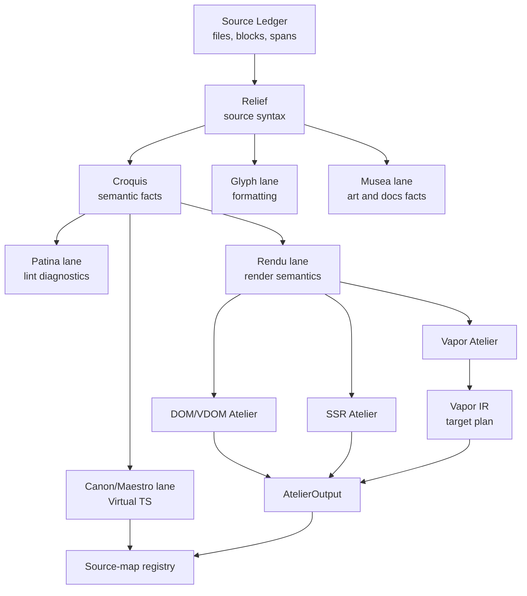
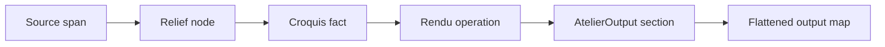

# Source Atlas

The source atlas is the target architecture for Vize as a toolchain, not only as
a compiler. It names the shared plates that let the compiler, linter,
typechecker, language server, formatter, inspector, playground, bundler
plugins, and source-map machinery agree on one source ledger without forcing
every path through one expensive transform pipeline.

The goal is to keep Vize shaped like a studio:

- `Armature` keeps the source ledger: files, blocks, spans, parser events, and
  source-map registration marks.
- `Relief` keeps the source-faithful syntax surface.
- `Croquis` keeps semantic studies that tools can reuse: scopes, bindings,
  components, directives, CSS variables, dialect facts, and dependency edges.
- `Virtual TS` is a projection for Canon, Maestro, and editor interop.
- `Rendu` is the render-semantic plate for DOM, SSR, Vapor, and related
  Ateliers.
- `AtelierOutput` is the structured output plate before JavaScript is flattened.
- `Vitrine` displays stable public payloads without exposing unstable internal
  plates too early.

This page is the review contract for issues
[#1634](https://github.com/ubugeeei-prod/vize/issues/1634) and
[#1601](https://github.com/ubugeeei-prod/vize/issues/1601).

The canary implementation backlog is split into reviewable plates:

| Track                 | Issue                                                                                                                  | Role                                                               |
| --------------------- | ---------------------------------------------------------------------------------------------------------------------- | ------------------------------------------------------------------ |
| Source plate registry | [#1692](https://github.com/ubugeeei-prod/vize/issues/1692)                                                             | Name the atlas ledger, plate requests, and source coordinates.     |
| Profile facts         | [#1693](https://github.com/ubugeeei-prod/vize/issues/1693)                                                             | Measure requested plates without building unrequested ones.        |
| Fallback facts        | [#1694](https://github.com/ubugeeei-prod/vize/issues/1694)                                                             | Explain why a lane used a legacy or reduced projection.            |
| Rendu                 | [#1695](https://github.com/ubugeeei-prod/vize/issues/1695)                                                             | Add the private render-semantic plate.                             |
| Source maps           | [#1696](https://github.com/ubugeeei-prod/vize/issues/1696)                                                             | Compose maps from registered output sections.                      |
| Inclusion Vapor       | [#1697](https://github.com/ubugeeei-prod/vize/issues/1697)                                                             | Lower Vapor from shared Rendu capability facts.                    |
| Version coordinate    | [#1698](https://github.com/ubugeeei-prod/vize/issues/1698)                                                             | Treat v0/v1/v2/v2.7/v3/Vapor compatibility as atlas facts.         |
| JSX/TSX reuse         | [#1579](https://github.com/ubugeeei-prod/vize/issues/1579), [#1580](https://github.com/ubugeeei-prod/vize/issues/1580) | Reuse Croquis and target SSR without duplicating render semantics. |

Current `canary` state:

- `SourceAtlasRoute` names the multi-source, multi-target request surface, and
  `SourceAtlasRegistry` attaches that route to a product lane such as compiler,
  typecheck, or source-map registration:
  sources such as SFC, template, script, style, JS, TS, JSX, and TSX can be
  paired with targets such as SFC, DOM/VDOM, SSR, Vapor, Virtual TS,
  diagnostics, source maps, and Vitrine. Build profile facts now record through
  the compiler registry while preserving the existing 0/1 samples for legacy
  SFC profile reports.
- `RenduRoot`, `RenduBlock`, `RenduOp`, and `RenduExprRef` provide the first
  borrowed render-semantic plate. `walk_rendu_ops` can stream transformed Relief
  trees as Rendu operations without allocating a persistent render IR, while
  `RenduPlate` keeps the structured output chunks and section ranges already
  emitted by the Ateliers.
- `TemplateBlockCompileResult` now owns the section-first extraction API used by
  SFC inline assembly. DOM script-setup assembly slices
  `AtelierOutputSections`; SSR and Vapor inline assembly slice
  `AtelierModuleSections`. Missing sections are internal compiler errors, not a
  compatibility path that scans generated JavaScript.
- Vapor's SFC adapter now registers module sections for imports, template
  declarations, and the render function. This keeps Vapor's target-specific IR
  intact while still letting the shared SFC assembly layer avoid rescanning
  flattened JavaScript.
- `SourceMapRegistration` records template map fragments as source-map
  registration marks with generated Rendu ranges, section identity, and
  composition state. `TemplateBlockCompileResult` exposes this as a borrowed
  registration view. Full SFC map composition remains a separate plate, but
  skipped composition is now observable through the `SourceMap` registry lane
  instead of implicit.
- Follow-up tracks #1692-#1698 build on this foundation without new hot-path
  cost: `PlateFamily`/`PlateFamilySet` keep lint/editor lanes render-free;
  `SourceAtlasCoordinate::compatibility_fallback` reports pre-v3 lines as
  `LegacySyntaxCompatibility`; `RenduCapability` / `vapor_route_fallback` let the
  Vapor lane consume shared facts and record `UnsupportedVaporShape`;
  fragment-less source maps report `SourceMapFragmentUnavailable`; and
  `render_fallback_report` / `render_registry_report` make fallbacks and plate
  requests explainable.

## Why An Atlas

Vize currently has a practical but uncomfortable pressure: several tools want
to share information, so lowering into a convenient AST-like form can become a
catch-all destination. That makes reuse possible, but the grain is wrong. A lint
rule, a typechecker projection, a Vapor compile, and a source-map pass do not
need the same product, and they should not all pay for each other's work.

The atlas model replaces "one pipeline that every tool must finish" with
"registered plates that a tool may request." A request should be cheap by
default, borrowed or arena-backed when possible, and measurable when it is not.

The rustc lesson is that each intermediate representation should have one job:
AST/HIR/THIR/MIR are separate because they serve different analyses and codegen
needs. Vize should keep the same discipline without copying MIR literally. The
V8 lesson is to start cheap, observe, then specialize. Vize should not build
Rendu, Virtual TS, source maps, or heavy profile facts unless the selected lane
needs them.

## Plate Families

| Family     | Plates                                                                                              | Owners                                    | Normal cost rule                                                 |
| ---------- | --------------------------------------------------------------------------------------------------- | ----------------------------------------- | ---------------------------------------------------------------- |
| Source     | files, SFC blocks, template, script, setup, style, custom block, JSX/TSX, standalone HTML           | Armature, Vitrine, bundler packages       | Always cheap enough to identify and span-map                     |
| Syntax     | Relief templates, OXC AST refs, CSS AST refs, parser diagnostics                                    | Armature, Relief, OXC, Lightning CSS      | Borrowed or arena-backed; no duplicate parsing                   |
| Semantic   | Croquis bindings, scopes, components, directives, CSS vars, dependency edges, dialect/version facts | Croquis, Patina, Canon, Maestro, Ateliers | Demandable by tools; reusable across lanes                       |
| Projection | Virtual TS, lint facade, editor facts, Musea art facts, inspector views                             | Canon, Maestro, Patina, Musea, Playground | Built only for the requesting surface                            |
| Render     | Rendu roots, blocks, operations, expression refs, capability facts                                  | Atelier core, DOM, SSR, Vapor, JSX/TSX    | Built only for render lanes                                      |
| Target     | DOM/VDOM, SSR, Vapor, inclusion Vapor, JSX/TSX emit, diagnostics, source maps                       | Ateliers, Vitrine packages                | Target-specific work stays in its Atelier                        |
| Finish     | AtelierOutput, diagnostics, maps, profile artifacts, Vitrine payloads                               | SFC, Vitrine, packages, CLI               | Structured before flattening; no string rescans when data exists |

## Version Coordinate

Every plate can carry a version coordinate when it matters. Vize should resolve
Vue-era compatibility once near the source and semantic layers, then let tools
consume the same capability facts.

| Coordinate | Meaning                                                       | Typical consumers                                           |
| ---------- | ------------------------------------------------------------- | ----------------------------------------------------------- |
| `v0`       | Vue 0.x era, including 0.10 and 0.11 distinctions when needed | parser recovery, migration diagnostics, compatibility docs  |
| `v1`       | Vue 1 era syntax and runtime expectations                     | parser recovery, lint compatibility, migration diagnostics  |
| `v2`       | Vue 2 syntax and runtime expectations                         | Armature, Relief, Croquis, Patina, Canon, SSR, DOM          |
| `v2.7`     | Vue 2.7 Composition API bridge behavior                       | Croquis, Virtual TS, linter, editor features                |
| `v3`       | Modern Vue 3 behavior                                         | all current compiler, linter, typechecker, and editor lanes |
| `vapor`    | Vapor target capability layer, not a Vue version by itself    | Rendu, Vapor Atelier, fallback reporting                    |

The version coordinate is a capability fact, not a new global mode that every
crate rediscovers. If Patina, Canon, Maestro, and the Ateliers disagree about a
dialect, that is an atlas bug. The implementation track is
[#1698](https://github.com/ubugeeei-prod/vize/issues/1698).

## Demand-Shaped Lanes

The atlas keeps the common source ledger but lets each product request only what
it needs.

The important property is negative as much as positive:

- lint-only runs do not build Rendu;
- format-only runs do not build Croquis unless a formatter feature needs it;
- typecheck runs request Virtual TS and diagnostic mappings, not render output;
- compile runs reuse Croquis and build Rendu only for targets that need render
  semantics;
- source-map-heavy runs are explicit and profileable;
- inspector/debug output is a requested view, not normal-path work.

## Rendu

`Rendu` is the render-semantic plate. It is not the whole toolchain IR. The
implementation track is
[#1695](https://github.com/ubugeeei-prod/vize/issues/1695).

`Rendu` should initially be structured, not a rustc-style control-flow graph.
Vue render output is dominated by elements, components, slots, directives,
fragments, branches, loops, hoists, props, events, text, and HTML. A structured
form is a better first fit than basic blocks. A CFG can still appear later if a
real optimization needs it.

The initial vocabulary should stay small:

- `RenduRoot<'a>`: a render entry with source, operation block, and capability
  facts.
- `RenduBlock<'a>`: an ordered render block.
- `RenduOp<'a>`: element, component, text, comment, interpolation, HTML, prop,
  event, directive, slot outlet, `if`, `for`, fragment, or hoist reference.
- `RenduExprRef<'a>`: borrowed expression material from Relief, OXC, or Croquis.
- `RenduCapabilities`: target facts for DOM, SSR, Vapor, custom renderers, and
  versioned syntax support.
- `walk_rendu_ops`: allocation-free traversal for lanes that need render
  semantics before a persistent arena plate is justified.

Vapor should keep its dedicated IR where it earns its keep. The clean route is
`Rendu -> Vapor IR -> Vapor output`, not deleting Vapor's target-specific plan.

## AtelierOutput

`AtelierOutput` is the finishing plate before generated JavaScript becomes a
flat string. It should carry:

- imports;
- helper preambles;
- hoists;
- render functions;
- exports;
- styles and custom block artifacts when owned by SFC assembly;
- output sections with byte ranges;
- source-map fragments;
- fallback and profile marks.

The purpose is to avoid recovering known structure by scanning generated code.
New code must register sections and map fragments while emitting.

The canary rule is now executable in SFC inline assembly:

- DOM inline mode uses fine render sections for imports, hoists, asset preamble
  statements, and the returned expression.
- SSR inline mode uses module sections for imports, hoists, and the full
  `ssrRender` function.
- Vapor inline mode uses module sections emitted by the SFC Vapor adapter for
  imports, template declarations, and the full `render` function.
- If a future output does not provide these sections, inline SFC assembly
  returns `TEMPLATE_SECTION_ERROR` instead of recovering by generated-code
  scanning.

## Source Maps

Source maps are registration marks between plates. The implementation track is
[#1696](https://github.com/ubugeeei-prod/vize/issues/1696).

The invariant is that a map fragment should be carried as long as the bridge is
still correct. If a later stage changes line offsets or concatenates sections
without composition, Vize must either compose the map or record why the map was
omitted.

Required registration facts:

- source file and block identity;
- original span;
- generated section identity;
- generated byte/line range;
- map fragment availability;
- composition or omission reason.

The first canary registration is intentionally narrow: template map fragments
are registered as `SourceMapRegistration` values covering the generated render
function range through `TemplateBlockCompileResult`. Composed template-only maps
and deferred script/template maps share the same registration mark, so Vize can
later compose SFC maps without rescanning generated JavaScript.

Source-map work is allowed to cost more only when `sourceMap` or an explicit
debug/profile lane requests it. The normal compiler and linter paths must remain
benchmark-neutral.

## Feedback And Fallbacks

`AtelierProfile` and `AtelierFallback` are the observation layer for the atlas.
They should be cheap enough to record from facts already computed by the active
lane. The implementation tracks are
[#1693](https://github.com/ubugeeei-prod/vize/issues/1693) and
[#1694](https://github.com/ubugeeei-prod/vize/issues/1694).

Profile facts should cover:

- source bytes and block layout;
- requested plates;
- dialect/version coordinate;
- Relief parse/lowering cost when measured;
- Croquis fact collection and cache reuse;
- Virtual TS projection cost;
- Rendu lowering cost;
- target Atelier emit cost;
- source-map segment and fragment counts;
- final output byte count;
- cache hit, miss, and bypass reasons.

Fallback facts should cover:

- source-map fragment unavailable;
- map composition skipped;
- Virtual TS projection skipped;
- unsupported Vapor shape;
- SSR/Vapor capability mismatch;
- custom renderer capability mismatch;
- legacy syntax compatibility fallback;
- cache bypass.

Fallback names should stay Vize-native. Use `AtelierFallback`, not deopt, even
when the engineering idea is inspired by V8.

## Performance Guardrails

Compiler and linter performance regressions are blockers.

- A new plate must remove duplicate work or unlock a proven product, not add an
  elegant extra pass on top of the old path.
- New structures should borrow from source, Relief, OXC, CSS, or Croquis data by
  default.
- Owned cloning on hot paths needs benchmark evidence.
- Patina should not pay for Rendu unless a rule explicitly requests render
  semantics.
- Virtual TS should be built for typecheck/editor lanes, not compiler-only lanes.
- Source-map finalization should be measured separately from basic compilation.
- Debug dumps and inspector views stay off the normal path.
- Every implementation slice must pass the PR benchmark budget and the relevant
  compiler/linter checks in GitHub Actions.

## Implementation Order

The issue-backed tracks above are the implementation order. Each slice must
preserve byte-equivalent output and pass benchmark gates before another risky
plate is stacked.

## Review Rules

- Research/design changes live in docs and issues.
- Implementation changes land as small conventional commits on `canary`.
- PR titles stay conventional.
- No broad snapshot churn without a tight explanation.
- Source-map behavior needs focused tests for omission, fragment preservation,
  and composition.
- Performance-sensitive changes wait for Actions benchmarks before another risky
  slice is stacked.

## References

- [rustc overview](https://rustc-dev-guide.rust-lang.org/overview.html)
- [rustc MIR guide](https://rustc-dev-guide.rust-lang.org/mir/index.html)
- [rustc query system](https://rustc-dev-guide.rust-lang.org/query.html)
- [rustc compiletest](https://rustc-dev-guide.rust-lang.org/tests/compiletest.html)
- [Rust compiler proposal process](https://forge.rust-lang.org/compiler/proposals-and-stabilization.html)
- [v8pedia pipeline overview](https://github.com/ubugeeei/v8pedia/blob/main/content/pipeline/overview.md)
- [v8pedia feedback and tiering](https://github.com/ubugeeei/v8pedia/blob/main/content/pipeline/feedback.md)
- [v8pedia parser notes](https://github.com/ubugeeei/v8pedia/blob/main/content/frontend/parser.md)
- [v8pedia Maglev notes](https://github.com/ubugeeei/v8pedia/blob/main/content/pipeline/maglev.md)
