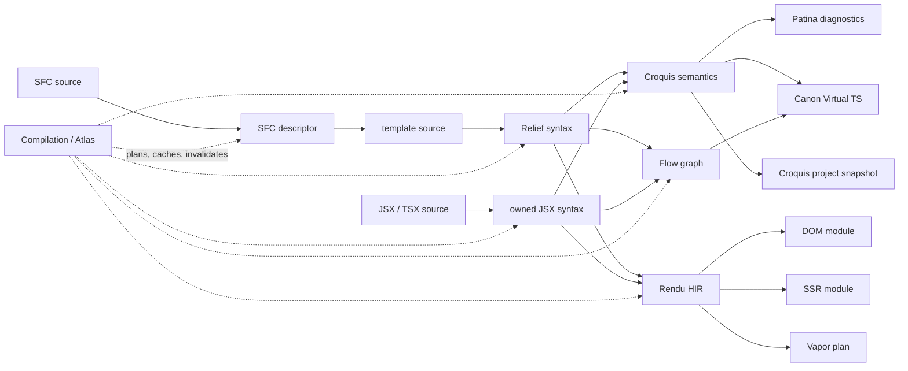

# Atlas artifact graph

Atlas is Vize's typed, demand-driven execution substrate. It is not a registry
of compiler nouns and it is not a Relief-to-Croquis pipeline.

A compilation owns stable source identities, revisions, open products and
providers, dependency planning, memoized artifacts, selective invalidation,
provider-attributed observations, execution outcomes, counters, and traces.
In the target model, compilers, linters, typecheckers, language-server
features, formatters, inspectors, and bundler adapters are recipes that request
root products from the same compilation. The current canary executes compiler,
semantic-lint, and semantic-typecheck roots this way; the other consumers and
production commands have not been cut over yet.

“Zero cost” in this design describes compiler operation:

- a provider outside the requested dependency closure is not planned or run;
- an unrequested product creates no persistent cache entry;
- two roots share each common dependency execution;
- a source or typed input change evicts only affected products and transitive
  consumers.

It does not claim that generated JavaScript has zero runtime cost.

This page is the implementation contract for
[#1634](https://github.com/ubugeeei-prod/vize/issues/1634).

## One graph, several representations

Atlas is not a universal IR. The representations are peer products with
different jobs:

| Product                        | Owner                 | One job                                                                                   |
| ------------------------------ | --------------------- | ----------------------------------------------------------------------------------------- |
| SFC descriptor/template source | `vize_atelier_sfc`    | Decompose a container and retain parent ranges.                                           |
| JSX/TSX syntax snapshot        | `vize_atelier_jsx`    | Own OXC-derived JSX syntax without constructing Relief.                                   |
| Relief snapshot                | `vize_relief`         | Preserve Vue-template syntax and exact source locations.                                  |
| Croquis semantic snapshot      | `vize_croquis`        | Preserve derived identity, scope, binding, usage, and reactivity facts.                   |
| Flow graph                     | `vize_flow`           | Represent single-file control, data, and effect flow.                                     |
| Croquis project snapshot       | `vize_croquis_cf`     | Aggregate component and provide/inject relationships across explicitly requested sources. |
| Rendu HIR                      | `vize_rendu`          | Represent frontend-neutral render intent for backends.                                    |
| DOM/SSR/Vapor output           | target Atelier crates | Emit or plan one target from Rendu without parsing source.                                |
| Patina diagnostics             | `vize_patina`         | Run semantic rules over the shared Croquis product.                                       |
| Canon Virtual TS               | `vize_canon`          | Generate mapped typecheck input from shared semantics plus Flow reachability/dominance.   |

No product above is “the foundation”. Atlas supplies identity and execution;
the owning crate supplies the representation and independently applicable
providers.

## Relief, Croquis, Flow, and Rendu

These names are deliberately not interchangeable.

| Question                                   | Relief                                                   | Croquis                                                  | Flow                                                             | Rendu                                                                       |
| ------------------------------------------ | -------------------------------------------------------- | -------------------------------------------------------- | ---------------------------------------------------------------- | --------------------------------------------------------------------------- |
| What was written?                          | Yes: tags, directives, expressions, comments, locations. | No.                                                      | No.                                                              | No.                                                                         |
| What does a name mean?                     | No.                                                      | Yes: identity, bindings, scopes, components, reactivity. | References already identified symbols/values.                    | Only opaque render expressions/bindings.                                    |
| How can execution branch or effects order? | Retains `v-if`/`v-for` syntax.                           | May supply semantic facts.                               | Yes: blocks, control/data/effect edges, reachability, dominance. | Retains structured render branches/iteration, not an analysis CFG.          |
| How should a target render it?             | No.                                                      | No.                                                      | No.                                                              | Yes: elements, components, slots, props, directives, text, branches, lists. |
| Frontend-specific?                         | Vue template.                                            | Value contract is frontend-neutral.                      | Frontend-neutral.                                                | Frontend-neutral.                                                           |

Relief is therefore not “before Croquis” in every recipe. A syntax rule may
request Relief and stop. JSX can produce Croquis or Rendu directly from its own
owned syntax and never create Relief. A compiler may request Rendu without
requesting Flow; a flow-aware tool may request Flow without Rendu.

`vize_croquis_cf` is also separate from `vize_flow`: Flow is one compilation
unit's CFG/data/effect representation, while Croquis CF is opt-in cross-file
module/component aggregation.

## Open provider selection

Products and providers are ordinary Rust types. Atlas contains no enum naming
Relief, Croquis, Rendu, tools, or targets.

`Product::Value` is the owned `'static` storage kept in the cache, not a rule
that every consumer must use an owned tree. A product can separately implement
`ProductView` to project that storage into a borrow, an arena/intern-table
facade, or an iterator-like stream tied to the query outcome's lifetime.
The storage may itself be a cloned `Shared` handle to compilation-owned source
or arena bytes, so a provider can expose a lazy view without copying the source
or materializing an intermediate collection. Products that only need their
stored value do not implement the view contract.
`CachePolicy::Transient` keeps an ephemeral or streamed value inside the
current execution only, so sibling roots can share it without creating a
persistent artifact entry. If every consumer is a cache hit, Atlas prunes the
transient dependency instead of recreating it speculatively.

Multiple crates may register providers for one product. For example, the SFC
and JSX crates both provide `RenduProduct` and `CroquisSemanticProduct`.
`Provider::supports` selects exactly one provider for a source during planning.
No central `match input_kind` must be edited when another frontend is added.

Planning fails explicitly when no provider applies or more than one provider
claims the same product. The immutable plan records the selected provider
identity, its declared dependencies, and relevant typed-input revisions.

Providers can attach structured diagnostics, fallback records, or notes to the
exact `(SourceId, ProductId)` request they are serving. Each observation also
stores the concrete `ProviderId`, target source/range, code, and message. These
side outcomes are cached with the product, so a cache hit preserves provenance
instead of reconstructing telemetry after execution. JSX parser diagnostics
exercise this path in the canary integration tests.

## Sources and provenance

`Compilation` assigns stable `SourceId` values and monotonic revisions. An
embedded source records its parent ID, the exact parent revision, and a
half-open byte range. SFC template products retain that information, so a
template, generated projection, diagnostic, and mapping can stay connected
without scanning generated text to rediscover structure.

Updating a parent revises its embedded descendants and evicts only their cache
entries. Unrelated source trees remain reusable. A plan created for an older
source, provider registry, or relevant typed-input revision is rejected rather
than executed against mismatched state.

## Cross-source requests and immutable snapshots

A request is identified by both `SourceId` and `ProductId`. Providers declare
complete cross-source dependency requests during planning and can read only
those declared products during execution. A plan captures every participating
source revision, so no project result can silently mix old and new documents.

`vize_croquis_cf::CroquisProjectProvider` is the executable proof. It declares
one `CroquisSemanticProduct` request for every supported SFC or JSX/TSX source,
then produces a deterministic owned component/provide/inject snapshot. The
provider is absent from compiler, lint, and typecheck closures unless the
project product itself is a requested root.

The cache records the source-revision dependencies of each product. Updating a
TSX component evicts that component's semantic product and dependent project
snapshots, while an unchanged SFC semantic product remains reusable. An
immutable compilation snapshot can be forked for editor or project work
without sharing later mutations back into the original compilation.

## Versions and targets are context

Vue v1, v2, v2.7, and v3 are values of the open `VueDialectInput`; DOM, SSR,
Vapor, non-Vapor, and custom-renderer availability are values of
`RenderCapabilitiesInput`. They shape provider applicability or output but are
not top-level pipelines and are not Atlas product variants.

Providers declare the inputs that can affect them. Atlas propagates that
relevance through dependencies. Changing render capabilities can evict a DOM
output while keeping Relief and Rendu cached; changing the Vue dialect evicts
Relief and every dependent product while preserving the SFC descriptor and
template-source product.

## Recipes

A recipe is only a root-product set:

| Recipe                      | Root products                    | Products intentionally absent             |
| --------------------------- | -------------------------------- | ----------------------------------------- |
| DOM compiler                | DOM module                       | SSR, Vapor, lint, Virtual TS, Flow        |
| Multi-backend compiler      | DOM + SSR + Vapor                | lint and Virtual TS unless also requested |
| Semantic lint               | Patina report                    | Rendu and backend output                  |
| Typecheck                   | Canon Virtual TS                 | Rendu and backend output                  |
| Combined editor analysis    | Patina report + Canon Virtual TS | Rendu unless a preview also requests it   |
| Cross-file project analysis | Croquis project snapshot         | Rendu and backend output                  |

Atlas derives the transitive closure and executes it in topological order.
The canary tests prove that multi-backend SFC and TSX requests execute Rendu
once, both frontends can produce the same peer Flow product, and combined
lint/typecheck requests execute Croquis semantics once. Canon's graph-native
Virtual TS provider also consumes the peer Flow product: it joins expressions
to Flow nodes by `SourceAnchor` and range, orders reachable expressions in
reverse postorder, retains unreachable expressions for diagnostics, and stores
block/immediate-dominator identities in mappings without requesting Rendu. The
tests prove that the TSX compiler/lint/typecheck/flow closures contain no Relief
product. A separate multi-source test proves the project provider runs only
when requested and selectively recomputes one changed source subtree.

The hidden canary command `vize graph <sources...>` is the executable outer
consumer. It registers every source in one immutable compilation snapshot,
then requests a compiler backend, Patina diagnostics, and Canon Virtual TS as
roots. Its JSON report records the selected provider and executed/cache status
for every request. This is the integration route for the architecture proof;
production `build`, `lint`, and `check` cutover remains a sequence of smaller
landing changes rather than shadow execution or double work.

## Physical dependency rules

- `vize_atlas` depends only on lower-level source/utility primitives and names
  no domain product.
- `vize_rendu` has no Relief, Croquis, SFC, JSX, or backend dependency.
- `vize_flow` has no syntax, semantic, frontend, Atelier, or cross-file
  dependency.
- graph-native DOM, SSR, and Vapor providers consume Rendu and do not parse
  source; their crates still retain legacy frontend-coupled entry points during
  production migration.
- `vize_atelier_core` may contain narrow shared transform/emission helpers, but
  it does not own or re-export Atlas/Rendu architecture.
- frontend-specific producers live in frontend crates; stable owned products
  cross the graph boundary.

Executable dependency-boundary tests enforce the Atlas, Rendu, Flow, Croquis
contract, and Atelier Core ownership rules. Integration tests enforce the
Rendu-only dependency closure of the graph-native backend providers; they do
not claim that the legacy backend surfaces have already been removed.

## Measurements

The initial compiler/lint/typecheck/combined allocation, peak-live-byte,
wall-time, query, execution, and cache-entry measurements are recorded in
[Artifact graph cost baseline](./artifact-graph-cost-baseline.md). They are a
canary baseline, not a cross-machine speed claim.
