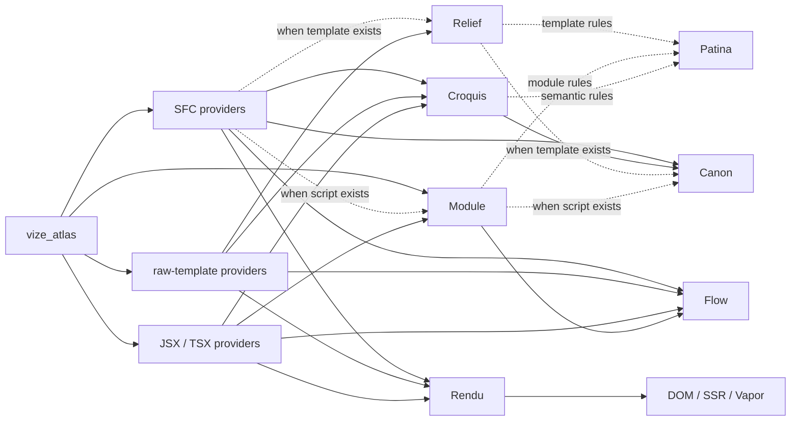

# Source Guide

This page is a map for contributors who need to change the source code rather than only use Vize.
Start with the [Architecture Overview](./overview.md) when you need the high-level relationship
diagram, then use this guide to find the implementation files that own a behavior.

## Repository Shape

Vize keeps most product behavior in the Rust workspace, with JavaScript packages acting as
distribution and integration layers.

| Path      | What lives there                                                                                                  |
| --------- | ----------------------------------------------------------------------------------------------------------------- |
| `crates/` | Rust crates for parsing, analysis, compilation, linting, formatting, type checking, LSP, CLI, and native bindings |
| `npm/`    | JavaScript packages for Vite, Nuxt, editor extensions, Musea integrations, and published package wrappers         |
| `docs/`   | User documentation, architecture notes, release notes, and the docs site theme                                    |
| `tests/`  | Cross-package fixtures, real-world projects, tooling tests, and snapshot governance                               |
| `bench/`  | Performance comparison scripts and PR benchmark budget enforcement                                                |
| `tools/`  | Repository automation that is not part of the shipped product                                                     |

When a change crosses directories, the owner is usually the layer that creates the user-visible
behavior. For example, a compiler output change belongs in `crates/`, even when the repro comes from
an npm package test.

## Production Artifact Graph

The hidden `vize graph` diagnostic route exposes the same demand-selected
provider edges used by production recipes:



One Atlas compilation owns source identity and executes each requested typed
product once. The diagram shows available provider edges, not one mandatory
pipeline. SFC, raw-template, and JSX frontends keep their own syntax; consumers
share only the Module, Croquis, Flow, or Rendu products they request. Each
authored SFC script block is parsed once while its live OXC `Program` is
projected into Module facts, Croquis analysis, and compiler preanalysis.

Production commands, Maestro, Glyph, Inspector, and binding hosts enter through
typed roots. Maestro revises one URI-keyed mutable compilation and queries it
directly. Inspector requests `InspectorAgentReport`, which aggregates its own
per-source analysis products: SFC analysis uses Module, descriptor, Relief, and
Croquis, while raw JS/TS analysis uses Module. NAPI/WASM expose compile,
raw-template, Patina, Canon, and cross-file roots as supported by each surface;
bundler packages only host the relevant compile bindings. Legacy public
functions remain compatibility APIs rather than host orchestration.

## Crate Entry Points

| Change area                     | Start here                                | Then check                                                                   |
| ------------------------------- | ----------------------------------------- | ---------------------------------------------------------------------------- |
| Template parsing                | `crates/vize_armature/src/lib.rs`         | parser fixtures and expected AST snapshots                                   |
| Typed artifact graph            | `crates/vize_atlas/src/lib.rs`            | product/provider planning, cache, invalidation, outcomes, and trace          |
| Vue-template syntax and options | `crates/vize_relief/src/lib.rs`           | downstream compiler, lint, and formatter callers                             |
| Template semantics              | `crates/vize_croquis/src/lib.rs`          | scope, binding, reactivity, and virtual TypeScript helpers                   |
| Cross-file semantics            | `crates/vize_croquis_cf/src/lib.rs`       | dependency, component, effect, and project-level graph consumers             |
| Single-file flow graphs         | `crates/vize_flow/src/lib.rs`             | CFG, data/effect edges, reachability, and dominance                          |
| JavaScript/TypeScript modules   | `crates/vize_module/src/lib.rs`           | owned imports, exports, declarations, references, and OXC CFG                |
| Render HIR                      | `crates/vize_rendu/src/lib.rs`            | SFC/JSX producers and DOM, SSR, Vapor consumers                              |
| Legacy template transforms      | `crates/vize_atelier_core/src/lib.rs`     | compatibility callers and backend-specific atelier crates                    |
| Client template output          | `crates/vize_atelier_dom/src/lib.rs`      | generated code snapshots and runtime fixture tests                           |
| Vapor output                    | `crates/vize_atelier_vapor/src/lib.rs`    | Vapor-specific rules and real-world fixture output                           |
| SSR output                      | `crates/vize_atelier_ssr/src/lib.rs`      | SSR snapshots, escaping, and hydration behavior                              |
| Raw template frontend           | `crates/vize_atelier_template/src/lib.rs` | Relief/Croquis plus independently requested Flow, Rendu, and targets         |
| SFC orchestration               | `crates/vize_atelier_sfc/src/lib.rs`      | descriptor and parse-once script projections, template, style, HMR, and maps |
| JSX/TSX frontend                | `crates/vize_atelier_jsx/src/lib.rs`      | owned OXC syntax and Module/Croquis/Flow/Rendu providers                     |
| Lint rules                      | `crates/vize_patina/src/lib.rs`           | rule snapshots and localized diagnostics                                     |
| Type checking                   | `crates/vize_canon/src/lib.rs`            | generated virtual TS and `corsa-bind` diagnostics                            |
| LSP behavior                    | `crates/vize_maestro/src/lib.rs`          | server handlers, virtual documents, and editor smoke tests                   |
| Formatting                      | `crates/vize_glyph/src/lib.rs`            | golden formatting snapshots                                                  |
| Native and WASM bindings        | `crates/vize_vitrine/src/lib.rs`          | npm package wrappers and generated type declarations                         |
| CLI behavior                    | `crates/vize/src/main.rs`                 | command modules, snapshots, and build/check/lint integration tests           |

Prefer following the public crate entry point first. Many crates have compact `lib.rs` modules that
re-export the internal modules a contributor is expected to touch.

## JavaScript Package Entry Points

| Package                     | Source entry                                                   | Rust boundary                                      |
| --------------------------- | -------------------------------------------------------------- | -------------------------------------------------- |
| `@vizejs/native`            | `npm/native/index.js` and generated declarations               | NAPI exports from `vize_vitrine`                   |
| `@vizejs/wasm`              | generated package around `vize_vitrine` WASM exports           | `crates/vize_vitrine/src/wasm`                     |
| `@vizejs/vite-plugin`       | `npm/builder/vite/src/index.ts`                                | native SFC compile products through `vize_vitrine` |
| `@vizejs/unplugin`          | `npm/builder/unplugin/src/index.ts`                            | native SFC/JSX compile products                    |
| `@vizejs/rspack-plugin`     | `npm/builder/rspack/src/index.ts`                              | native SFC compile products                        |
| `@vizejs/nuxt`              | `npm/framework/nuxt/src/index.ts`                              | Vite host options and component integration        |
| `@vizejs/vite-plugin-musea` | `npm/builder/vite-musea/src/index.ts` and related package code | `vize_musea` APIs exposed through bindings         |
| `oxlint-plugin-vize`        | `npm/oxint/src/index.ts`                                       | Patina diagnostics through bindings                |

Use package tests for integration wiring, but keep language semantics in Rust tests. The package
layer should mostly prove that options, virtual modules, HMR, and native calls are connected.

## Change Workflow

1. Find the owning crate or package from the tables above.
2. Add the smallest fixture or snapshot that proves the behavior.
3. Run the narrow command for that owner.
4. Broaden to package, real-world, browser, benchmark, or GitHub Actions checks when the change
   crosses a public surface.

For language-facing work, follow the evidence matrix in
[Language Engineering Practices](./language-engineering-practices.md). For crate responsibilities
and package mapping, use the [Crate Reference](./crates.md).

## Source Length

Aim to keep handwritten source files at 350 lines or less. The repository still has historical
exceptions, so the first guard is incremental: a pull request should not add a new over-limit file,
push an under-limit file past the limit, or grow an existing over-limit file.

Run the inventory locally with:

```sh
vp run --workspace-root source:lengths
```

The `test:scripts` GitHub Actions job runs the same MoonBit tool in check mode against the pull
request base commit. Generated files, snapshots, fixtures, lockfiles, vendor output, coverage output,
and build directories are excluded from the source inventory. When an existing exception needs work,
prefer splitting by ownership boundary first: helpers, fixtures, snapshots, and command handlers
usually make better extraction targets than shared data structures.

## Tooling Scripts

Repository automation prefers MoonBit command packages under `tools/moon/cmd/`. They run through the
normal package path (`moon run --target native tools/moon/cmd/<name> -- <args>`), share the toolchain
that already builds the compiler, and are covered by `tests/tooling/*.test.ts` suites that exercise
them via `moon run` and assert full expected output. Root tasks invoke them with the `moonScript`
helper in `tools/vite-plus/task-commands.ts`, so each consumer stays a stable task name rather than
an inline command.

Good MoonBit candidates are small, pure, and dependency-light: argument parsing, JSON or text
transforms, inventories, and pass/fail checks whose correctness can be proved with a `moon run` test.

Keep a script in Node (`.mjs`) when MoonBit would add friction rather than remove it:

- It is imported as a module by other JavaScript or by a `node --test` suite (for example
  `tools/github/release-platforms.mjs`), so rewriting it would split one source across two languages.
- It depends on the npm ecosystem (globbing libraries, package tooling, GitHub Action SDKs) or on
  Node-only APIs that have no MoonBit equivalent.
- It is large or exploratory enough that its behavior is not yet pinned by a full-output test; do not
  migrate anything that could break CI without such a test.

## Reading Generated Output

Compiler and tool changes are reviewed through generated artifacts. Treat these outputs as the
contract:

- Template compiler snapshots show emitted JavaScript and optimization shape.
- Lint snapshots show diagnostic ranges, messages, and rule metadata.
- Type-check snapshots show virtual TypeScript and mapped diagnostics.
- Formatter snapshots show the exact output users will see.
- Real-world fixture snapshots show whether broad applications still build and run.

If output changes only because of paths, timings, ordering, hashes, or host-specific data, normalize
the source before updating snapshots.

## When In Doubt

Small source changes should leave a clear trail: owning crate, fixture, snapshot, verification
command, and any broader CI lane that matters. If a change crosses crates, identify the product each
crate truly owns and add only the provider edges the consumer needs; do not force the behavior into a
universal representation.
