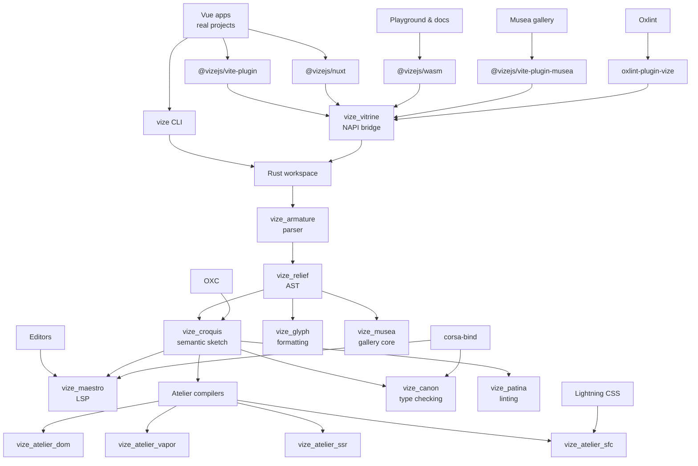
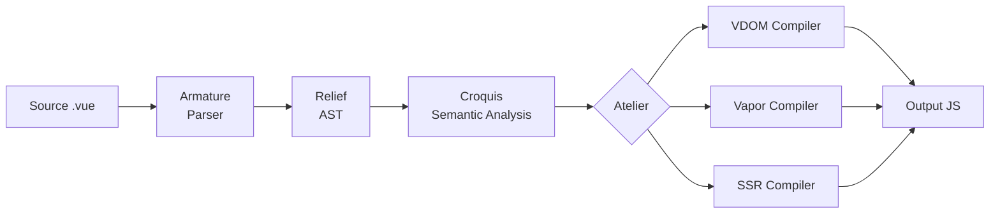
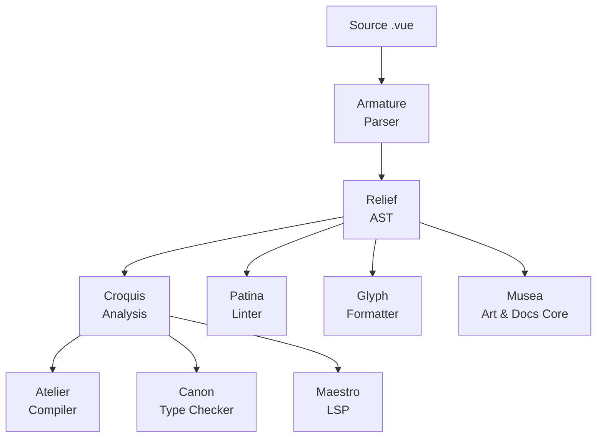

<!-- Generated translation; source: architecture/overview.md -->

# Aperçu de l’architecture

> **⚠️ Travaux en cours :** Vize est en développement actif et n’est pas encore prêt pour une utilisation en production. L’architecture interne peut évoluer au fur et à mesure que le projet évolue.

Vize est conçu comme un espace de travail modulaire Rust où chaque caisse répond à une préoccupation spécifique. L’architecture est organisée en voies réutilisables qui transportent le code source SFC de Vue via des étapes d’analyse, d’analyse et de compilation.

## Carte des relations de projet

Le dépôt est organisé comme un studio : les surfaces orientées utilisateur entrent via des paquets JavaScript,
le noyau Rust partagé façonne le code source Vue, et des outils spécialisés réutilisent le même parseur et le même modèle de
sémantique plutôt que de conserver chacun une copie privée du langage.

Cette carte de relations concerne la propriété et la réutilisation, pas tous les avantages des appels. L’invariant important est
que l’analyse analyseur, AST et sémantique restent partagés, tandis que les backends du compilateur et les outils de développement restent
des ateliers remplaçables autour de ce modèle de langage partagé.

## Voies

### Détails de la scène

1. **Source** — Un fichier `.vue` contenant `<template>`blocs , `<script>`et `<style>`
2. **Armature** (analyseur) — Tokenise la source brute en un flux de jetons, puis les analyse en un AST structuré. Le tokenizer gère la syntaxe spécifique à Vue : directives (`v-if`, `v-for`, `v-bind`), interpolation d’expressions (`{{ }}`), et frontières de blocs SFC.
3. **Relief** (AST) — La représentation intermédiaire. Tous les étages en aval fonctionnent sur cet AST partagé, éliminant ainsi l’analyse syntaxique redondante.
4. **Croquis** (Analyse sémantique) — Résout les expressions modèles, suit les portées des variables, détecte les types de liaison (configuration, données, props, injection) et valide la correction des expressions. Utilise OXC pour l’analyse AST JavaScript/TypeScript.
5. **Atelier** (Compilation) — Transforme l’AST analysé en sortie JavaScript. Trois backends servent des cibles différentes :
   - **VDOM** (`vize_atelier_dom`) — appels `createVNode`/`h` avec optimisation des drapeaux de patch et élévation statique
   - **Vapor** (`vize_atelier_vapor`) — Code réactif à grain fin avec manipulation directe du DOM (sans VDOM)
   - **SSR** (`vize_atelier_ssr`) — Concaténationnement de chaînes avec marqueurs d’hydratation
6. **Sortie** — Code JavaScript généré avec des cartes sources

## Outils Voies

Au-delà de la compilation, Vize propose des outils supplémentaires qui réutilisent la même infrastructure d’analyse et d’analyse :

Comme tous les outils partagent le même parseur et AST, ils ont une compréhension cohérente de votre code. Une règle de peluches dans Patina fonctionne sur les mêmes nœuds AST que le compilateur dans Atelier — il n’y a aucun risque de désaccord entre les analyseurs.

Pour la vérification de types, `vize_canon` ajoute une étape supplémentaire : il génère un TypeScript virtuel à partir des SFC Vue et demande des sessions de projet Corsa à [`corsa-bind`](https://github.com/ubugeeei/corsa-bind) des diagnostics natifs, puis remappe ces résultats sur les fichiers originaux.

Le flux de travail de mise en œuvre est documenté dans
[Language Engineering Practices](./language-engineering-practices.md), qui mappe les modifications du parser,
compilateur, analyseur, vérificateur de type, formateur, LSP et release sur les éléments de fixture, snapshot, parité
, benchmark et preuves de préparation attendues pour examen.

## Responsabilités en caisse

| Couche               | Caisse               | Rôle                                                                       |
| -------------------- | -------------------- | -------------------------------------------------------------------------- |
| Fondation            | `vize_carton`        | Utilités partagées, allocateur d’arène, internat de chaînes                |
| AST                  | `vize_relief`        | Définitions de nœuds AST, types d’erreurs, options de compilateur          |
| Analyse syntaxique   | `vize_armature`      | Tokenizer + analyseur de descente récursive                                |
| Analyse              | `vize_croquis`       | Analyse sémantique, suivi de la portée de la caméra, détection de liaison  |
| Compilation          | `vize_atelier_core`  | Voie de transformation partagée, utilitaires de codegen, cartes de sources |
| Compilation          | `vize_atelier_dom`   | Génération de code VDOM                                                    |
| Compilation          | `vize_atelier_vapor` | Génération de codes en mode vapeur                                         |
| Compilation          | `vize_atelier_sfc`   | Orchestration SFC (script + modèle + style + HMR)                          |
| Compilation          | `vize_atelier_ssr`   | Compilation de rendu côté serveur                                          |
| Reliures             | `vize_vitrine`       | Node.js (NAPI) + Fixations WASM                                            |
| CLI                  | `vize`               | Interface en ligne de commande (clap + rayon)                              |
| Vérification de type | `vize_canon`         | Diagnostics natifs TypeScript et Vue via `corsa-bind`                      |
| Linting              | `vize_patina`        | Vue.js Linter avec i18N (EN/Ja/ZH)                                         |
| Mise en forme        | `vize_glyph`         | Vue.js formateur (modèle + script + style)                                 |
| LSP                  | `vize_maestro`       | Protocole de Serveur de Langage (tour-lsp)                                 |
| Musea                | `vize_musea`         | Analyse artistique, documentation, palette, autogénération et cœur VRT     |
| TUI                  | `vize_fresco`        | Cadre d’interface utilisateur terminale (terme croisé + taffy)             |

L’interface de la galerie et l’intégration dev-server pour Musea sont disponibles dans le paquet JavaScript
`@vizejs/vite-plugin-musea`; la caisse de rouille se concentre sur l’analyse et le noyau de génération.

## Convention de dénomination

Les caisses Vize portent leur nom **d’une terminologie artistique et sculpturale**, reflétant la façon dont chaque composant façonne et transforme le code Vue. Ce système de dénomination est plus qu’esthétique — il encode le rôle et les relations entre les caisses. Voir [Philosophy](../philosophy.md) pour la justification complète.

| Nom          | Origine      | Analogie artistique                                               | Rôle technique                                                                                 |
| ------------ | ------------ | ----------------------------------------------------------------- | ---------------------------------------------------------------------------------------------- |
| **Carton**   | /kɑːˈtɒn/    | Boîtier portfolio d’artiste — stocke et organise les outils       | Utilités partagées — la boîte à outils fondamentale dont chaque caisse dépend                  |
| **Relief**   | /rɪˈliːf/    | Technique sculpturale qui projette sur une surface plane          | L’AST — une surface structurée qui donne forme au code source brut                             |
| **Armature** | /ˈɑːrmətʃər/ | Squelette interne soutenant une sculpture                         | L’analyseur syntaxique — le cadre structurel qui soutient l’AST                                |
| **Croquis**  | /kʁɔ.ki/     | Esquisse gestuel rapide capturant l’essence d’un sujet            | Analyse sémantique — un aperçu rapide qui saisit la signification du code                      |
| **Atelier**  | /ˌætəlˈjeɪ/  | Atelier d’artiste où la création a lieu                           | Espaces de travail de compilateur — où le code est transformé en sa forme finale               |
| **Vitrine**  | /vɪˈtriːn/   | Vitrine en verre dans un musée                                    | Bindings — une couche transparente qui expose le compilateur aux consommateurs externes        |
| **Canon**    | /ˈkænən/     | Standard des proportions idéales en sculpture classique           | Vérificateur de type — garantit que le code est conforme à la norme de correction              |
| **Patine**   | /ˈpætɪnə/    | Finition de surface vieillie qui témoigne de qualité et de soin   | Linter — peaufine le code en identifiant les problèmes qui affectent la qualité                |
| **Glyphe**   | /ɡlɪf/       | Symbole ou forme de lettre sculptée avec des proportions précises | Formateur — façonne le code en formes de lettres cohérentes et lisibles                        |
| **Maestro**  | /ˈmaɪstroʊ/  | Chef d’orchestre maître qui orchestre un ensemble                 | LSP — orchestre toutes les fonctionnalités linguistiques dans une expérience d’éditeur unifiée |
| **Musea**    | /mjuːˈziːə/  | Pluriel de musée — un espace d’exposition d’art                   | Galerie de composants — un espace pour exposer et explorer des composants                      |
| **Fresque**  | /ˈfrɛskoʊ/   | Technique de peinture appliquée aux murs en plâtre humide         | Cadre TUI — peindre les interfaces sur la surface du terminal                                  |

### Pourquoi la terminologie artistique ?

L’analogie entre la compilation logicielle et la création artistique est étonnamment profonde :

- Un **parseur** (Armature) fournit le squelette interne — la structure sur laquelle tout le reste se construit, tout comme l’armature d’un sculpteur soutient l’argile
- **L’analyse sémantique** (Croquis) est comme un croquis rapide — elle saisit le sens essentiel sans s’engager dans une forme finale
- Le **compilateur** (Atelier) est un atelier où la matière première est transformée en une œuvre achevée
- **L’AST** (Relief) est une projection — elle donne une structure tridimensionnelle à ce qui était à l’origine un texte plat
- **Les reliures** (vitrine) sont des vitrines en verre — elles permettent de voir et d’interagir avec l’œuvre à l’intérieur sans la toucher directement
- Le **linter** (Patina) examine la finition de surface — identifiant les imperfections qui affectent la qualité globale
- Le **formateur** (Glyphe) assure des proportions cohérentes — comme un typographe sculptant des formes de lettres avec un espacement précis

Cette convention de nommage rend la hiérarchie des caisses intuitive : quand vous voyez `vize_atelier_dom`, vous comprenez immédiatement qu’il s’agit d’un _atelier_ qui produit _des sorties VDOM_.

## Dépendances externes

Vize s’intègre à l’écosystème plus large de Rust pour des tâches spécialisées :

| Dépendance                                               | Objectif                                            | Utilisé par                                 |
| -------------------------------------------------------- | --------------------------------------------------- | ------------------------------------------- |
| [OXC](https://oxc.rs/)                                   | Analyse AST JavaScript/TypeScript                   | `vize_croquis`, `vize_atelier_core`         |
| [Rayon](https://docs.rs/rayon)                           | Multithreading en parallèle de données              | `vize`, `vize_vitrine`                      |
| [bumpalo](https://docs.rs/bumpalo)                       | Allocation d’arène pour les nœuds AST               | `vize_carton`                               |
| [LightningCSS](https://lightningcss.dev/)                | Analyse et transformation CSS                       | `vize_atelier_sfc`                          |
| [`corsa-bind`](https://github.com/ubugeeei/corsa-bind)   | Sessions de projet et diagnostics natifs TypeScript | `vize_canon`, `vize_maestro`, `vize_patina` |
| [tower-lsp](https://docs.rs/tower-lsp)                   | Cadre serveur LSP                                   | `vize_maestro`                              |
| [clap](https://docs.rs/clap)                             | Analyse syntaxique des arguments CLI                | `vize`                                      |
| [wasm-bindgen](https://rustwasm.github.io/wasm-bindgen/) | Interopérative WASM-JavaScript                      | `vize_vitrine`                              |
| [napi-rs](https://napi.rs/)                              | Node.js liaisons d’addons natifs                    | `vize_vitrine`                              |
