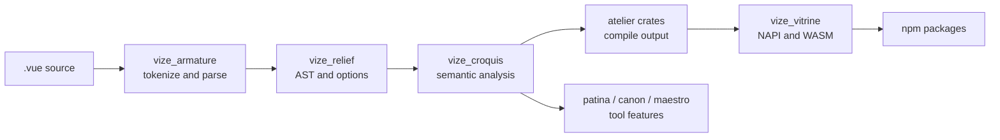

<!-- Generated translation; source: architecture/source-guide.md -->

# Guide des sources

Cette page est une carte pour les contributeurs qui doivent modifier le code source plutôt que d’utiliser uniquement Vize.
Commencez par le [Architecture Overview](./overview.md) lorsque vous avez besoin du diagramme de relations
de haut niveau, puis utilisez ce guide pour trouver les fichiers d’implémentation qui possèdent un comportement.

## Forme du dépôt

Vize conserve la plupart des comportements produits dans l’espace de travail Rust, les paquets JavaScript agissant comme
couches de distribution et d’intégration.

| Chemin    | Ce qui y vit                                                                                                                              |
| --------- | ----------------------------------------------------------------------------------------------------------------------------------------- |
| `crates/` | Rust crates pour l’analyse, la compilation, le linting, la mise en forme, la vérification de type, le LSP, la CLI et les liaisons natives |
| `npm/`    | Packages JavaScript pour Vite, Nuxt, extensions d’éditeurs, intégrations Musea, et wrappers de paquets publiés                            |
| `docs/`   | Documentation utilisateur, notes d’architecture, notes de version et thème du site docs                                                   |
| `tests/`  | Fixtures inter-packages, projets réels, tests d’outillages et gouvernance instantanée                                                     |
| `bench/`  | Scripts de comparaison de performance et application budgétaire des benchmarks de RP                                                      |
| `tools/`  | Automatisation de dépôt qui ne fait pas partie du produit expédié                                                                         |

Lorsqu’un changement traverse les répertoires, le propriétaire est généralement la couche qui crée le comportement
visible par l’utilisateur. Par exemple, un changement de sortie du compilateur appartient à `crates/`, même lorsque la reproduction provient de
un test de paquet npm.

## Pipeline de langage

La plupart des modifications de sources suivent le même flux de données :



La règle partagée est simple : analyser une fois, garder le modèle syntaxique commun, puis laisser chaque surface de produit
n’ajouter que le comportement qu’elle possède.

## Points d’entrée de caisse

| Changement de zone                  | Commencez ici                          | Alors vérifie                                                                |
| ----------------------------------- | -------------------------------------- | ---------------------------------------------------------------------------- |
| Analyse syntaxique de modèles       | `crates/vize_armature/src/lib.rs`      | Fixatures de parseurs et instantanés AST attendus                            |
| Forme AST et options du compilateur | `crates/vize_relief/src/lib.rs`        | compilateur en aval, appels LINT et formateur                                |
| Sémantique des modèles              | `crates/vize_croquis/src/lib.rs`       | Helpers de portée, liaison, réactivité et TypeScript virtuels                |
| Comportement partagé du compilateur | `crates/vize_atelier_core/src/lib.rs`  | Caisses d’atelier spécifiques au backend                                     |
| Sortie du modèle client             | `crates/vize_atelier_dom/src/lib.rs`   | Instantanés de code générés et tests d’accessoires à l’exécution             |
| Sortie de vapeur                    | `crates/vize_atelier_vapor/src/lib.rs` | Règles spécifiques à la vapeur et sortie réelle des matchs                   |
| Sortie SSR                          | `crates/vize_atelier_ssr/src/lib.rs`   | Instantanés SSR, évasion et comportement d’hydratation                       |
| Orchestration SFC                   | `crates/vize_atelier_sfc/src/lib.rs`   | script, modèle, style, HMR et chemins de la source-map                       |
| Règles de peluches                  | `crates/vize_patina/src/lib.rs`        | Instantanés de règles et diagnostics localisés                               |
| Vérification de type                | `crates/vize_canon/src/lib.rs`         | TS et diagnostics `corsa-bind` virtuels générés                              |
| Comportement des LSP                | `crates/vize_maestro/src/lib.rs`       | Gestionnaires de serveurs, documents virtuels et tests de fumée de l’éditeur |
| Mise en forme                       | `crates/vize_glyph/src/lib.rs`         | Instantanés dorés de mise en forme                                           |
| Fixations natives et WASM           | `crates/vize_vitrine/src/lib.rs`       | Enveloppes de paquets NPM et déclarations de types générées                  |
| Comportement de la CLI              | `crates/vize/src/main.rs`              | modules de commande, snapshots, et tests d’intégration build/check/lint      |

Privilégiez d’abord le point d’entrée public de la caisse. De nombreuses caisses disposent de modules `lib.rs` compacts qui
réexporter les modules internes qu’un contributeur est censé toucher.

## Points d’entrée de paquets JavaScript

| Package                     | Entrée de source                                                 | Limite de rouille                                     |
| --------------------------- | ---------------------------------------------------------------- | ----------------------------------------------------- |
| `@vizejs/vite-plugin`       | `npm/builder/vite/src/index.ts`                                  | `@vizejs/native` à travers `vize_vitrine`             |
| `@vizejs/nuxt`              | `npm/framework/nuxt/src/index.ts`                                | Options de plugins Vite et intégration des composants |
| `@vizejs/wasm`              | généré des paquets autour `vize_vitrine` exportations WASM       | `crates/vize_vitrine/src/wasm`                        |
| `@vizejs/vite-plugin-musea` | `npm/builder/vite-musea/src/index.ts` et code de package associé | `vize_musea` API exposées via des liaisons            |
| `oxlint-plugin-vize`        | `npm/oxlint/src/index.ts`                                         | `vize_patina` diagnostic par liaisons                 |

Utilisez les tests de paquet pour le câblage d’intégration, mais gardez la sémantique du langage dans les tests Rust. La couche package
devrait surtout prouver que les options, modules virtuels, HMR et appels natifs sont connectés.

## Flux de travail de changement

1. Trouvez la caisse ou le paquet propriétaire dans les tableaux ci-dessus.
2. Ajoutez le plus petit luminaire ou instantané qui prouve le comportement.
3. Exécutez la commande étroite pour ce propriétaire.
4. Élargir aux vérifications de paquets, de conditions réelles, de navigateur, de benchmark ou de GitHub lors du changement
   traverse une surface publique.

Pour les travaux orientés vers le langage, suivez la matrice des preuves dans
[Language Engineering Practices](./language-engineering-practices.md). Pour les
de crates et le mappage de paquets, utilisez le [Crate Reference](./crates.md).

## Longueur de la source

Essayez de garder les fichiers sources manuscrits à 350 lignes ou moins. Le dépôt possède toujours des exceptions historiques
, donc la première protection est incrémentale : une pull request ne doit pas ajouter un nouveau fichier de dépassement de limite,
pousser un fichier de dépassement de la limite, ni faire croître un fichier de dépassement existant.

Gérez l’inventaire localement avec :

```sh
vp run --workspace-root source:lengths
```

Le job GitHub Actions de `test:scripts` exécute le même outil MoonBit en mode vérification contre le commit pull
request base. Les fichiers générés, instantanés, fixtures, lockfiles, sorties du fournisseur, sorties de couverture,
et répertoires de compilation sont exclus de l’inventaire source. Lorsqu’une exception existante nécessite des travaux,
préfèrent d’abord la division par limite de propriété : les assistants, fixtures, snapshots et gestionnaires de commandes
généralement de meilleures cibles d’extraction que les structures de données partagées.

## Scripts d’outillages

L’automatisation des dépôts préfère les packages de commandes MoonBit sous `tools/moon/cmd/`. Ils s’exécutent dans le
chemin normal du paquet (`moon run --target native tools/moon/cmd/<name> -- <args>`), partagent la chaîne d’outils
qui construit déjà le compilateur, et sont couverts par `tests/tooling/*.test.ts` suites qui les
via `moon run` et affirment la sortie attendue complète. Les tâches root les invoquent avec l’aide `moonScript`
dans `tools/config/vite-plus/task-commands.ts`, de sorte que chaque consommateur garde un nom de tâche stable plutôt que
une commande en ligne.

Les bons candidats MoonBit sont petits, purs et peu dépendants : analyse d’arguments, transformations de
JSON ou texte, inventaires et vérifications de réussite/échec dont la correction peut être prouvée par un test `moon run` .

Gardez un script dans Node (`.mjs`) lorsque MoonBit ajouterait de la friction plutôt que de la supprimer :

- Il est importé sous forme de module par d’autres JavaScript ou par une suite `node --test` (par exemple
  `tools/commands/ci/github/release-platforms.rs`), donc la réécrire diviserait une source en deux langues.
  - Cela dépend de l’écosystème npm (bibliothèques globbing, outils de paquets, SDKs d’action GitHub) ou de
    API uniquement pour les nœuds qui n’ont pas d’équivalent MoonBit.
- Il est suffisamment vaste ou exploratoire pour que son comportement ne soit pas encore déterminé par un test à sortie complète ; Ne le fais pas
  migrer tout ce qui pourrait casser le CI sans un tel test.

## Lecture des sorties générées

Les modifications du compilateur et des outils sont examinées à travers des artefacts générés. Considérez ces sorties comme le contrat
:

- Les instantanés du compilateur de modèles affichent JavaScript émis et forme d’optimisation.
- Les instantanés de peluches affichent les plages de diagnostic, les messages et les métadonnées des règles.
- Les snapshots de vérification de type affichent un TypeScript virtuel et des diagnostics mappés.
- Les instantanés de formateur montrent exactement la sortie que les utilisateurs verront.
- Les instantanés réels des équipements montrent si des applications larges continuent de se développer et de fonctionner.

Si la sortie ne change qu’à cause des chemins, des timings, de l’ordre, des hachages ou des données spécifiques à l’hôte, normalisez
la source avant de mettre à jour les instantanés.

## En cas de doute

De petits changements de source devraient laisser une trace claire : posséder la caisse, le luminaire, l’instantané, la vérification
la commande, et toute voie CI plus large qui compte. Si un changement semble appartenir à plusieurs caisses,
commencer par la représentation partagée la plus précoce et garder les couches suivantes comme des adaptateurs fins.
