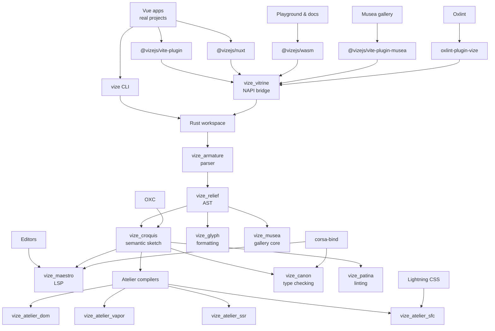
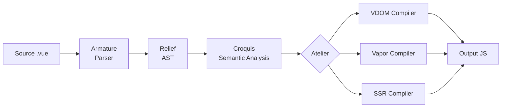
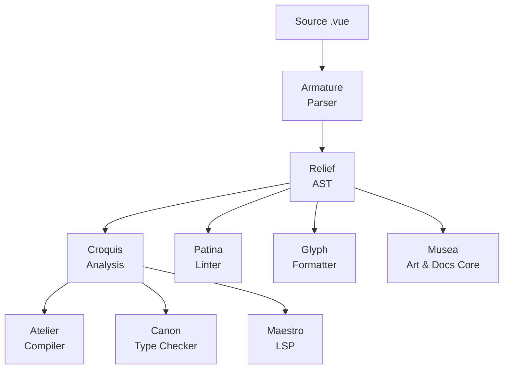

<!-- Generated translation; source: architecture/overview.md -->

# アーキテクチャの概要

> **⚠️ 進行中の作業:**Vize は積極的に開発中であり、まだ運用環境で使用する準備ができていません。プロジェクトの進行に応じて内部アーキテクチャが変更される可能性があります。

Vize はモジュール式の Rust ワークスペースとして構築されており、各クレートが特定の懸念事項を処理します。このアーキテクチャは、解析、分析、コンパイルの段階を通じて Vue SFC ソースを運ぶ再利用可能なレーンに編成されています。

## プロジェクト関係マップ

リポジトリはスタジオのように編成されています。ユーザー向けのサーフェスは JavaScript パッケージを通じて入力され、
共有された Rust コアは Vue ソースを形成し、専用ツールは同じパーサーとセマンティクスを再利用します。
それぞれが言語のプライベートコピーを保持するのではなく、モデルを作成します。

この関係マップは、すべてのコール エッジではなく、所有権と再利用に関するものです。重要な不変条件は
パーサー、AST、セマンティック分析は共有されたままですが、コンパイラー バックエンドと開発者ツールは共有されます。
その共有言語モデルを中心とした置き換え可能なワークショップは残ります。

## レーン

### ステージ詳細

1.**ソース**— `<template>`、`<script>`、および `<style>` ブロックを含む `.vue` ファイル2.**アーマチュア**(パーサー) — 生のソースをトークンのストリームにトークン化し、構造化された AST に解析します。トークナイザーは、Vue 固有の構文、ディレクティブ (`v-if`、`v-for`、`v-bind`)、式補間 (`{{ }}`)、および SFC ブロック境界を処理します。3.**レリーフ**(AST) — 中間表現。すべての下流ステージはこの共有 AST 上で動作し、冗長な解析を排除します。4.**Croquis**(セマンティック分析) - テンプレート式を解決し、変数スコープを追跡し、バインディング タイプ (setup、data、props、inject) を検出し、式の正確さを検証します。 JavaScript/TypeScript AST 解析に OXC を使用します。5.**Atelier**(コンパイル) — 分析された AST を JavaScript 出力に変換します。 3 つのバックエンドが異なるターゲットに対応します。

- **VDOM**(`vize_atelier_dom`) — パッチ フラグの最適化と静的ホイスティングを使用した `createVNode`/`h` 呼び出し
- **Vapor**(`vize_atelier_vapor`) — 直接 DOM 操作を使用したきめ細かいリアクティブ コード (VDOM なし)
- **SSR**(`vize_atelier_ssr`) — 水和マーカーとの文字列連結 6.**出力**— ソース マップを含む生成された JavaScript コード

## ツールレーン

Vize はコンパイル以外にも、同じ解析および分析インフラストラクチャを再利用する追加ツールを提供します。

すべてのツールは同じパーサーと AST を共有するため、コードを一貫して理解できます。 Patina の lint ルールは、Atelier のコンパイラーと同じ AST ノードで動作します。パーサーの不一致のリスクはありません。

型チェックの場合、`vize_canon` はもう 1 つのステップを追加します。Vue SFC から仮想 TypeScript を生成し、[`corsa-bind`](https://github.com/ubugeeei/corsa-bind) からの Corsa プロジェクト セッションにネイティブ診断を依頼し、その結果を元のファイルにマッピングします。

実装ワークフローは次の場所に文書化されています。
[Language Engineering Practices](./language-engineering-practices.md)、パーサーをマップします。
コンパイラ、アナライザ、タイプチェッカー、フォーマッタ、LSP、およびフィクスチャ、スナップショット、
同等性、ベンチマーク、準備状況の証拠がレビューされることが予想されます。

## クレートの責任

| レイヤー       | 木箱                 | 役割                                                                  |
| -------------- | -------------------- | --------------------------------------------------------------------- |
| 財団           | `vize_carton`        | 共有ユーティリティ、アリーナ アロケータ、文字列インターン             |
| AST            | `vize_relief`        | AST ノード定義、エラー タイプ、コンパイラ オプション                  |
| 解析           | `vize_armature`      | トークナイザー + 再帰降下パーサー                                     |
| 分析           | `vize_croquis`       | セマンティック分析、スコープ追跡、バインディング検出                  |
| 編集           | `vize_atelier_core`  | 共有変換レーン、codegen ユーティリティ、ソース マップ                 |
| 編集           | `vize_atelier_dom`   | VDOM コード生成                                                       |
| 編集           | `vize_atelier_vapor` | 蒸気モードコード生成                                                  |
| 編集           | `vize_atelier_sfc`   | SFC オーケストレーション (スクリプト + テンプレート + スタイル + HMR) |
| 編集           | `vize_atelier_ssr`   | サーバー側レンダリングのコンパイル                                    |
| バインディング | `vize_vitrine`       | Node.js (NAPI) + WASM バインディング                                  |
| CLI            | `vize`               | コマンドラインインターフェース (clap + rayon)                         |
| 型チェック     | `vize_canon`         | `corsa-bind` によるネイティブ TypeScript および Vue 診断              |
| リンティング   | `vize_patina`        | i18n を使用した Vue.js リンター (en/ja/zh)                            |
| フォーマット   | `vize_glyph`         | Vue.js フォーマッタ (テンプレート + スクリプト + スタイル)            |
| LSP            | `vize_maestro`       | 言語サーバー プロトコル (tower-lsp)                                   |
| 美術館         | `vize_musea`         | アート解析、ドキュメント、パレット、自動生成、および VRT コア         |
| トゥイ         | `vize_fresco`        | ターミナル UI フレームワーク (crossterm + taffy)                      |

Musea のギャラリー UI と開発サーバー統合は JavaScript パッケージ内にあります
`@vizejs/vite-plugin-musea`; Rust クレートは解析と生成のコアに焦点を当てています。

## 命名規則

Vize クレートは、**芸術と彫刻の用語**にちなんで名付けられており、各コンポーネントが Vue コードをどのように形成および変換するかを反映しています。この命名システムは見た目の美しさだけではなく、クレート間の役割と関係をエンコードしています。完全な理論的根拠については、[哲学](../philosophy.md) を参照してください。

| 名前             | 由来         | アートアナロジー                                                                                                      | 技術的役割                                                                                   |
| ---------------- | ------------ | --------------------------------------------------------------------------------------------------------------------- | -------------------------------------------------------------------------------------------- | -------------------------------- |
| **カートン**     | /kɑːˈtɒn/    | アーティストのポートフォリオ ケース — ツールを保管および整理する                                                      | 共有ユーティリティ — すべてのクレートが依存する基本的なツールボックス                        |
| **救済**         | /rɪˈliːf/    | 平面から突き出す彫刻技法                                                                                              | AST — 生のソースコードに形を与える構造化された表面                                           |
| **アーマチュア** | /ˈɑːrmətʃər/ | 彫刻を支える内部骨格                                                                                                  | 写真パーサー — AST                                                                           | をサポートする構造フレームワーク |
| **クロッキー**   | /kʁɔ.ki/     | 主題の本質を捉えた素早いジェスチャー スケッチ                                                                         | セマンティック分析 — コードの意味を捉える簡単なスケッチ                                      |
| **アトリエ**     | /ˌætəlˈjeɪ/  | 創作が生まれるアーティストのワークショップ                                                                            | コンパイラー ワークスペース — コードが最終形式に変換される場所                               |
| **展示品**       | /vɪˈtriːn/   | 博物館のガラス展示ケース                                                                                              | 写真 博物館のガラス展示ケースバインディング — コンパイラを外部コンシューマに公開する透明な層 |
| **キヤノン**     | /ˈkænən/     | 古典彫刻における理想的なプロポーションの基準                                                                          | 型チェッカー — コードが正確性の標準に準拠していることを確認します。                          |
| **緑青**         | /ˈpætɪnə/    | 品質と手入れを示すエイジング加工された表面仕上げ                                                                      | リンター — 品質に影響を与える問題を特定することでコードを磨きます                            |
| **グリフ**       | /ɡlɪf/       | 正確な比率で彫刻されたシンボルまたは文字形                                                                            | フォーマッタ — コードを一貫性のある読みやすい文字形式に整形します                            |
| **マエストロ**   | /ˈmaɪstroʊ/  | アンサンブルを指揮する名指揮者                                                                                        | LSP — すべての言語機能を調整して、統一されたエディター エクスペリエンスを実現します。        |
| **博物館**       | /mjuːˈziːə/  | 美術館の複数形 — 芸術を展示するための空間コンポーネント ギャラリー — コンポーネントを展示および探索するためのスペース |
| **フレスコ画**   | /ˈfrɛskoʊ/   | 濡れた漆喰壁に適用された塗装技術                                                                                      | TUI フレームワーク — 端末表面にインターフェイスをペイントする                                |

### なぜアート用語を使うのか?

ソフトウェアのコンパイルと芸術的創作の類似点は驚くほど深いです。

- **パーサー**(アーマチュア) は内部のスケルトン、つまり彫刻家のアーマチュアが粘土を支えるのと同じように、他のすべてが構築される構造を提供します。
- **意味分析**(クロッキー) は簡単なスケッチのようなものです。最終的な形式にこだわることなく本質的な意味を捉えます。
- **コンパイラー**(アトリエ) は、原材料を完成品に変換する工房です
- **AST**(レリーフ) は投影です。元は平坦なテキストであったものに 3 次元の構造を与えます。
- **バインディング**(ヴィトリン) はガラス製の展示ケースです。直接触れることなく、中の作品を見て操作することができます。
- **リンター**(緑青) は表面仕上げを検査し、全体的な品質に影響を与える欠陥を見つけます。
- **フォーマッタ**(グリフ) は、正確な間隔で文字の形を彫るタイポグラファーのように、一貫した比率を保証します。

この命名規則により、クレート階層が直感的になります。`vize_atelier_dom` を見ると、それが _VDOM 出力_ を生成する _ワークショップ_ であることがすぐにわかります。

## 外部依存関係

Vize は、特殊なタスクのために広範な Rust エコシステムと統合します。

| 依存関係                                                 | 目的                                                 | 使用者                                      |
| -------------------------------------------------------- | ---------------------------------------------------- | ------------------------------------------- |
| [OXC](https://oxc.rs/)                                   | JavaScript/TypeScript AST 解析                       | `vize_croquis`、`vize_atelier_core`         |
| [レーヨン](https://docs.rs/rayon)                        | データ並列マルチスレッド                             | `vize`、`vize_vitrine`                      |
| [バンパロ](https://docs.rs/bumpalo)                      | AST ノードのアリーナ割り当て                         | `vize_carton`                               |
| [ライトニングCSS](https://lightningcss.dev/)             | CSS の解析と変換                                     | `vize_atelier_sfc`                          |
| [`corsa-bind`](https://github.com/ubugeeei/corsa-bind)   | ネイティブ TypeScript プロジェクトのセッションと診断 | `vize_canon`、`vize_maestro`、`vize_patina` |
| [タワー-lsp](https://docs.rs/tower-lsp)                  | LSP サーバー フレームワーク                          | `vize_maestro`                              |
| [拍手](https://docs.rs/clap)                             | CLI 引数の解析                                       | `vize`                                      |
| [wasm-bindgen](https://rustwasm.github.io/wasm-bindgen/) | WASM と JavaScript の相互運用                        | `vize_vitrine`                              |
| [napi-rs](https://napi.rs/)                              | Node.js ネイティブ アドオン バインディング           | `vize_vitrine`                              |
