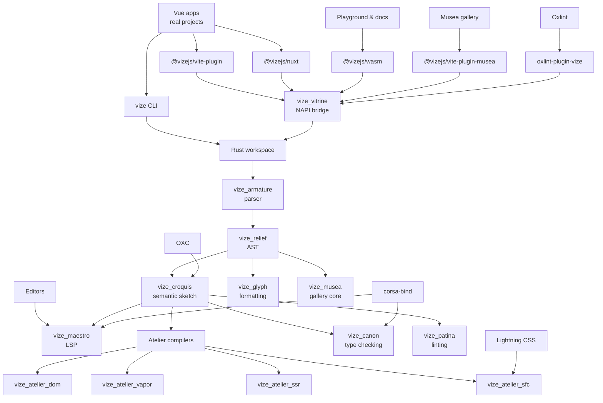
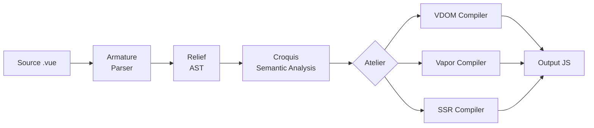
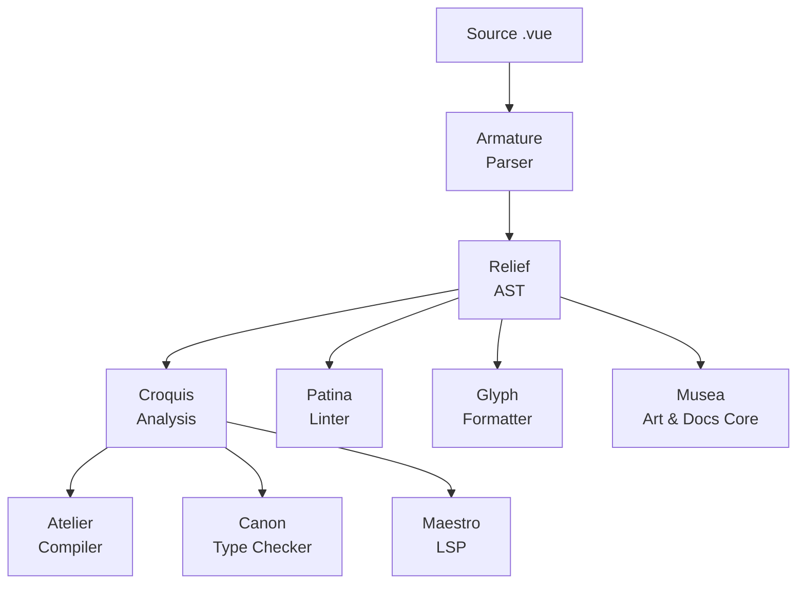

<!-- Reviewed translation; source: architecture/overview.md; scope: complete document -->

# アーキテクチャの概要

Vize の JavaScript パッケージと Rust のコンパイラ・開発ツールのつながりを説明します。
連携の不具合を調べたり修正を提案したりする前に、どの部分が動作を担当するか確認したいときに使ってください。
アプリへの導入は [Getting Started](../getting-started.md) から始められます。

[関係図](#プロジェクト関係マップ) で、`@vizejs/vite-plugin` などの入口から担当クレートをたどってください。
実装ファイルは [ソースガイド](./source-guide.md)、公開 API の役割は
[クレートリファレンス](./crates.md) で確認できます。

図は `crates/` にある既存製品の処理経路を表しています。実験段階のレベル構造は `davinci/` にあり、
移行の順序と条件は [レベル再編の決定記録](https://github.com/ubugeeei-prod/vize/blob/main/docs/davinci/decisions/2026-09-27-level-restructure%2Emd) に記載されています。
内部構造は引き続き変更されます。

## プロジェクト関係マップ

JavaScript の連携パッケージはネイティブバインディングを呼び出し、コンパイラと開発ツールは
共通の構文解析・意味解析を利用します。利用しているパッケージから矢印をたどってください。

```mermaid
graph TD
    App["Vue apps<br/>real projects"] --> Vite["@vizejs/vite-plugin"]
    App --> Nuxt["@vizejs/nuxt"]
    App --> Cli["vize CLI"]
    Editor["Editors"] --> Maestro["vize_maestro<br/>LSP"]
    Browser["Playground & docs"] --> Wasm["@vizejs/wasm"]
    MuseaUi["Musea gallery"] --> MuseaPkg["@vizejs/vite-plugin-musea"]
    Oxlint["Oxlint"] --> OxlintPkg["oxlint-plugin-vize"]

    Vite --> Vitrine["vize_vitrine<br/>NAPI bridge"]
    Nuxt --> Vitrine
    Wasm --> Vitrine
    MuseaPkg --> Vitrine
    OxlintPkg --> Vitrine
    Cli --> Core["Rust workspace"]
    Vitrine --> Core

    Core --> Armature["vize_armature<br/>parser"]
    Armature --> Relief["vize_relief<br/>AST"]
    Relief --> Croquis["vize_croquis<br/>semantic sketch"]
    Croquis --> Atelier["Atelier compilers"]
    Atelier --> Dom["vize_atelier_dom"]
    Atelier --> Vapor["vize_atelier_vapor"]
    Atelier --> Ssr["vize_atelier_ssr"]
    Atelier --> Sfc["vize_atelier_sfc"]

    Croquis --> Canon["vize_canon<br/>type checking"]
    Croquis --> Patina["vize_patina<br/>linting"]
    Relief --> Glyph["vize_glyph<br/>formatting"]
    Croquis --> Maestro
    Relief --> Musea["vize_musea<br/>gallery core"]

    Oxc["OXC"] --> Croquis
    Corsa["corsa-bind"] --> Canon
    Corsa --> Maestro
    Lightning["Lightning CSS"] --> Sfc
```

この図は、各機能の担当と共通基盤の利用関係を示しており、すべての呼び出し経路を表すものではありません。
パーサー、AST、意味解析を共有し、その共通の言語モデルを中心に、コンパイラのバックエンドや開発ツールを
置き換えられる構造にすることが基本方針です。

## コンパイルの流れ

```mermaid
graph LR
    A[Source .vue] --> B[Armature<br/>Parser]
    B --> C[Relief<br/>AST]
    C --> D[Croquis<br/>Semantic Analysis]
    D --> E{Atelier}
    E --> F[VDOM Compiler]
    E --> G[Vapor Compiler]
    E --> H[SSR Compiler]
    F --> I[Output JS]
    G --> I
    H --> I
```

### 各段階の役割

1. **ソース** — `<template>`、`<script>`、`<style>` ブロックを含む `.vue` ファイルです。
2. **Armature（パーサー）** — ソースをトークン列に分け、構造化した AST に解析します。字句解析では、ディレクティブ (`v-if`、`v-for`、`v-bind`)、式の補間 (`{{ }}`)、SFC ブロックの境界など、Vue 固有の構文を扱います。
3. **Relief（AST）** — 後続の段階が利用する共通の中間表現です。構文木を共有して、同じ構文の解析を重複させないようにします。
4. **Croquis（意味解析）** — テンプレートの式の解決、変数スコープの追跡、バインディングの種類（setup・data・props・inject）の検出、式の妥当性の確認を行います。JavaScript・TypeScript の AST の解析には OXC を使います。
5. **Atelier（コンパイル）** — 解析済みの AST を JavaScript に変換します。出力先に応じて、次の三つのバックエンドを使います。
   - **VDOM** (`vize_atelier_dom`) — パッチフラグによる最適化や静的な要素の巻き上げを使い、`createVNode`・`h` の呼び出しを生成します。
   - **Vapor** (`vize_atelier_vapor`) — VDOM を使わず、DOM を直接操作する細粒度のリアクティブコードを生成します。
   - **SSR** (`vize_atelier_ssr`) — ハイドレーション用のマーカーを含む、文字列を連結するコードを生成します。
6. **出力** — ソースマップを含む JavaScript コードです。

## 開発ツールの流れ

コンパイルに加えて、同じ構文解析・意味解析の基盤を利用する開発ツールがあります。

```mermaid
graph TD
    A[Source .vue] --> B[Armature<br/>Parser]
    B --> C[Relief<br/>AST]
    C --> D[Croquis<br/>Analysis]
    D --> E[Atelier<br/>Compiler]
    C --> F[Patina<br/>Linter]
    C --> G[Glyph<br/>Formatter]
    D --> H[Canon<br/>Type Checker]
    C --> I[Musea<br/>Art & Docs Core]
    D --> J[Maestro<br/>LSP]
```

構文解析と AST の共通化により、言語処理の重複を減らせます。コンパイラや各ツールの互換性は、
それぞれのフィクスチャと連携テストで確認します。

型チェックでは、`vize_canon` が Vue SFC から仮想 TypeScript を生成します。
[`corsa-bind`](https://github.com/ubugeeei/corsa-bind) を通じて Corsa のプロジェクトセッションにネイティブ診断を依頼し、
結果を元のファイルの位置に対応付けます。

実装を変更する際に必要な検証は、[言語工学の実践](./language-engineering-practices.md) にまとめています。
パーサー、コンパイラ、解析器、型チェッカー、フォーマッタ、LSP、リリースの変更に対して、
フィクスチャ、スナップショット、互換性、ベンチマーク、利用準備状況をどう確認するかが分かります。

## クレートの役割

| 層             | クレート             | 役割                                                                 |
| -------------- | -------------------- | -------------------------------------------------------------------- |
| 共通基盤       | `vize_carton`        | 共通のユーティリティ、アリーナアロケーター、文字列のインターン       |
| AST            | `vize_relief`        | AST ノードの定義、エラーの型、コンパイラのオプション                 |
| 構文解析       | `vize_armature`      | 字句解析器と再帰下降パーサー                                         |
| 意味解析       | `vize_croquis`       | 意味解析、スコープの追跡、バインディングの検出                       |
| コンパイル     | `vize_atelier_core`  | 共通の変換処理、コード生成のユーティリティ、ソースマップ             |
| コンパイル     | `vize_atelier_dom`   | VDOM のコード生成                                                    |
| コンパイル     | `vize_atelier_vapor` | Vapor モードのコード生成                                             |
| コンパイル     | `vize_atelier_sfc`   | SFC 全体の処理（スクリプト・テンプレート・スタイル・HMR）            |
| コンパイル     | `vize_atelier_ssr`   | サーバーレンダリング向けのコンパイル                                 |
| バインディング | `vize_vitrine`       | Node.js (NAPI) と WASM のバインディング                              |
| CLI            | `vize`               | コマンドラインインターフェース (clap・rayon)                         |
| 型チェック     | `vize_canon`         | `corsa-bind` を通じたネイティブ TypeScript・Vue の診断               |
| lint           | `vize_patina`        | 各言語の診断 (en・ja・zh) を提供する Vue.js のリンター               |
| 整形           | `vize_glyph`         | Vue.js のフォーマッタ（テンプレート・スクリプト・スタイル）          |
| LSP            | `vize_maestro`       | Language Server Protocol (tower-lsp)                                 |
| Musea          | `vize_musea`         | art ファイルの解析、ドキュメント、パレット、自動生成、VRT の中核処理 |
| TUI            | `vize_fresco`        | ターミナル UI のフレームワーク (crossterm・taffy)                    |

Musea のギャラリー UI と開発サーバーとの連携は、JavaScript パッケージの
`@vizejs/vite-plugin-musea` が担当します。Rust クレートは解析と生成の中核処理を担当します。

## 命名規則

既存製品のクレート名は、美術や彫刻の用語に由来します。それぞれが Vue のコードを整形・変換する役割に対応し、
クレート同士の関係を表しています。名前の考え方は [Philosophy](../philosophy.md) を参照してください。

| 名前         | 発音         | 美術での意味                                             | 技術上の役割                                                    |
| ------------ | ------------ | -------------------------------------------------------- | --------------------------------------------------------------- |
| **Carton**   | /kɑːˈtɒn/    | 画家の道具や作品を整理して収納するケース                 | 共通のユーティリティ — 各クレートが利用する基盤の道具箱         |
| **Relief**   | /rɪˈliːf/    | 平面から形を浮き出させる彫刻の技法                       | AST — ソースコードに構造を与える表現                            |
| **Armature** | /ˈɑːrmətʃər/ | 彫刻を支える内部の骨組み                                 | パーサー — AST を支える構造の基盤                               |
| **Croquis**  | /kʁɔ.ki/     | 対象の本質を素早く捉える素描                             | 意味解析 — コードの意味を捉える下描き                           |
| **Atelier**  | /ˌætəlˈjeɪ/  | 制作を行う工房                                           | コンパイラ — コードを最終的な形に変換する場所                   |
| **Vitrine**  | /vɪˈtriːn/   | 美術館のガラス展示ケース                                 | バインディング — 外部からコンパイラを利用するための透明な層     |
| **Canon**    | /ˈkænən/     | 古典彫刻における理想的な比例の基準                       | 型チェッカー — コードが正しさの基準に合うかを確認するもの       |
| **Patina**   | /ˈpætɪnə/    | 時間の経過による表面の仕上がりで、品質や手入れを表すもの | リンター — 品質に影響する問題を見つけてコードを磨くもの         |
| **Glyph**    | /ɡlɪf/       | 正確な比例を持つ、彫られた記号や文字                     | フォーマッタ — コードを統一された読みやすい形に整えるもの       |
| **Maestro**  | /ˈmaɪstroʊ/  | 合奏をまとめる指揮者                                     | LSP — 言語の各機能を一つのエディター体験にまとめるもの          |
| **Musea**    | /mjuːˈziːə/  | museum の複数形。作品を展示する場所                      | コンポーネントギャラリー — コンポーネントを展示し、調べる場所   |
| **Fresco**   | /ˈfrɛskoʊ/   | 湿った漆喰の壁に描く絵画の技法                           | TUI のフレームワーク — ターミナル上にインターフェースを描くもの |

### 名前から役割を読む

コンパイルの役割と美術の制作工程は、次のように対応しています。

- **パーサー（Armature）** は内部の骨組みです。彫刻の芯材が粘土を支えるように、後続の処理が使う構造を作ります。
- **意味解析（Croquis）** は素早い下描きです。最終的な形にする前に、コードの本質的な意味を捉えます。
- **コンパイラ（Atelier）** は工房です。素材を完成した作品へ変換します。
- **AST（Relief）** は立体的な表現です。平面の文字列に構造を与えます。
- **バインディング（Vitrine）** はガラス展示ケースです。中の実装を直接変更せず、外から結果を見たり操作したりできます。
- **リンター（Patina）** は表面の仕上がりを調べます。全体の品質に影響する問題を見つけます。
- **フォーマッタ（Glyph）** は比例を揃えます。文字の間隔を整えて彫るように、コードの形を統一します。

たとえば `vize_atelier_dom` は、_VDOM 向けの出力_ を生成する _工房_ に当たるクレートです。
名前の由来に加えて、担当する機能は [クレートリファレンス](./crates.md) でも確認できます。

## 外部依存関係

専門的な処理には、Rust エコシステムのライブラリなどを利用します。

| 依存関係                                                 | 用途                                                 | 利用するクレート                            |
| -------------------------------------------------------- | ---------------------------------------------------- | ------------------------------------------- |
| [OXC](https://oxc.rs/)                                   | JavaScript・TypeScript の AST の解析                 | `vize_croquis`, `vize_atelier_core`         |
| [Rayon](https://docs.rs/rayon)                           | データ並列によるマルチスレッド処理                   | `vize`, `vize_vitrine`                      |
| [bumpalo](https://docs.rs/bumpalo)                       | AST ノードのアリーナ割り当て                         | `vize_carton`                               |
| [LightningCSS](https://lightningcss.dev/)                | CSS の解析と変換                                     | `vize_atelier_sfc`                          |
| [`corsa-bind`](https://github.com/ubugeeei/corsa-bind)   | ネイティブ TypeScript のプロジェクトセッションと診断 | `vize_canon`, `vize_maestro`, `vize_patina` |
| [tower-lsp](https://docs.rs/tower-lsp)                   | LSP サーバーのフレームワーク                         | `vize_maestro`                              |
| [clap](https://docs.rs/clap)                             | CLI の引数の解析                                     | `vize`                                      |
| [wasm-bindgen](https://rustwasm.github.io/wasm-bindgen/) | WASM と JavaScript の連携                            | `vize_vitrine`                              |
| [napi-rs](https://napi.rs/)                              | Node.js のネイティブアドオン用バインディング         | `vize_vitrine`                              |
