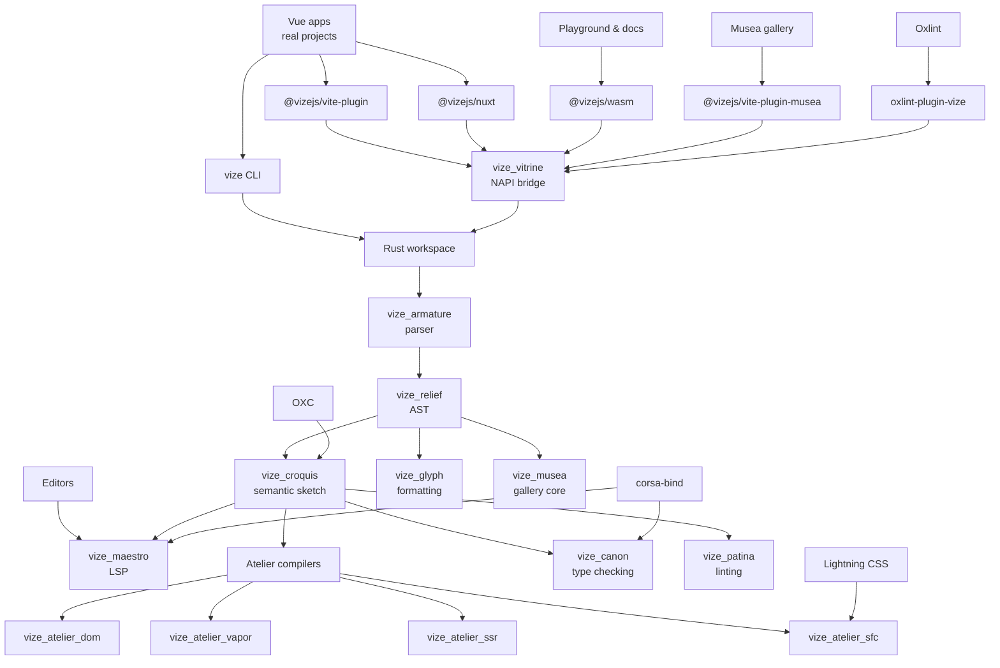
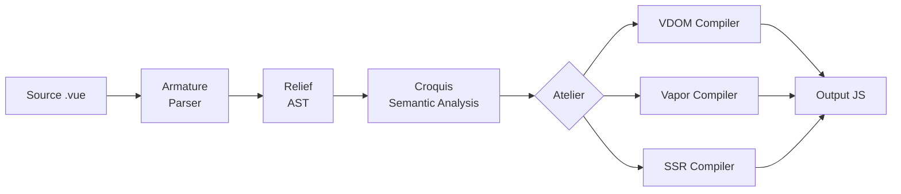
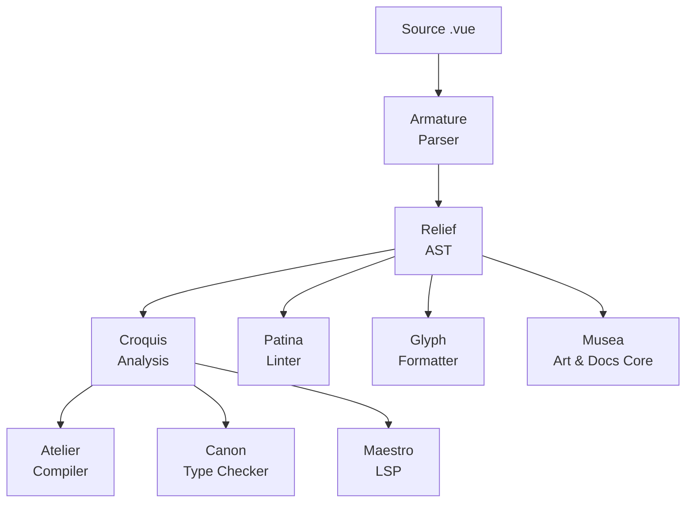

<!-- Reviewed translation; source: architecture/overview.md; scope: introduction, headings and reading order -->

# アーキテクチャの概要

Vize の JavaScript パッケージと Rust のコンパイラ・開発ツールのつながりを説明します。
連携の不具合を調べたり修正を提案したりする前に、どの部分が動作を担当するか確認したいときに使ってください。
アプリへの導入は [Getting Started](../getting-started.md) から始められます。

[関係図](#プロジェクト関係マップ) で、`@vizejs/vite-plugin` などの入口から担当クレートをたどってください。
実装ファイルは [ソースガイド](./source-guide.md)、公開 API の役割は
[クレートリファレンス](./crates.md) で確認できます。

図は `crates/` にある既存製品の処理経路を表しています。実験段階のレベル構造は `davinci/` にあり、
移行の順序と条件は [レベル再編の決定記録](https://github.com/ubugeeei-prod/vize/blob/main/docs/davinci/decisions/2026-09-27-level-restructure%2Emd) に記載されています。
内部構造は引き続き変更されます。

## プロジェクト関係マップ

JavaScript の連携パッケージはネイティブバインディングを呼び出し、コンパイラと開発ツールは
共通の構文解析・意味解析を利用します。利用しているパッケージから矢印をたどってください。

```mermaid
graph TD
    App["Vue apps<br/>real projects"] --> Vite["@vizejs/vite-plugin"]
    App --> Nuxt["@vizejs/nuxt"]
    App --> Cli["vize CLI"]
    Editor["Editors"] --> Maestro["vize_maestro<br/>LSP"]
    Browser["Playground & docs"] --> Wasm["@vizejs/wasm"]
    MuseaUi["Musea gallery"] --> MuseaPkg["@vizejs/vite-plugin-musea"]
    Oxlint["Oxlint"] --> OxlintPkg["oxlint-plugin-vize"]

    Vite --> Vitrine["vize_vitrine<br/>NAPI bridge"]
    Nuxt --> Vitrine
    Wasm --> Vitrine
    MuseaPkg --> Vitrine
    OxlintPkg --> Vitrine
    Cli --> Core["Rust workspace"]
    Vitrine --> Core

    Core --> Armature["vize_armature<br/>parser"]
    Armature --> Relief["vize_relief<br/>AST"]
    Relief --> Croquis["vize_croquis<br/>semantic sketch"]
    Croquis --> Atelier["Atelier compilers"]
    Atelier --> Dom["vize_atelier_dom"]
    Atelier --> Vapor["vize_atelier_vapor"]
    Atelier --> Ssr["vize_atelier_ssr"]
    Atelier --> Sfc["vize_atelier_sfc"]

    Croquis --> Canon["vize_canon<br/>type checking"]
    Croquis --> Patina["vize_patina<br/>linting"]
    Relief --> Glyph["vize_glyph<br/>formatting"]
    Croquis --> Maestro
    Relief --> Musea["vize_musea<br/>gallery core"]

    Oxc["OXC"] --> Croquis
    Corsa["corsa-bind"] --> Canon
    Corsa --> Maestro
    Lightning["Lightning CSS"] --> Sfc
```

この関係マップは、すべてのコール エッジではなく、所有権と再利用に関するものです。重要な不変条件は
パーサー、AST、セマンティック分析は共有されたままですが、コンパイラー バックエンドと開発者ツールは共有されます。
その共有言語モデルを中心とした置き換え可能なワークショップは残ります。

## レーン

```mermaid
graph LR
    A[Source .vue] --> B[Armature<br/>Parser]
    B --> C[Relief<br/>AST]
    C --> D[Croquis<br/>Semantic Analysis]
    D --> E{Atelier}
    E --> F[VDOM Compiler]
    E --> G[Vapor Compiler]
    E --> H[SSR Compiler]
    F --> I[Output JS]
    G --> I
    H --> I
```

### ステージ詳細

1.**ソース**— `<template>`、`<script>`、および `<style>` ブロックを含む `.vue` ファイル2.**アーマチュア**(パーサー) — 生のソースをトークンのストリームにトークン化し、構造化された AST に解析します。トークナイザーは、Vue 固有の構文、ディレクティブ (`v-if`、`v-for`、`v-bind`)、式補間 (`{{ }}`)、および SFC ブロック境界を処理します。3.**レリーフ**(AST) — 中間表現。すべての下流ステージはこの共有 AST 上で動作し、冗長な解析を排除します。4.**Croquis**(セマンティック分析) - テンプレート式を解決し、変数スコープを追跡し、バインディング タイプ (setup、data、props、inject) を検出し、式の正確さを検証します。 JavaScript/TypeScript AST 解析に OXC を使用します。5.**Atelier**(コンパイル) — 分析された AST を JavaScript 出力に変換します。 3 つのバックエンドが異なるターゲットに対応します。

- **VDOM**(`vize_atelier_dom`) — パッチ フラグの最適化と静的ホイスティングを使用した `createVNode`/`h` 呼び出し
- **Vapor**(`vize_atelier_vapor`) — 直接 DOM 操作を使用したきめ細かいリアクティブ コード (VDOM なし)
- **SSR**(`vize_atelier_ssr`) — 水和マーカーとの文字列連結 6.**出力**— ソース マップを含む生成された JavaScript コード

## ツールレーン

Vize はコンパイル以外にも、同じ解析および分析インフラストラクチャを再利用する追加ツールを提供します。

```mermaid
graph TD
    A[Source .vue] --> B[Armature<br/>Parser]
    B --> C[Relief<br/>AST]
    C --> D[Croquis<br/>Analysis]
    D --> E[Atelier<br/>Compiler]
    C --> F[Patina<br/>Linter]
    C --> G[Glyph<br/>Formatter]
    D --> H[Canon<br/>Type Checker]
    C --> I[Musea<br/>Art & Docs Core]
    D --> J[Maestro<br/>LSP]
```

構文解析と AST の共通化により、言語処理の重複を減らせます。コンパイラや各ツールの互換性は、
それぞれのフィクスチャと連携テストで確認します。

型チェックの場合、`vize_canon` はもう 1 つのステップを追加します。Vue SFC から仮想 TypeScript を生成し、[`corsa-bind`](https://github.com/ubugeeei/corsa-bind) からの Corsa プロジェクト セッションにネイティブ診断を依頼し、その結果を元のファイルにマッピングします。

実装ワークフローは次の場所に文書化されています。
[Language Engineering Practices](./language-engineering-practices.md)、パーサーをマップします。
コンパイラ、アナライザ、タイプチェッカー、フォーマッタ、LSP、およびフィクスチャ、スナップショット、
同等性、ベンチマーク、準備状況の証拠がレビューされることが予想されます。

## クレートの責任

| レイヤー       | クレート                 | 役割                                                                  |
| -------------- | -------------------- | --------------------------------------------------------------------- |
| 基盤           | `vize_carton`        | 共有ユーティリティ、アリーナ アロケータ、文字列インターン             |
| AST            | `vize_relief`        | AST ノード定義、エラー タイプ、コンパイラ オプション                  |
| 解析           | `vize_armature`      | トークナイザー + 再帰降下パーサー                                     |
| 分析           | `vize_croquis`       | セマンティック分析、スコープ追跡、バインディング検出                  |
| コンパイル           | `vize_atelier_core`  | 共有変換レーン、codegen ユーティリティ、ソース マップ                 |
| コンパイル           | `vize_atelier_dom`   | VDOM コード生成                                                       |
| コンパイル           | `vize_atelier_vapor` | Vapor モードコード生成                                                  |
| コンパイル           | `vize_atelier_sfc`   | SFC オーケストレーション (スクリプト + テンプレート + スタイル + HMR) |
| コンパイル           | `vize_atelier_ssr`   | サーバー側レンダリングのコンパイル                                    |
| バインディング | `vize_vitrine`       | Node.js (NAPI) + WASM バインディング                                  |
| CLI            | `vize`               | コマンドラインインターフェース (clap + rayon)                         |
| 型チェック     | `vize_canon`         | `corsa-bind` によるネイティブ TypeScript および Vue 診断              |
| リンティング   | `vize_patina`        | i18n を使用した Vue.js リンター (en/ja/zh)                            |
| フォーマット   | `vize_glyph`         | Vue.js フォーマッタ (テンプレート + スクリプト + スタイル)            |
| LSP            | `vize_maestro`       | 言語サーバー プロトコル (tower-lsp)                                   |
| Musea         | `vize_musea`         | アート解析、ドキュメント、パレット、自動生成、および VRT コア         |
| TUI         | `vize_fresco`        | ターミナル UI フレームワーク (crossterm + taffy)                      |

Musea のギャラリー UI と開発サーバー統合は JavaScript パッケージ内にあります
`@vizejs/vite-plugin-musea`; Rust クレートは解析と生成のコアに焦点を当てています。

## 命名規則

既存製品のクレート名は美術や彫刻の用語に由来します。以下は、ソース内の名前を読むための対応表です。
新しい `davinci/` のクレートは `vize_l0` から `vize_l4` など、レベル名を使います。
プロジェクトの考え方は [Philosophy](../philosophy.md) を参照してください。

| 名前 | 由来 | 技術上の役割 |
| --- | --- | --- |
| Carton | 画家の道具入れ | 共有ユーティリティ |
| Relief | 浮き彫り | AST とコンパイラの設定 |
| Armature | 彫刻の芯材 | パーサー |
| Croquis | 素描 | 意味解析 |
| Atelier | 工房 | コンパイラ |
| Vitrine | 展示ケース | ネイティブ・WASM バインディング |
| Canon | 比例の基準 | 型チェッカー |
| Patina | 緑青 | リンター |
| Glyph | 彫られた文字 | フォーマッタ |
| Maestro | 指揮者 | LSP |
| Musea | museum の複数形 | コンポーネントギャラリー |
| Fresco | フレスコ画 | TUI の基盤 |

### 名前から役割を読む

たとえば `vize_atelier_dom` は、DOM 向けのコードを生成する既存のコンパイラクレートです。
名前の由来を暗記する必要はありません。担当する機能は [クレートリファレンス](./crates.md) で調べられます。

## 外部依存関係

Vize は、特殊なタスクのために広範な Rust エコシステムと統合します。

| 依存関係                                                 | 目的                                                 | 使用者                                      |
| -------------------------------------------------------- | ---------------------------------------------------- | ------------------------------------------- |
| [OXC](https://oxc.rs/)                                   | JavaScript/TypeScript AST 解析                       | `vize_croquis`、`vize_atelier_core`         |
| [レーヨン](https://docs.rs/rayon)                        | データ並列マルチスレッド                             | `vize`、`vize_vitrine`                      |
| [バンパロ](https://docs.rs/bumpalo)                      | AST ノードのアリーナ割り当て                         | `vize_carton`                               |
| [ライトニングCSS](https://lightningcss.dev/)             | CSS の解析と変換                                     | `vize_atelier_sfc`                          |
| [`corsa-bind`](https://github.com/ubugeeei/corsa-bind)   | ネイティブ TypeScript プロジェクトのセッションと診断 | `vize_canon`、`vize_maestro`、`vize_patina` |
| [タワー-lsp](https://docs.rs/tower-lsp)                  | LSP サーバー フレームワーク                          | `vize_maestro`                              |
| [拍手](https://docs.rs/clap)                             | CLI 引数の解析                                       | `vize`                                      |
| [wasm-bindgen](https://rustwasm.github.io/wasm-bindgen/) | WASM と JavaScript の相互運用                        | `vize_vitrine`                              |
| [napi-rs](https://napi.rs/)                              | Node.js ネイティブ アドオン バインディング           | `vize_vitrine`                              |
