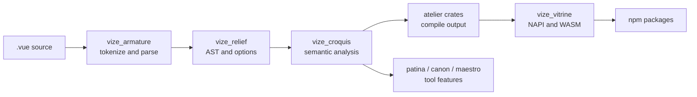

<!-- Generated translation; source: architecture/source-guide.md -->

# ソースガイド

このページは、Vize のみを使用するのではなく、ソース コードを変更する必要がある投稿者向けのマップです。
高レベルの関係が必要な場合は、[アーキテクチャの概要](./overview.md) から始めてください。
図を参照してから、このガイドを使用して、動作を所有する実装ファイルを見つけます。

## リポジトリの形状

Vize はほとんどの製品の動作を Rust ワークスペースに保持し、JavaScript パッケージは次のように機能します。
配布層と統合層。

| パス      | そこに住むもの                                                                                                              |
| --------- | --------------------------------------------------------------------------------------------------------------------------- |
| `crates/` | 解析、分析、コンパイル、リンティング、フォーマット、型チェック、LSP、CLI、およびネイティブ バインディング用の Rust クレート |
| `npm/`    | Vite、Nuxt、エディター拡張機能、Musea 統合、および公開パッケージ ラッパー用の JavaScript パッケージ                         |
| `docs/`   | ユーザー ドキュメント、アーキテクチャ ノート、リリース ノート、ドキュメント サイトのテーマ                                  |
| `tests/`  | クロスパッケージのフィクスチャ、実際のプロジェクト、ツールのテスト、およびスナップショットのガバナンス                      |
| `bench/`  | パフォーマンス比較スクリプトと PR ベンチマーク予算の適用                                                                    |
| `tools/`  | 出荷された製品の一部ではないリポジトリの自動化                                                                              |

変更がディレクトリをまたぐ場合、所有者は通常、ユーザーに表示されるファイルを作成するレイヤーになります。
行動。たとえば、コンパイラ出力の変更は、再現元が `crates/` である場合でも、
npmパッケージのテスト。

## 言語パイプライン

ほとんどのソース変更は同じデータ フローに従います。



共有ルールはシンプルです。一度解析し、構文モデルを共通に保ち、その後、各製品を表面化します。
所有する動作のみを追加します。

## クレートエントリーポイント

| エリア変更                           | ここから始めましょう                   | 次に、                                                                   | をチェックしてください。 |
| ------------------------------------ | -------------------------------------- | ------------------------------------------------------------------------ | ------------------------ |
| テンプレートの解析                   | `crates/vize_armature/src/lib.rs`      | パーサー フィクスチャと予想される AST スナップショット                   |
| AST 形状とコンパイラ オプション      | `crates/vize_relief/src/lib.rs`        | ダウンストリームのコンパイラ、lint、およびフォーマッタの呼び出し元       |
| テンプレートのセマンティクス         | `crates/vize_croquis/src/lib.rs`       | スコープ、バインディング、反応性、および仮想 TypeScript ヘルパー         |
| 共有コンパイラの動作                 | `crates/vize_atelier_core/src/lib.rs`  | バックエンド固有のアトリエクレート                                       |
| クライアントテンプレートの出力       | `crates/vize_atelier_dom/src/lib.rs`   | 生成されたコードのスナップショットとランタイム フィクスチャ テスト       |
| 蒸気出力                             | `crates/vize_atelier_vapor/src/lib.rs` | 蒸気固有のルールと実際のフィクスチャの出力                               |
| SSR出力                              | `crates/vize_atelier_ssr/src/lib.rs`   | SSR スナップショット、脱出、および水分補給の動作                         |
| SFCオーケストレーション              | `crates/vize_atelier_sfc/src/lib.rs`   | スクリプト、テンプレート、スタイル、HMR、およびソースマップのパス        |
| リントのルール                       | `crates/vize_patina/src/lib.rs`        | ルールのスナップショットとローカライズされた診断                         |
| 型チェック                           | `crates/vize_canon/src/lib.rs`         | 生成された仮想 TS および `corsa-bind` 診断                               |
| LSP の動作                           | `crates/vize_maestro/src/lib.rs`       | サーバー ハンドラー、仮想ドキュメント、およびエディターのスモーク テスト |
| フォーマット                         | `crates/vize_glyph/src/lib.rs`         | ゴールデンフォーマットスナップショット                                   |
| ネイティブおよび WASM バインディング | `crates/vize_vitrine/src/lib.rs`       | npm パッケージ ラッパーと生成された型宣言                                |
| CLI の動作                           | `crates/vize/src/main.rs`              | コマンド モジュール、スナップショット、ビルド/チェック/lint 統合テスト   |

最初にパブリック クレートのエントリ ポイントに従うことをお勧めします。多くのクレートにはコンパクトな `lib.rs` モジュールが含まれています。
貢献者が触れることが予想される内部モジュールを再エクスポートします。

## JavaScript パッケージのエントリ ポイント

| パッケージ                  | ソースエントリ                                                    | 錆びの境界                                        |
| --------------------------- | ----------------------------------------------------------------- | ------------------------------------------------- |
| `@vizejs/vite-plugin`       | `npm/builder/vite/src/index.ts`                                   | `@vizejs/native` ～ `vize_vitrine`                |
| `@vizejs/nuxt`              | `npm/framework/nuxt/src/index.ts`                                 | Vite プラグイン オプションとコンポーネントの統合  |
| `@vizejs/wasm`              | `vize_vitrine` WASM エクスポートに関する生成されたパッケージ      | `crates/vize_vitrine/src/wasm`                    |
| `@vizejs/vite-plugin-musea` | `npm/builder/vite-musea/src/index.ts` および関連パッケージ コード | `vize_musea` バインディングを通じて公開される API |
| `oxlint-plugin-vize`        | `npm/oxlint/src/index.ts`                                          | バインディングによる `vize_patina` 診断           |

統合配線にはパッケージ テストを使用しますが、言語セマンティクスは Rust テストに保持します。パッケージ
レイヤーは主に、オプション、仮想モジュール、HMR、およびネイティブ呼び出しが接続されていることを証明する必要があります。

## ワークフローの変更

1. 上の表から所有するクレートまたはパッケージを見つけます。
2. 動作を証明する最小のフィクスチャまたはスナップショットを追加します。
3. その所有者に対してNarrowコマンドを実行します。
4. 変更時のチェックをパッケージ、実世界、ブラウザ、ベンチマーク、または GitHub Actions に拡大します。
   公共の場を横切ります。

言語に関わる作業の場合は、次の証拠マトリックスに従ってください。
[言語エンジニアリングの実践](./language-engineering-practices.md)。クレートの責任について
およびパッケージのマッピングには、[Crate Reference](./crates.md) を使用します。

## ソースの長さ

手書きのソース ファイルは 350 行以下に抑えるようにしてください。リポジトリにはまだ履歴が残っています
例外があるため、最初のガードは増分です。プル リクエストでは新しい制限を超えたファイルを追加すべきではありません。
制限未満のファイルを制限を超えてプッシュするか、既存の制限を超えたファイルを拡張します。

以下を使用してインベントリをローカルで実行します。

```sh
vp run --workspace-root source:lengths
```

`test:scripts` GitHub Actions ジョブは、プルに対してチェック モードで同じ MoonBit ツールを実行します。
ベースコミットをリクエストします。生成されたファイル、スナップショット、フィクスチャ、ロックファイル、ベンダー出力、カバレッジ出力、
また、ビルド ディレクトリはソース インベントリから除外されます。既存の例外に対処する必要がある場合、
最初に所有権境界によって分割することを好みます: ヘルパー、フィクスチャ、スナップショット、コマンド ハンドラー
通常、共有データ構造よりも適切な抽出ターゲットを作成します。

## ツールスクリプト

リポジトリ自動化では、`tools/moon/cmd/` の下の MoonBit コマンド パッケージが優先されます。彼らは駆け抜ける
通常のパッケージ パス (`moon run --target native tools/moon/cmd/<name> -- <args>`)、ツールチェーンを共有
すでにコンパイラを構築しており、実行する `tests/tooling/*.test.ts` スイートでカバーされています。
`moon run` 経由でそれらを生成し、期待される完全な出力をアサートします。ルートタスクは `moonScript` で呼び出します。
`tools/config/vite-plus/task-commands.ts` のヘルパーにより、各コンシューマーはタスク名ではなく安定したタスク名を維持します。
インラインコマンド。

MoonBit の適切な候補は、引数の解析、JSON またはテキストなど、小さく、純粋で、依存関係が少ないものです。
変換、インベントリ、および合否チェック。その正しさは `moon run` テストで証明できます。

MoonBit が摩擦を削除するのではなく追加する場合は、ノード (`.mjs`) にスクリプトを保持します。

- 他の JavaScript または `node --test` スイートによってモジュールとしてインポートされます (たとえば、
  `tools/commands/ci/github/release-platforms.rs`) なので、これを書き直すと 1 つのソースが 2 つの言語に分割されてしまいます。
- npm エコシステム (グロビング ライブラリ、パッケージ ツール、GitHub Action SDK) または
  MoonBit に相当するものがないノード専用 API。
- 十分に大規模であるか探索的であるため、その動作は完全な出力テストによってまだ特定されていません。しないでください
  CI を破壊する可能性のあるものは、そのようなテストを行わずに移行してください。

## 生成された出力の読み取り

コンパイラーとツールの変更は、生成されたアーティファクトを通じて確認されます。これらの出力を
契約:

- テンプレート コンパイラのスナップショットには、出力された JavaScript と最適化の形状が表示されます。
- lint スナップショットには、診断範囲、メッセージ、ルールのメタデータが表示されます。
- 型チェック スナップショットには、仮想 TypeScript とマップされた診断が表示されます。
- フォーマッタのスナップショットには、ユーザーに表示される正確な出力が表示されます。
- 現実世界のフィクスチャのスナップショットは、広範なアプリケーションがまだ構築され実行されているかどうかを示します。

パス、タイミング、順序、ハッシュ、またはホスト固有のデータだけが原因で出力が変更される場合は、正規化します
スナップショットを更新する前のソース。

## 迷ったときは

ソースの小さな変更は明確な痕跡を残す必要があります: クレート、フィクスチャ、スナップショット、検証の所有
コマンド、および重要なより広範な CI レーン。変更が複数のクレートに属しているように感じられる場合は、
最初の共有表現から開始し、後の層をシン アダプターとして保持します。
