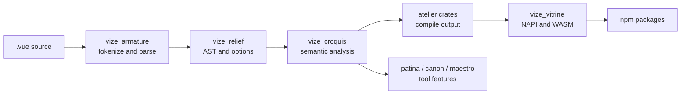

<!-- Reviewed translation; source: architecture/source-guide.md; scope: complete document -->

# ソースガイド

Vize を変更するときに、担当する実装とテストを見つけるためのガイドです。
パッケージとクレートの関係は [アーキテクチャの概要](./overview.md) で確認し、
下の [クレートの入口](#クレートエントリーポイント)・[JavaScript パッケージの入口](#javascript-パッケージのエントリ-ポイント) で変更箇所を選んでください。

テンプレートの誤った診断は `vize_croquis` や `vize_patina`、エディターの応答が返らない問題は
`vize_maestro` が調査の入口です。担当を見つけたら [変更の進め方](#ワークフローの変更) に従い、
小さな再現例と検証を追加してください。

## リポジトリの構成

製品の主要な動作は Rust ワークスペースで実装し、JavaScript パッケージが配布と連携を担当します。

| パス                        | 内容                                                                                                           |
| --------------------------- | -------------------------------------------------------------------------------------------------------------- |
| `crates/`                   | 解析、意味解析、コンパイル、lint、整形、型チェック、LSP、CLI、ネイティブバインディングを担当する Rust クレート |
| `davinci/`                  | 実験段階のレベルクレートと、新しい処理経路の共有基盤                                                           |
| `npm/`                      | Vite、Nuxt、エディター拡張、Musea の連携、公開パッケージのラッパーを提供する JavaScript パッケージ             |
| `docs/`                     | 利用者向けドキュメント、アーキテクチャの説明、リリースノート、ドキュメントサイトのテーマ                       |
| `tests/`                    | 複数のパッケージで使うフィクスチャ、実際のプロジェクト、ツールのテスト、スナップショットの管理                 |
| `tools/benchmarks/scripts/` | 性能比較のスクリプトと、PR のベンチマーク予算の適用                                                            |
| `tools/`                    | 製品に含めないリポジトリの自動化                                                                               |

変更が複数のディレクトリにまたがる場合は、通常、利用者が目にする動作を生成する層が実装を担当します。
たとえば、npm パッケージのテストで見つかったコンパイラの出力の問題も、変更先は `crates/` です。

## 言語パイプライン

ソースの変更は、主に次のデータの流れに沿って調べられます。


```mermaid
graph LR
    Source[".vue source"] --> Armature["vize_armature<br/>tokenize and parse"]
    Armature --> Relief["vize_relief<br/>AST and options"]
    Relief --> Croquis["vize_croquis<br/>semantic analysis"]
    Croquis --> Atelier["atelier crates<br/>compile output"]
    Croquis --> Tools["patina / canon / maestro<br/>tool features"]
    Atelier --> Vitrine["vize_vitrine<br/>NAPI and WASM"]
    Vitrine --> Packages["npm packages"]
```

共通の方針は、一度解析した構文モデルを共有し、各製品が担当する動作を追加することです。

## クレートエントリーポイント

| 変更の対象                         | 調査の入口                             | 次に確認するもの                                                        |
| ---------------------------------- | -------------------------------------- | ----------------------------------------------------------------------- |
| テンプレートの構文解析             | `crates/vize_armature/src/lib.rs`      | パーサーのフィクスチャと、期待する AST のスナップショット               |
| AST の構造・コンパイラのオプション | `crates/vize_relief/src/lib.rs`        | 後続のコンパイラ・lint・フォーマッタからの呼び出し                      |
| テンプレートの意味解析             | `crates/vize_croquis/src/lib.rs`       | スコープ、バインディング、リアクティビティ、仮想 TypeScript の補助処理  |
| 共通のコンパイラ処理               | `crates/vize_atelier_core/src/lib.rs`  | 各バックエンドの atelier クレート                                       |
| クライアント用テンプレートの出力   | `crates/vize_atelier_dom/src/lib.rs`   | 生成コードのスナップショットと、実行時のフィクスチャのテスト            |
| Vapor の出力                       | `crates/vize_atelier_vapor/src/lib.rs` | Vapor 固有のルールと、実際のプロジェクトのフィクスチャの出力            |
| SSR の出力                         | `crates/vize_atelier_ssr/src/lib.rs`   | SSR のスナップショット、エスケープ、ハイドレーションの動作              |
| SFC 全体の処理                     | `crates/vize_atelier_sfc/src/lib.rs`   | スクリプト・テンプレート・スタイル・HMR・ソースマップの処理経路         |
| lint ルール                        | `crates/vize_patina/src/lib.rs`        | ルールのスナップショットと、各言語の診断                                |
| 型チェック                         | `crates/vize_canon/src/lib.rs`         | 生成する仮想 TS と `corsa-bind` の診断                                  |
| LSP の動作                         | `crates/vize_maestro/src/lib.rs`       | サーバーのハンドラー、仮想ドキュメント、エディターの基本動作のテスト    |
| 整形                               | `crates/vize_glyph/src/lib.rs`         | 整形後の文字列を照合するスナップショット                                |
| ネイティブ・WASM バインディング    | `crates/vize_vitrine/src/lib.rs`       | npm パッケージのラッパーと、生成する型宣言                              |
| CLI の動作                         | `crates/vize/src/main.rs`              | コマンドのモジュール、スナップショット、build・check・lint の統合テスト |

まず、各クレートの公開エントリーポイントからたどってください。多くのクレートの `lib.rs` は短く、
実際に変更する内部モジュールを再エクスポートしています。

## JavaScript パッケージのエントリ ポイント

| パッケージ                  | ソースの入口                                                       | Rust 側との接点                                            |
| --------------------------- | ------------------------------------------------------------------ | ---------------------------------------------------------- |
| `@vizejs/vite-plugin`       | `npm/builder/vite/src/index.ts`                                    | `vize_vitrine` のバインディングを提供する `@vizejs/native` |
| `@vizejs/nuxt`              | `npm/framework/nuxt/src/index.ts`                                  | Vite プラグインのオプションとコンポーネント連携            |
| `@vizejs/wasm`              | `vize_vitrine` の WASM エクスポートから生成するパッケージ          | `crates/vize_vitrine/src/wasm`                             |
| `@vizejs/vite-plugin-musea` | `npm/builder/vite-musea/src/index.ts` と関連するパッケージのコード | バインディングで公開する `vize_musea` の API               |
| `oxlint-plugin-vize`        | `npm/oxlint/src/index.ts`                                          | バインディングで取得する `vize_patina` の診断              |

パッケージのテストでは連携を確認し、言語の意味に関わる動作は Rust のテストで確認してください。
パッケージ側では主に、オプション、仮想モジュール、HMR、ネイティブ呼び出しが正しく接続されることを検証します。

<a id="ワークフローの変更"></a>

## 変更の進め方

1. 上の表で、変更を担当するクレートやパッケージを見つけます。
2. 動作を示す最小限のフィクスチャやスナップショットを追加します。
3. 担当箇所に絞った検証コマンドを実行します。
4. 公開する機能や連携先に影響する場合は、パッケージ、実際のプロジェクト、ブラウザ、ベンチマーク、GitHub Actions へ検証範囲を広げます。

言語処理の変更で必要な検証は [言語工学の実践](./language-engineering-practices.md) にまとめています。
クレートの役割とパッケージとの対応は [クレートリファレンス](./crates.md) を参照してください。

## ソースの長さ

手書きのソースファイルは、350 行以下を目指してください。既存の長いファイルは残っているため、
まず変更によって上限超過が増えないように判定します。上限を超える新しいファイルの追加、
上限以内のファイルを上限超過にする変更、すでに上限を超えたファイルの行数を増やす変更は避けてください。

ローカルでファイルの行数を集計するコマンドは次のとおりです。

```sh
vp run --workspace-root source:lengths
```

GitHub Actions の `test:scripts` ジョブは、同じ Rust Script ツールをチェックモードで実行し、
PR のベースコミットと比較します。生成ファイル、スナップショット、フィクスチャ、ロックファイル、
vendor の出力、カバレッジの出力、ビルドディレクトリは集計から除外します。
既存の例外を変更する場合は、役割ごとの分割を優先してください。共通のデータ構造よりも、
ヘルパー、フィクスチャ、スナップショット、コマンドのハンドラーが切り出しに適しています。

## ツールスクリプト

リポジトリの自動化では、`tools/commands/` に置く Rust Script コマンドを優先します。
共通の補助処理は、用途に応じて `tools/support/` に置きます。ルートのタスクは
`tools/config/vite-plus/task-commands.ts` の `rustTool` で呼び出すため、利用側はインラインコマンドではなく、
安定したタスク名を使えます。

Rust Script に適しているのは、引数の解析、JSON・テキストの変換、集計、合否判定など、
小さく、純粋で、依存関係の少ない処理です。正しさを直接 `rust-script` のテストで示せるものを選んでください。

次の場合は、移植による負担が増えるため、Node のスクリプト (`.mjs`) を維持してください。

- 他の JavaScript や `node --test` のテストからモジュールとして読み込む場合。書き換えると、一つの処理が二つの言語に分かれます。
- npm のライブラリやツール、GitHub Action SDK、Rust に直接対応するものがない Node 専用 API に依存する場合。
- 大きい処理や試行中の処理で、まだ完全な出力を比較するテストがない場合。そのようなテストを用意せずに、CI を壊す可能性のある移植は行わないでください。

## 生成された出力の読み取り

コンパイラやツールの変更は、生成した成果物でレビューします。次の出力を、動作の契約として扱ってください。

- テンプレートコンパイラのスナップショットは、生成する JavaScript と最適化後の構造を示します。
- lint のスナップショットは、診断の範囲、メッセージ、ルールのメタデータを示します。
- 型チェックのスナップショットは、仮想 TypeScript と、元のソース位置に対応付けた診断を示します。
- フォーマッタのスナップショットは、利用者が目にする文字列を正確に示します。
- 実際のプロジェクトのフィクスチャのスナップショットは、アプリケーション全体を引き続きビルド・実行できるかを示します。

パス、計測時間、順序、ハッシュ、ホスト固有の情報だけで出力が変わる場合は、
スナップショットを更新する前に、その情報が入る箇所を正規化してください。

## 迷ったときは

小さな変更でも、担当クレート、フィクスチャ、スナップショット、検証コマンド、必要な追加の CI 検証を
たどれるようにしてください。複数のクレートに関わる変更は、最初の共通表現から調べ、後続の層は薄いアダプターに保ちます。
