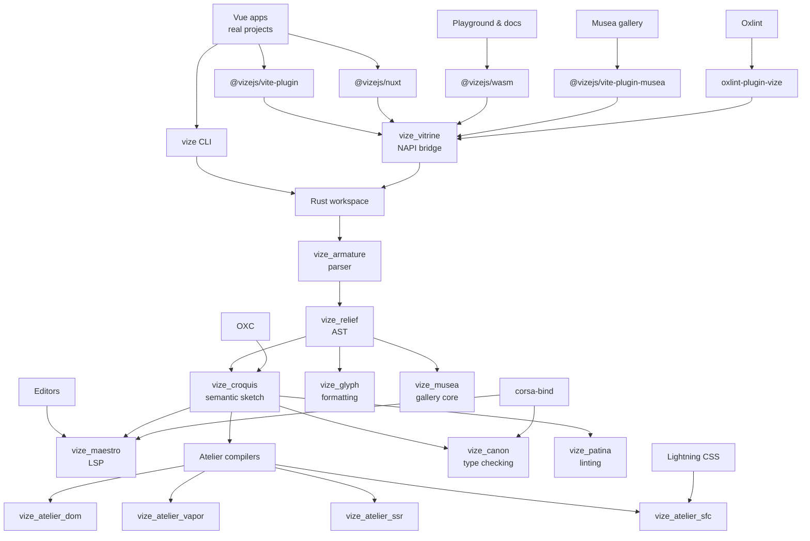
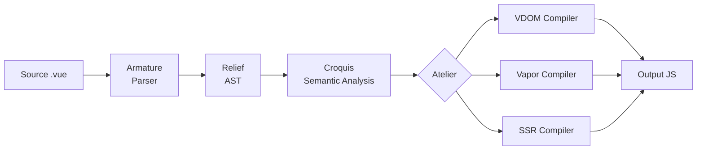
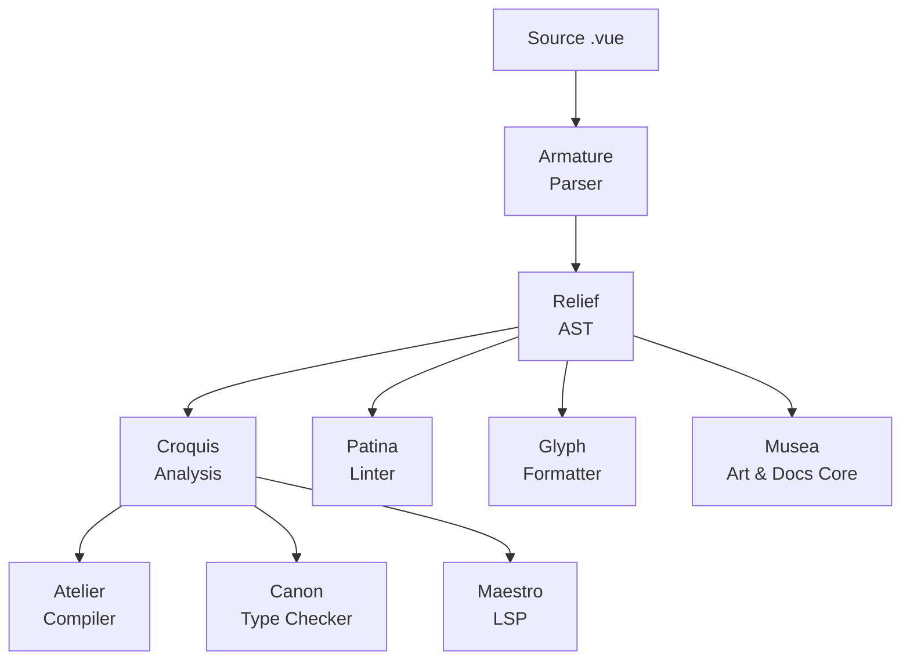

<!-- Generated translation; source: architecture/overview.md -->

# Visão Geral da Arquitetura

> **⚠️ Trabalho em andamento:** O Vize está em desenvolvimento ativo e ainda não está pronto para uso em produção. A arquitetura interna pode mudar conforme o projeto evolui.

Vize foi construído como um espaço modular de trabalho Rust, onde cada caixa resolve uma preocupação específica. A arquitetura é organizada em faixas reutilizáveis que transportam o código-fonte SFC do Vue por meio de estágios de análise sintática, análise e compilação.

## Mapa de Relacionamento do Projeto

O repositório é organizado como um estúdio: superfícies voltadas para o usuário entram por meio de pacotes JavaScript,
o núcleo compartilhado Rust molda a fonte do Vue, e ferramentas especializadas reutilizam o mesmo parser e modelo semântico de
em vez de cada uma manter uma cópia privada da linguagem.

Esse mapa de relacionamento é sobre posse e reutilização, não sobre todas as vantagens de chamada. O invariante importante é
que analisador pars, AST e análise semântica permanecem compartilhados, enquanto os backends do compilador e as ferramentas de desenvolvimento
continuam oficinas substituíveis em torno desse modelo de linguagem compartilhado.

## Faixas

### Detalhes do Cenário

1. **Fonte** — Um arquivo `.vue` contendo blocos `<template>`, `<script>`e `<style>`
2. **Armature** (Parser) — Tokeniza a fonte bruta em um fluxo de tokens, depois os analisa em um AST estruturado. O tokenizador lida com sintaxe específica do Vue: diretivas (`v-if`, `v-for`, `v-bind`), interpolação de expressões (`{{ }}`) e limites de blocos SFC.
3. **Alívio** (AST) — A representação intermediária. Todos os estágios a jusante operam nesse AST compartilhado, eliminando a análise sintática redundante.
4. **Croquis** (Análise Semântica) — Resolve expressões de template, acompanha escopos de variáveis, detecta tipos de binding (setup, dados, props, injeção) e valida a correção da expressão. Usa OXC para análise AST em JavaScript/TypeScript.
5. **Atelier** (Compilação) — Transforma o AST analisado em saída JavaScript. Três backends atendem a alvos diferentes:
   - **VDOM** (`vize_atelier_dom`) — chamadas `createVNode`/`h` com otimização de patch flag e içagem estática
   - **Vapor** (`vize_atelier_vapor`) — Código reativo de granulação fina com manipulação direta do DOM (sem VDOM)
   - **SSR** (`vize_atelier_ssr`) — Concatenação de cadeias com marcadores de hidratação
6. **Saída** — Código JavaScript gerado com mapas de origem

## Estradas de Ferramentas

Além da compilação, o Vize oferece ferramentas adicionais que reutilizam a mesma infraestrutura de análise e análise:

Como todas as ferramentas compartilham o mesmo parser e AST, elas têm um entendimento consistente do seu código. Uma regra de fiapos no Patina opera nos mesmos nós AST que o compilador no Atelier — não há risco de discordância do analisador.

Para verificação de tipos, `vize_canon` adiciona mais um passo: gera TypeScript virtual a partir dos SFCs do Vue e solicita sessões de projeto Corsa do [`corsa-bind`](https://github.com/ubugeeei/corsa-bind) diagnósticos nativos, depois mapeia esses resultados de volta para os arquivos originais.

O fluxo de trabalho de implementação é documentado em
[Language Engineering Practices](./language-engineering-practices.md), que mapeia as alterações de parser, compilador de
, analisador, verificador de tipos, formatador, LSP e release para as evidências de fixture, snapshot, paridade
, benchmark e prontidão esperadas para revisão.

## Responsabilidades na Caixa

| Camada               | Caixa                | Função                                                                       |
| -------------------- | -------------------- | ---------------------------------------------------------------------------- |
| Fundação             | `vize_carton`        | Utilidades compartilhadas, alocador de arena, estagiário de string           |
| AST                  | `vize_relief`        | Definições de nós AST, tipos de erro, opções do compilador                   |
| Análise sintáctica   | `vize_armature`      | Tokenizer + parser de descida recursiva                                      |
| Análise              | `vize_croquis`       | Análise semântica, rastreamento de escopo, detecção de ligação               |
| Compilação           | `vize_atelier_core`  | Rota de transformação compartilhada, utilitários de codegen, mapas de origem |
| Compilação           | `vize_atelier_dom`   | Geração de código VDOM                                                       |
| Compilação           | `vize_atelier_vapor` | Geração de códigos no modo vapor                                             |
| Compilação           | `vize_atelier_sfc`   | Orquestração SFC (script + template + style + HMR)                           |
| Compilação           | `vize_atelier_ssr`   | Compilação de renderização no lado do servidor                               |
| Encadernações        | `vize_vitrine`       | Node.js (NAPI) + Ligações WASM                                               |
| CLI                  | `vize`               | Interface de linha de comando (clap + rayon)                                 |
| Verificação de Tipos | `vize_canon`         | Diagnósticos nativos de TypeScript e Vue via `corsa-bind`                    |
| Linting              | `vize_patina`        | Vue.js Linter com i18N (EN/JA/ZH)                                            |
| Formatação           | `vize_glyph`         | Vue.js formatador (template + script + style)                                |
| LSP                  | `vize_maestro`       | Protocolo de Servidor de Linguagem (tower-lsp)                               |
| Musea                | `vize_musea`         | Análise de arte, documentação, paleta, autogeração e núcleo VRT              |
| TUI                  | `vize_fresco`        | Framework de interface terminal (crossterm + taffy)                          |

A interface da galeria e a integração com dev-server para o Musea estão disponíveis no pacote JavaScript
`@vizejs/vite-plugin-musea`; a caixa Rust foca no núcleo de análise e geração.

## Convenção de nomeação

As caixas Vize recebem nomes de **terminologia de arte e escultura**, refletindo como cada componente molda e transforma o código do Vue. Esse sistema de nomes vai além da estética — ele codifica o papel e as relações entre as caixas. Veja [Philosophy](../philosophy.md) para a justificativa completa.

| Nome         | Origem       | Analogia da Arte                                                  | Função Técnica                                                                              |
| ------------ | ------------ | ----------------------------------------------------------------- | ------------------------------------------------------------------------------------------- |
| **Caixa**    | /kɑːˈtɒn/    | Estojo de portfólio do artista — armazena e organiza ferramentas  | Utilidades compartilhadas — a caixa de ferramentas fundamental da qual toda caixa depende   |
| **Relevo**   | /rɪˈliːf/    | Técnica escultórica que projeta a partir de uma superfície plana  | O AST — uma superfície estruturada que dá forma ao código-fonte bruto                       |
| **Armadura** | /ˈɑːrmətʃər/ | Esqueleto interno sustentando uma escultura                       | O parser — a estrutura estrutural que suporta o AST                                         |
| **Croquis**  | /kʁɔ.ki/     | Esboço gestual rápido capturando a essência de um sujeito         | Análise semântica — um esboço rápido que captura o significado de código                    |
| **Atelier**  | /ˌætəlˈjeɪ/  | Oficina de artista onde a criação acontece                        | Espaços de trabalho do compilador — onde o código é transformado em sua forma final         |
| **Vitrine**  | /vɪˈtriːn/   | Vitrine de vidro em museu                                         | Bindings — uma camada transparente que expõe o compilador a consumidores externos           |
| **Canon**    | /ˈkænən/     | Padrão das proporções ideais na escultura clássica                | Verificador de tipos — garante que o código esteja em conformidade com o padrão de correção |
| **Pátina**   | /ˈpætɪnə/    | Acabamento superficial envelhecido que indica qualidade e cuidado | Linter — aprimora o código identificando problemas que afetam a qualidade                   |
| **Glifo**    | /ɡlɪf/       | Símbolo ou forma de letra esculpida com proporções precisas       | Formatter — molda o código em formas de letras consistentes e legíveis                      |
| **Maestro**  | /ˈmaɪstroʊ/  | Maestro maestro que orquestra um conjunto                         | LSP — orquestra todos os recursos da linguagem em uma experiência unificada de editor       |
| **Musea**    | /mjuːˈziːə/  | Plural de museu — um espaço para exposição de arte                | Galeria de componentes — um espaço para exposições e exploração de componentes              |
| **Afresco**  | /ˈfrɛskoʊ/   | Técnica de pintura aplicada em paredes de gesso úmido             | Estrutura TUI — pintura das interfaces na superfície do terminal                            |

### Por que terminologia artística?

A analogia entre compilação de software e criação artística é surpreendentemente profunda:

- Um **parser** (Armadura) fornece o esqueleto interno — a estrutura sobre a qual todo o resto se baseia, assim como a armadura de um escultor sustenta a argila
- **A análise semântica** (Croquis) é como um esboço rápido — captura o significado essencial sem se comprometer com uma forma final
- O **compilador** (Atelier) é uma oficina onde a matéria-prima é transformada em uma obra finalizada
- O **AST** (Relevo) é uma projeção — ele dá estrutura tridimensional ao que originalmente era texto plano
- **Encadernações** (Vitrine) são vitrines de vidro — permitem que você veja e interaja com a obra interna sem tocá-la diretamente
- O **linter** (Patina) examina o acabamento superficial — encontrando imperfeições que afetam a qualidade geral
- O **formador** (Glifo) garante proporções consistentes — como um tipógrafo entalhando formas de letras com espaçamento preciso

Essa convenção de nomenclatura torna a hierarquia de caixas intuitiva: quando você vê `vize_atelier_dom`, entende imediatamente que é um _workshop_ que produz _saída VDOM_.

## Dependências externas

Vize se integra ao ecossistema mais amplo da Rust para tarefas especializadas:

| Dependência                                              | Propósito                                            | Usado por                                   |
| -------------------------------------------------------- | ---------------------------------------------------- | ------------------------------------------- |
| [OXC](https://oxc.rs/)                                   | Análise AST em JavaScript/TypeScript                 | `vize_croquis`, `vize_atelier_core`         |
| [Rayon](https://docs.rs/rayon)                           | Multithreading paralelo de dados                     | `vize`, `vize_vitrine`                      |
| [bumpalo](https://docs.rs/bumpalo)                       | Alocação de arena para nós AST                       | `vize_carton`                               |
| [LightningCSS](https://lightningcss.dev/)                | Análise sintática e transformação CSS                | `vize_atelier_sfc`                          |
| [`corsa-bind`](https://github.com/ubugeeei/corsa-bind)   | Sessões nativas de projeto TypeScript e diagnósticos | `vize_canon`, `vize_maestro`, `vize_patina` |
| [tower-lsp](https://docs.rs/tower-lsp)                   | Framework de servidor LSP                            | `vize_maestro`                              |
| [clap](https://docs.rs/clap)                             | Análise de argumentos CLI                            | `vize`                                      |
| [wasm-bindgen](https://rustwasm.github.io/wasm-bindgen/) | Interoperativa WASM-JavaScript                       | `vize_vitrine`                              |
| [napi-rs](https://napi.rs/)                              | Node.js Adesões nativas de addons                    | `vize_vitrine`                              |
