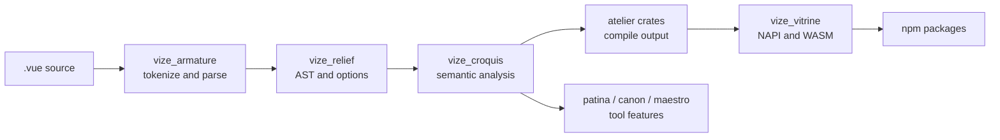

<!-- Generated translation; source: architecture/source-guide.md -->

# Guia de Fontes

Esta página é um mapa para colaboradores que precisam alterar o código-fonte em vez de usar apenas o Vize.
Comece pelo [Architecture Overview](./overview.md) quando precisar do diagrama
de relacionamento de alto nível, depois use este guia para encontrar os arquivos de implementação que possuem um comportamento.

## Formato do Repositório

O Vize mantém a maior parte do comportamento do produto no espaço de trabalho Rust, com os pacotes JavaScript atuando como camadas
distribuição e integração.

| Caminho   | O que vive lá                                                                                                                   |
| --------- | ------------------------------------------------------------------------------------------------------------------------------- |
| `crates/` | Rust crates para análise sintática, análise, compilação, linting, formatação, verificação de tipos, LSP, CLI e bindings nativos |
| `npm/`    | Pacotes JavaScript para Vite, Nuxt, extensões de editores, integrações com Musea e wrappers de pacotes publicados               |
| `docs/`   | Documentação para usuários, notas de arquitetura, notas de atualização e o tema do site docs                                    |
| `tests/`  | Fixtures cross-package, projetos do mundo real, testes de ferramentas e governança snapshot                                     |
| `tools/benchmarks/scripts/`  | Scripts de comparação de desempenho e fiscalização de benchmarks de PR                                                          |
| `tools/`  | Automação de repositórios que não faz parte do produto enviado                                                                  |

Quando uma mudança cruza diretórios, o proprietário geralmente é a camada que cria o comportamento
visível para o usuário. Por exemplo, uma alteração de saída do compilador pertence a `crates/`, mesmo quando a reprodução vem de
um teste de pacote npm.

## Pipeline de Linguagem

A maioria das alterações de origem segue o mesmo fluxo de dados:



A regra compartilhada é simples: analise uma vez, mantenha o modelo sintático comum e depois deixe cada superfície de produto
adicionar apenas o comportamento que possui.

## Pontos de Entrada na Caixa

| Área de mudança                           | Comece aqui                            | Então verifique                                                               |
| ----------------------------------------- | -------------------------------------- | ----------------------------------------------------------------------------- |
| Análise sintática de templates            | `crates/vize_armature/src/lib.rs`      | Fixtures do parser e snapshots AST esperados                                  |
| Forma AST e opções do compilador          | `crates/vize_relief/src/lib.rs`        | Compiladores posteriores, chamadas LINT e Formatter                           |
| Semântica de template                     | `crates/vize_croquis/src/lib.rs`       | helpers de escopo, vinculação, reatividade e TypeScript virtual               |
| Comportamento do compilador compartilhado | `crates/vize_atelier_core/src/lib.rs`  | Caixas de ateliê específicas para backend                                     |
| Saída do modelo de cliente                | `crates/vize_atelier_dom/src/lib.rs`   | snapshots de código gerados e testes de fixture em tempo de execução          |
| Saída de vapor                            | `crates/vize_atelier_vapor/src/lib.rs` | Regras específicas de vapor e saída de jogos do mundo real                    |
| Saída SSR                                 | `crates/vize_atelier_ssr/src/lib.rs`   | Snapshots SSR, fuga e comportamento de hidratação                             |
| Orquestração SFC                          | `crates/vize_atelier_sfc/src/lib.rs`   | script, template, style, HMR e caminhos de source-map                         |
| Regras de fiapos                          | `crates/vize_patina/src/lib.rs`        | Snapshots de regras e diagnósticos localizados                                |
| Verificação de tipos                      | `crates/vize_canon/src/lib.rs`         | gerou TS virtual e diagnósticos `corsa-bind`                                  |
| Comportamento dos LSP                     | `crates/vize_maestro/src/lib.rs`       | Manipuladores de servidores, documentos virtuais e testes de fumaça do editor |
| Formatação                                | `crates/vize_glyph/src/lib.rs`         | Instantâneos dourados de formatação                                           |
| Fixações nativas e WASM                   | `crates/vize_vitrine/src/lib.rs`       | Envelopes de pacotes NPM e declarações de tipo geradas                        |
| Comportamento da CLI                      | `crates/vize/src/main.rs`              | módulos de comando, snapshots e testes de integração build/check/lint         |

Prefiro seguir o ponto de entrada da caixa pública primeiro. Muitas caixas possuem módulos compactos `lib.rs` que
reexportar os módulos internos que o contribuinte deve tocar.

## Pontos de Entrada de Pacotes JavaScript

| Pacote                      | Entrada de fonte                                                     | Limite de ferrugem                                 |
| --------------------------- | -------------------------------------------------------------------- | -------------------------------------------------- |
| `@vizejs/vite-plugin`       | `npm/builder/vite/src/index.ts`                                      | `@vizejs/native` por `vize_vitrine`                |
| `@vizejs/nuxt`              | `npm/framework/nuxt/src/index.ts`                                    | Opções de plugins Vite e integração de componentes |
| `@vizejs/wasm`              | gerado pacotes por volta de `vize_vitrine` exportações WASM          | `crates/vize_vitrine/src/wasm`                     |
| `@vizejs/vite-plugin-musea` | `npm/builder/vite-musea/src/index.ts` e código de pacote relacionado | `vize_musea` APIs expostas por meio de bindings    |
| `oxlint-plugin-vize`        | `npm/oxlint/src/index.ts`                                             | `vize_patina` diagnóstico por meio de fixações     |

Use testes de pacote para fiação de integração, mas mantenha a semântica da linguagem nos testes Rust. A camada
pacote deve provar principalmente que opções, módulos virtuais, HMR e chamadas nativas estão conectadas.

## Fluxo de Trabalho de Mudança

1. Encontre a caixa ou pacote que possui nas tabelas acima.
2. Adicione o menor aparelho ou snapshot que comprove o comportamento.
3. Execute o comando estreito para esse dono.
4. Amplie para verificações de pacotes, do mundo real, de navegador, benchmarks ou GitHub Actions quando a mudança
   atravessa uma superfície pública.

Para trabalhos voltados para a linguagem, siga a matriz de evidências em
[Language Engineering Practices](./language-engineering-practices.md). Para responsabilidades de
de caixas e mapeamento de pacotes, use o [Crate Reference](./crates.md).

## Comprimento da Fonte

Procure manter os arquivos-fonte manuscritos com 350 linhas ou menos. O repositório ainda possui exceções históricas
, então a primeira proteção é incremental: uma pull request não deve adicionar um novo arquivo de limite
passar do limite ou expandir um arquivo de limite acima do limite.

Faça o inventário localmente com:

```sh
vp run --workspace-root source:lengths
```

O trabalho `test:scripts` GitHub Actions roda a mesma ferramenta MoonBit no modo check contra o commit de pull
request base. Arquivos gerados, snapshots, fixtures, lockfiles, saída do fornecedor, output de cobertura,
e diretórios de build são excluídos do inventário de origem. Quando uma exceção existente precisa de trabalho,
prefere dividir primeiro por limite de propriedade: helpers, fixtures, snapshots e command handlers
geralmente são melhores alvos de extração do que estruturas de dados compartilhadas.

## Scripts de Ferramentas

A automação de repositórios prefere pacotes de comandos MoonBit sob `tools/moon/cmd/`. Eles executam o caminho normal
do pacote (`moon run --target native tools/moon/cmd/<name> -- <args>`), compartilham a
da cadeia de ferramentas que já constrói o compilador e são cobertos por suítes `tests/tooling/*.test.ts` que os
via `moon run` e afirmam a saída esperada completa. As tarefas raiz as invocam com o ajudante `moonScript`
em `tools/config/vite-plus/task-commands.ts`, então cada consumidor mantém um nome de tarefa estável em vez de
um comando inline.

Bons candidatos ao MoonBit são pequenos, puros e com pouca dependência: análise sintática de argumentos, transformações de
de JSON ou texto, inventários e verificações de aprovação/reprovação, cuja correção pode ser comprovada com um teste `moon run` .

Mantenha um script em Node (`.mjs`) quando o MoonBit adicionaria atrito em vez de removê-lo:

- Ele é importado como módulo por outro JavaScript ou por uma suíte `node --test` (por exemplo,
  `tools/commands/ci/github/release-platforms.rs`), então reescrevê-lo dividiria uma fonte em dois idiomas.
  - Depende do ecossistema npm (bibliotecas globbing, ferramentas de pacotes, SDKs de ação do GitHub) ou de
    APIs exclusivas para nós que não têm equivalente ao MoonBit.
- É grande ou exploratório o suficiente para que seu comportamento ainda não seja definido por um teste de saída completa; Não
  migrar qualquer coisa que possa quebrar o IC sem esse tipo de teste.

## Leitura da Saída Gerada

As alterações no compilador e na ferramenta são revisadas por meio de artefatos gerados. Trate essas saídas como o contrato
:

- Snapshots do compilador de templates mostram JavaScript emitido e forma de otimização.
- Snapshots de lint mostram intervalos de diagnóstico, mensagens e metadados de regras.
- Snapshots de verificação de tipos mostram TypeScript virtual e diagnósticos mapeados.
- Snapshots de formatador mostram exatamente a saída que os usuários vão ver.
- Snapshots reais de dispositivos mostram se aplicações amplas ainda são construídas e executadas.

Se a saída mudar apenas por causa de caminhos, tempos, ordenação, hashes ou dados específicos do host, normalize
a fonte antes de atualizar snapshots.

## Quando Em Dúvida

Pequenas mudanças na fonte devem deixar um rastro claro: possuir caixa, luminária, snapshot, verificação
comando e qualquer faixa de CI mais ampla que importe. Se uma mudança parecer pertencer a múltiplas caixas,
começar pela representação compartilhada mais cedo e manter as camadas posteriores como adaptadores finos.
