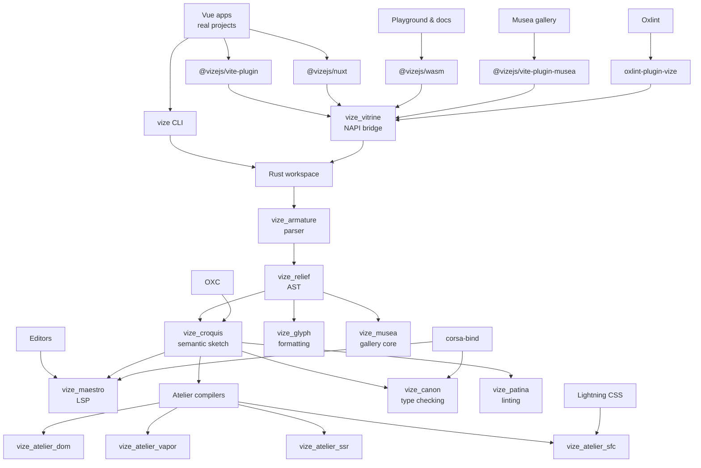
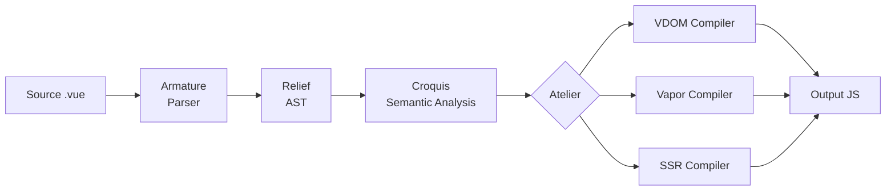
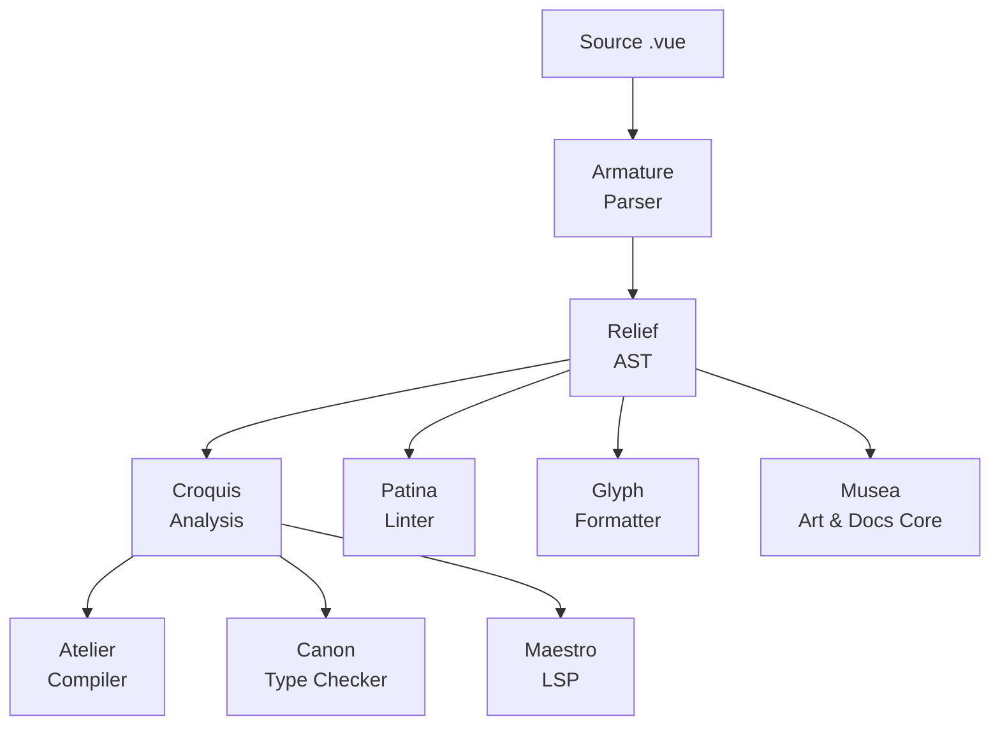

<!-- Generated translation; source: architecture/overview.md -->

# 架构概述

> **⚠️ 正在进行中：**Vize 正在积极开发中，尚未准备好用于生产使用。随着项目的发展，内部架构可能会发生变化。

Vize 构建为模块化 Rust 工作区，其中每个板条箱处理特定的问题。该架构被组织成可重用的通道，通过解析、分析和编译阶段承载 Vue SFC 源代码。

## 项目关系图

存储库的组织方式就像一个工作室：面向用户的表面通过 JavaScript 包输入，
共享的 Rust 核心塑造了 Vue 源代码，专用工具重用相同的解析器和语义
模型，而不是每个人都保留该语言的私人副本。

该关系图涉及所有权和重用，而不是每个调用边缘。重要的不变量是
解析器、AST 和语义分析保持共享，而编译器后端和开发人员工具
围绕该共享语言模型仍然是可替代的研讨会。

## 车道

### 舞台细节

1.**源**— 包含 `<template>`、`<script>` 和 `<style>` 块的 `.vue` 文件2.**Armature**（解析器）——将原始源标记为标记流，然后将它们解析为结构化 AST。分词器处理 Vue 特定的语法：指令（`v-if`、`v-for`、`v-bind`）、表达式插值（`{{ }}`）和 SFC 块边界。3.**Relief**(AST) — 中间表示。所有下游阶段都在此共享 AST 上运行，消除了冗余解析。4.**Croquis**（语义分析）——解析模板表达式，跟踪变量范围，检测绑定类型（设置、数据、道具、注入），并验证表达式的正确性。使用 OXC 进行 JavaScript/TypeScript AST 解析。5.**Atelier**（编译）——将分析后的 AST 转换为 JavaScript 输出。三个后端服务于不同的目标：

- **VDOM**(`vize_atelier_dom`) — `createVNode`/`h` 调用，带有补丁标志优化和静态提升
- **Vapor**(`vize_atelier_vapor`) — 具有直接 DOM 操作的细粒度反应式代码（无 VDOM）
- **SSR**(`vize_atelier_ssr`) — 带水合标记的字符串连接 6.**输出**— 生成带有源映射的 JavaScript 代码

## 工具通道

除了编译之外，Vize 还提供了其他工具来重用相同的解析和分析基础设施：

由于所有工具共享相同的解析器和 AST，因此它们对您的代码有一致的理解。 Patina 中的 lint 规则与 Atelier 中的编译器在相同的 AST 节点上运行 - 不存在解析器不一致的风险。

对于类型检查，`vize_canon` 又添加了一步：它从 Vue SFC 生成虚拟 TypeScript，并向 [`corsa-bind`](https://github.com/ubugeeei/corsa-bind) 请求 Corsa 项目会话进行本机诊断，然后将这些结果映射回原始文件。

实施工作流程记录在
[语言工程实践](./language-engineering-practices.md)，映射解析器，
编译器、分析器、类型检查器、格式化程序、LSP 以及对夹具、快照的发布更改，
预期进行审查的平价、基准和准备情况证据。

## 板条箱职责

| 层         | 板条箱               | 角色                                              |
| ---------- | -------------------- | ------------------------------------------------- |
| 基金会     | `vize_carton`        | 共享实用程序、arena 分配器、字符串实习            |
| 谷草转氨酶 | `vize_relief`        | AST 节点定义、错误类型、编译器选项                |
| 解析       | `vize_armature`      | 分词器 + 递归下降解析器                           |
| 分析       | `vize_croquis`       | 语义分析、范围跟踪、绑定检测                      |
| 编译       | `vize_atelier_core`  | 共享变换通道、codegen 实用程序、源映射            |
| 编译       | `vize_atelier_dom`   | VDOM 代码生成                                     |
| 编译       | `vize_atelier_vapor` | Vapor 模式代码生成                                |
| 编译       | `vize_atelier_sfc`   | SFC编排（脚本+模板+样式+HMR）                     |
| 编译       | `vize_atelier_ssr`   | 服务端渲染编译                                    |
| 绑定       | `vize_vitrine`       | Node.js (NAPI) + WASM 绑定                        |
| 命令行     | `vize`               | 命令行界面（拍手 + 人造丝）                       |
| 类型检查   | `vize_canon`         | 通过 `corsa-bind` 进行本机 TypeScript 和 Vue 诊断 |
| 绒毛       | `vize_patina`        | Vue.js linter 与 i18n (en/ja/zh)                  |
| 格式化     | `vize_glyph`         | Vue.js 格式化程序（模板+脚本+样式）               |
| LSP        | `vize_maestro`       | 语言服务器协议 (tower-lsp)                        |
| 穆塞亚     | `vize_musea`         | 艺术解析、文档、调色板、autogen 和 VRT 核心       |
| 途易       | `vize_fresco`        | 终端UI框架（crossterm + taffy）                   |

Musea 的图库 UI 和开发服务器集成位于 JavaScript 包中
`@vizejs/vite-plugin-musea`; Rust 箱专注于解析和生成核心。

## 命名约定

Vize 箱以**艺术和雕塑术语**命名，反映了每个组件如何塑造和转换 Vue 代码。这个命名系统不仅仅是为了美观——它编码了板条箱之间的角色和关系。请参阅[哲学](../philosophy.md) 了解完整的原理。

| 名称       | 产地         | 艺术类比                           | 技术角色                                      |
| ---------- | ------------ | ---------------------------------- | --------------------------------------------- |
| **纸箱**   | /kɑːˈtɒn/    | 艺术家的作品集案例——存储和整理工具 | 共享实用程序——每个板条箱都依赖的基础工具箱    |
| **救济**   | /rɪˈliːf/    | 从平面投射的雕塑技术               | AST——一种赋予原始源代码形状的结构化表面       |
| **电枢**   | /ˈɑːrmətʃər/ | 支撑雕塑的内部骨架                 | 解析器——支持 AST 的结构框架                   |
| **速写**   | /kʁɔ.ki/     | 捕捉主题本质的快速手势草图         | 语义分析——捕捉代码含义的快速草图              |
| **工作室** | /ˌætəlˈjeɪ/  | 创作发生的艺术家工作室             | 编译器工作区 — 代码在其中转换为最终形式       |
| **玻璃柜** | /vɪˈtriːn/   | 博物馆的玻璃展示柜                 | 绑定——将编译器暴露给外部消费者的透明层        |
| **佳能**   | /ˈkænən/     | 古典雕塑理想比例标准               | 类型检查器——确保代码符合正确性标准            |
| **铜绿**   | /ˈpætɪnə/    | 做旧的表面光洁度彰显品质和保养     | Linter — 通过识别影响质量的问题来完善代码     |
| **字形**   | /ɡlɪf/       | 具有精确比例的雕刻符号或字母       | 格式化程序 — 将代码塑造成一致、可读的字母形式 |
| **大师**   | /ˈmaɪstroʊ/  | 指挥乐团的指挥大师                 | LSP — 将所有语言功能编排成统一的编辑器体验    |
| **穆塞亚** | /mjuːˈziːə/  | Museum 的复数形式 — 展示艺术的空间 | 组件画廊——展示和探索组件的空间                |
| **壁画**   | /ˈfrɛskoʊ/   | 应用于湿灰泥墙的绘画技术           | TUI 框架 — 将界面绘制到终端表面               |

### 为什么要使用艺术术语？

软件编译和艺术创作之间的类比惊人地深刻：

- **解析器**（骨架）提供内部骨架 - 其他一切都建立在其上的结构，就像雕塑家的骨架支撑粘土一样
- **语义分析**（Croquis）就像一个快速草图 - 它捕捉了本质含义，但不承诺最终形式
- **编译器**（Atelier）是一个将原材料转化为成品的工作室
- **AST**（浮雕）是一种投影 - 它为最初的平面文本提供了三维结构
- **绑定**（Vitrine）是一个玻璃展示柜 - 它们可以让您看到里面的作品并与之互动，而无需直接触摸它
- **linter**（铜绿）检查表面光洁度 - 查找影响整体质量的缺陷
- **格式化程序**（字形）确保比例一致 - 就像印刷师以精确的间距雕刻字母形式一样

这种命名约定使 crate 层次结构直观：当您看到 `vize_atelier_dom` 时，您会立即明白它是一个生成 _VDOM 输出_ 的 _workshop_。

## 外部依赖

Vize 与更广泛的 Rust 生态系统集成以执行专门任务：

| 依赖                                                     | 目的                           | 使用者                                      |
| -------------------------------------------------------- | ------------------------------ | ------------------------------------------- |
| [OXC](https://oxc.rs/)                                   | JavaScript/TypeScript AST 解析 | `vize_croquis`、`vize_atelier_core`         |
| [人造丝](https://docs.rs/rayon)                          | 数据并行多线程                 | `vize`、`vize_vitrine`                      |
| [bumpalo](https://docs.rs/bumpalo)                       | AST 节点的 Arena 分配          | `vize_carton`                               |
| [LightningCSS](https://lightningcss.dev/)                | CSS解析与转换                  | `vize_atelier_sfc`                          |
| [`corsa-bind`](https://github.com/ubugeeei/corsa-bind)   | 本机 TypeScript 项目会话和诊断 | `vize_canon`、`vize_maestro`、`vize_patina` |
| [塔-lsp](https://docs.rs/tower-lsp)                      | LSP服务器框架                  | `vize_maestro`                              |
| [鼓掌](https://docs.rs/clap)                             | CLI 参数解析                   | `vize`                                      |
| [wasm-bindgen](https://rustwasm.github.io/wasm-bindgen/) | WASM-JavaScript 互操作         | `vize_vitrine`                              |
| [napi-rs](https://napi.rs/)                              | Node.js 原生插件绑定           | `vize_vitrine`                              |
