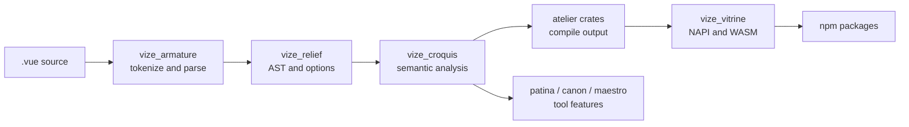

<!-- Generated translation; source: architecture/source-guide.md -->

# 源码指南

此页面是为需要更改源代码而不是仅使用 Vize 的贡献者提供的地图。
当需要高层关系时，从[架构概述](./overview.md)开始
图表，然后使用本指南查找拥有行为的实现文件。

## 存储库形状

Vize 将大多数产品行为保留在 Rust 工作区中，JavaScript 包充当
分布层和集成层。

| 路径      | 那里住着什么                                                                   |
| --------- | ------------------------------------------------------------------------------ |
| `crates/` | 用于解析、分析、编译、linting、格式化、类型检查、LSP、CLI 和本机绑定的 Rust 箱 |
| `npm/`    | 用于 Vite、Nuxt、编辑器扩展、Musea 集成和已发布的包包装器的 JavaScript 包      |
| `docs/`   | 用户文档、架构说明、发行说明和文档站点主题                                     |
| `tests/`  | 跨包装置、实际项目、工具测试和快照治理                                         |
| `bench/`  | 性能比较脚本和 PR 基准预算执行                                                 |
| `tools/`  | 不属于已发货产品的存储库自动化                                                 |

当更改跨越目录时，所有者通常是创建用户可见的层
行为。例如，编译器输出更改属于 `crates/`，即使重现来自
npm 包测试。

## 语言管道

大多数源更改都遵循相同的数据流：



共享规则很简单：解析一次，保持语法模型通用，然后让每个产品浮现出来
仅添加其拥有的行为。

## 板条箱入口点

| 更改区域             | 从这里开始                             | 然后检查                                 |
| -------------------- | -------------------------------------- | ---------------------------------------- |
| 模板解析             | `crates/vize_armature/src/lib.rs`      | 解析器装置和预期的 AST 快照              |
| AST 形状和编译器选项 | `crates/vize_relief/src/lib.rs`        | 下游编译器、lint 和格式化程序调用程序    |
| 模板语义             | `crates/vize_croquis/src/lib.rs`       | 范围、绑定、反应性和虚拟 TypeScript 助手 |
| 共享编译器行为       | `crates/vize_atelier_core/src/lib.rs`  | 后端特定工作室箱                         |
| 客户端模板输出       | `crates/vize_atelier_dom/src/lib.rs`   | 生成的代码快照和运行时夹具测试           |
| 蒸汽输出             | `crates/vize_atelier_vapor/src/lib.rs` | 特定于蒸汽的规则和现实世界的夹具输出     |
| 固态继电器输出       | `crates/vize_atelier_ssr/src/lib.rs`   | SSR 快照、逃逸和水合行为                 |
| 证监会编排           | `crates/vize_atelier_sfc/src/lib.rs`   | 脚本、模板、样式、HMR 和源映射路径       |
| 皮棉规则             | `crates/vize_patina/src/lib.rs`        | 规则快照和本地化诊断                     |
| 类型检查             | `crates/vize_canon/src/lib.rs`         | 生成虚拟TS和`corsa-bind`诊断             |
| LSP 行为             | `crates/vize_maestro/src/lib.rs`       | 服务器处理程序、虚拟文档和编辑器冒烟测试 |
| 格式化               | `crates/vize_glyph/src/lib.rs`         | 黄金格式快照                             |
| 本机和 WASM 绑定     | `crates/vize_vitrine/src/lib.rs`       | npm 包包装器和生成的类型声明             |
| CLI 行为             | `crates/vize/src/main.rs`              | 命令模块、快照和构建/检查/lint 集成测试  |

更喜欢首先遵循公共板条箱入口点。许多板条箱都有紧凑型 `lib.rs` 模块，
重新导出贡献者预期接触的内部模块。

## JavaScript 包入口点

|套餐 |源码入口|铁锈边界|
| ------------------------ | | -------------------------------------------------------------------------- | -------------------------------------------------------- |
| `@vizejs/vite-plugin` | `npm/builder/vite/src/index.ts` | `@vizejs/native` 至 `vize_vitrine` |
| `@vizejs/nuxt` | `npm/framework/nuxt/src/index.ts` | Vite 插件选项和组件集成 |
| `@vizejs/wasm` |围绕 `vize_vitrine` WASM 导出生成的包 | `crates/vize_vitrine/src/wasm` |
| `@vizejs/vite-plugin-musea` | `npm/builder/vite-musea/src/index.ts` 及相关封装代码 | `vize_musea` 通过绑定公开的 API |
| `oxlint-plugin-vize` | `npm/oxlint/src/index.ts` | `vize_patina` 通过绑定进行诊断 |

使用包测试进行集成连接，但在 Rust 测试中保留语言语义。套餐
层应该主要证明选项、虚拟模块、HMR 和本机调用是连接的。

## 改变工作流程

1. 从上表中找到所属的板条箱或包装。
2. 添加证明该行为的最小装置或快照。
3. 为该所有者运行狭窄命令。
4. 扩大到包、真实世界、浏览器、基准测试或 GitHub Actions 检查何时发生更改
   穿过公共表面。

对于面向语言的工作，请遵循以下证据矩阵
[语言工程实践](./language-engineering-practices.md)。对于板条箱责任
和包映射，请使用[Crate Reference](./crates.md)。

## 源长度

目标是将手写源文件控制在 350 行或更少。该存储库仍然有历史记录
异常，因此第一个保护是增量的：拉取请求不应添加新的超限文件，
将低于限制的文件推送到超过限制，或增加现有的超出限制的文件。

使用以下命令在本地运行清单：

```sh
vp run --workspace-root source:lengths
```

`test:scripts` GitHub Actions 作业在检查模式下针对拉取运行相同的 MoonBit 工具
请求基础提交。生成的文件、快照、固定装置、锁定文件、供应商输出、覆盖率输出、
和构建目录被排除在源清单之外。当现有异常需要处理时，
更喜欢首先按所有权边界进行划分：助手、固定装置、快照和命令处理程序
通常比共享数据结构产生更好的提取目标。

## 工具脚本

存储库自动化更喜欢 `tools/moon/cmd/` 下的 MoonBit 命令包。他们贯穿
正常包路径（`moon run --target native tools/moon/cmd/<name> -- <args>`），分享工具链
已经构建了编译器，并被 `tests/tooling/*.test.ts` 套件覆盖
它们通过 `moon run` 并断言完整的预期输出。根任务使用 `moonScript` 调用它们
`tools/vite-plus/task-commands.ts` 中的助手，因此每个消费者都保持稳定的任务名称而不是
内联命令。

好的 MoonBit 候选者是小、纯粹且依赖轻：参数解析、JSON 或文本
转换、清单和通过/失败检查，其正确性可以通过 `moon run` 测试来证明。

当 MoonBit 会增加摩擦而不是删除它时，在 Node (`.mjs`) 中保留一个脚本：

- 它由其他 JavaScript 或 `node --test` 套件作为模块导入（例如
  `tools/github/release-platforms.mjs`），因此重写它会将一个源代码拆分为两种语言。
- 这取决于 npm 生态系统（全局库、包工具、GitHub Action SDK）或
  仅节点 API，没有 MoonBit 等效项。
- 它足够大或具有探索性，其行为尚未通过全输出测试来确定；不
  无需进行此类测试即可迁移任何可能破坏 CI 的内容。

## 读取生成的输出

通过生成的工件来审查编译器和工具的更改。将这些输出视为
合同：

- 模板编译器快照显示发出的 JavaScript 和优化形状。
- Lint 快照显示诊断范围、消息和规则元数据。
- 类型检查快照显示虚拟 TypeScript 和映射的诊断。
- 格式化程序快照显示用户将看到的确切输出。
- 真实世界的夹具快照显示广泛的应用程序是否仍在构建和运行。

如果输出仅因路径、计时、排序、哈希或特定于主机的数据而变化，则标准化
更新快照之前的源。

## 当有疑问时

小的源代码更改应该留下清晰的痕迹：拥有 crate、fixture、snapshot、verification
命令，以及任何重要的更广泛的 CI 通道。如果某个更改感觉像是属于多个板条箱，
从最早的共享表示开始，并将后面的层保留为瘦适配器。
